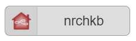
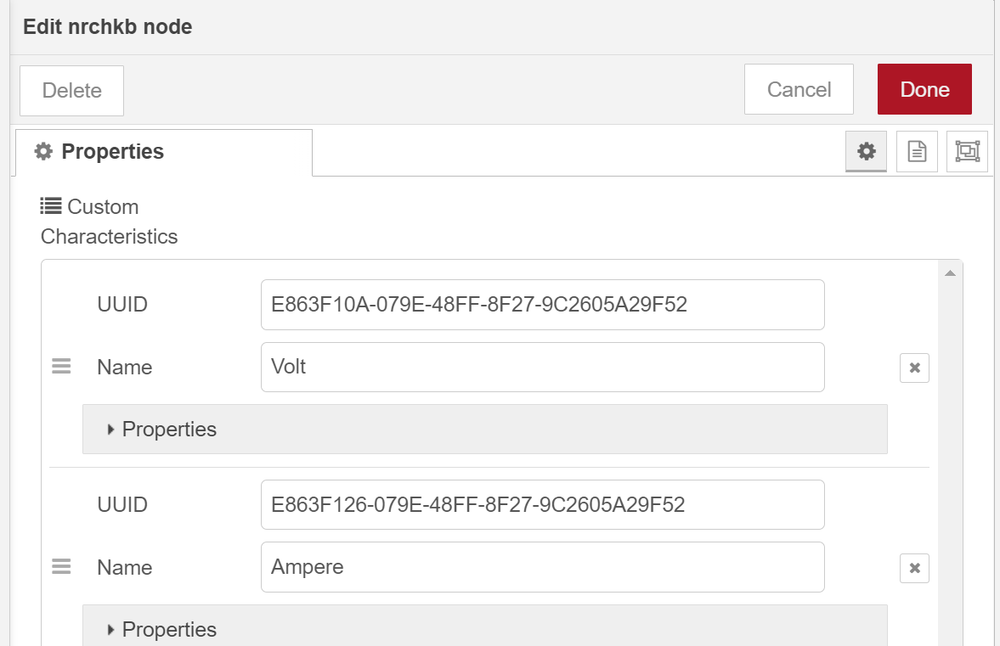
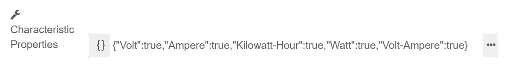
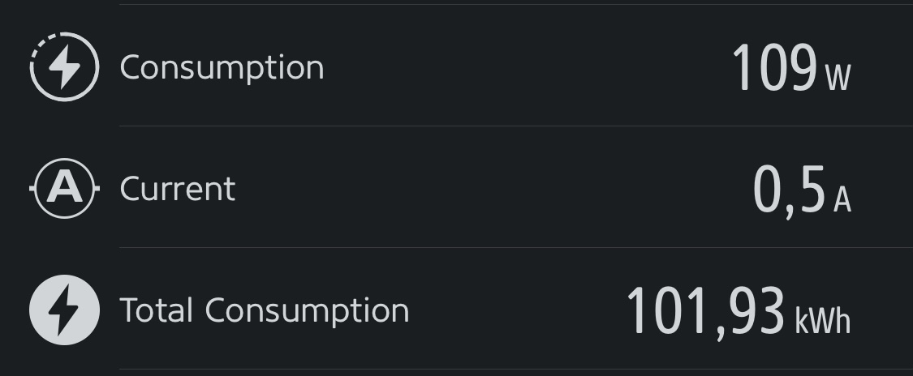

During development, we add new features that are marked as `experimental`.

They can be marked that way for few reasons:

1. Early adopting and testing, allows us to phase new features.
2. Discovering better ways to solve problems.
3. Easier to test new designs without releasing to public.

> **Important Notice,** any experimental feature is subject to change and might be not bug free.

## Getting started

In order to be able to use experimental features you have to start Node-RED with `NRCHKB_EXPERIMENTAL=true` environment variable.

Examples

### Terminal

`NRCHKB_EXPERIMENTAL=true node-red` or with `DEBUG` you can use `NRCHKB_EXPERIMENTAL=true DEBUG=NRCHKB* node-red`

### System Service (Raspberry Pi)

If you run Node-RED using the provided system service after installing with their Raspberry Pi script, then you will need to modify the system service file.

The file should be located at `/lib/systemd/system/nodered.service`

Find a line starting with `Environment` and add one (or both) of the following lines.

```bash
Environment="NRCHKB_EXPERIMENTAL=true"
Environment="DEBUG=NRCHKB*"
```

**Watching these logs** after enabling the logging can be done using the `journalctl -f` command. Specifically on Raspberry Pi, run this command:

```bash
sudo journalctl -u nodered.service -f
```

### Docker

Edit your `docker-compose` file like this:

```yaml
version: '3.8'
services:
  node-red-homekit:
    image: nrchkb/node-red-homekit:latest-12
    environment:
      NRCHKB_EXPERIMENTAL: 'true'
    network_mode: host
    volumes:
      - './data/node-red-homekit:/data'
    container_name: node-red-homekit
    restart: always
```

## Experimental features

### Custom Characteristics

[NRCHKB/node-red-contrib-homekit-bridged#52](https://github.com/NRCHKB/node-red-contrib-homekit-bridged/issues/52)

Using nrchkb node  you can define new Characteristics.



After you add them you need to also enable them on Service node.



> **Important Notice,** currently, Home.app (default Apple app for managing smart home) is not displaying Custom Characteristics.
> To see them in action you have to use alternative app like Eve.app
> 

#### Example Eve Characteristics

##### Sumary

| name          | UUID                                 | format | description       | minValue | maxValue   | minStep |
| ------------- | ------------------------------------ | ------ | ----------------- | -------- | ---------- | ------- |
| Volt          | E863F10A-079E-48FF-8F27-9C2605A29F52 | uint16 | Eve Volt          | 0        | 400        | 3       |
| Ampere        | E863F126-079E-48FF-8F27-9C2605A29F52 | float  | Eve Ampere        | 0        | 16         | 0.01    |
| Watt          | E863F10D-079E-48FF-8F27-9C2605A29F52 | uint16 | Eve Watt          | 0        | 3500       |         |
| Kilowatt-Hour | E863F10C-079E-48FF-8F27-9C2605A29F52 | float  | Eve Kilowatt-Hour | 0        | 4294967295 | 0.01    |
| Volt-Ampere   | E863F110-079E-48FF-8F27-9C2605A29F52 | float  | Eve Volt-Ampere   | 0        | 4000       | 0.01    |

##### `~/.node-red/nrchkb/35b973f1696b4cd60b78ca5f719b83ca`

```json
{"key":"customCharacteristics","value":[{"name":"Volt","UUID":"E863F10A-079E-48FF-8F27-9C2605A29F52","format":"uint16","unit":"","perms":["pr","pw","ev","tw","wr"],"ev":"true","description":"Eve Volt","minValue":"0","maxValue":"400","minStep":"3","maxLen":"","maxDataLen":"","validValues":"","adminOnlyAccess":["0","1","2"]},{"name":"Ampere","UUID":"E863F126-079E-48FF-8F27-9C2605A29F52","format":"float","unit":"","perms":["pr","pw","ev","tw","wr"],"ev":"true","description":"Eve Ampere","minValue":"0","maxValue":"16","minStep":"0.01","maxLen":"","maxDataLen":"","validValues":"","adminOnlyAccess":["0","1","2"]},{"name":"Watt","UUID":"E863F10D-079E-48FF-8F27-9C2605A29F52","format":"uint16","unit":"","perms":["pr","pw","ev","tw","wr"],"ev":"true","description":"Eve Watt","minValue":"0","maxValue":"3500","minStep":"","maxLen":"","maxDataLen":"","validValues":"","adminOnlyAccess":["0","1","2"]},{"name":"Kilowatt-Hour","UUID":"E863F10C-079E-48FF-8F27-9C2605A29F52","format":"float","unit":"","perms":["pr","pw","ev","tw","wr"],"ev":"true","description":"Eve Kilowatt-Hour","minValue":"0","maxValue":"4294967295","minStep":"0.01","maxLen":"","maxDataLen":"","validValues":"","adminOnlyAccess":["0","1","2"]},{"name":"Volt-Ampere","UUID":"E863F110-079E-48FF-8F27-9C2605A29F52","format":"float","unit":"","perms":["pr","pw","ev","tw","wr"],"ev":"true","description":"Eve Volt-Ampere","minValue":"0","maxValue":"4000","minStep":"0.01","maxLen":"","maxDataLen":"","validValues":"","adminOnlyAccess":["0","1","2"]}]}
```

### Service 2

[NRCHKB/node-red-contrib-homekit-bridged#392](https://github.com/NRCHKB/node-red-contrib-homekit-bridged/issues/392)
