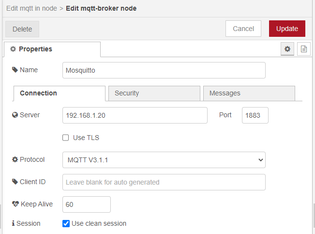
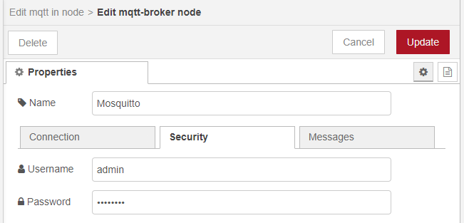
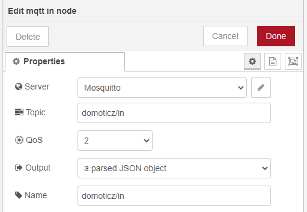
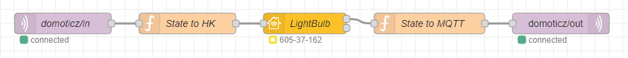

## What is an ESP ?

ESP is a microcontroller integrated circuit with Wi-Fi connection and very inexpensive. There are several versions of ESP, including ESP32 which is the latest version. ESP32 is more powerful and integrates Bluetooth connection. A popular option is Itead Sonoff modules which integrate an ESP, but the original firmware is not fully "open" so it cannot be easily added to systems like Node-RED. To solve this problem, [ESP Easy](https://www.letscontrolit.com/wiki/index.php?title=ESPEasy) or [Tasmota](https://tasmota.github.io/docs/About/) firmware can be used to transform the ESP module into a simple multi-function sensor device for home automation solutions.

## Why use an ESP with Node-RED ?

Tasmota and ESP Easy integrate easily with many home automation solutions, usually over MQTT protocol. Node-RED has a full set of MQTT nodes so using this hardware (or anything with MQTT) is simple and robust. There are various "MQTT standards" which may be compatible with Tasmota and ESP Easy including Domoticz, Homie, and HomeAssistant; these "standards" are MQTT topic and payload structures which are generally used to make discovery of devices easier.

## Wich ESP to choose ?

Buy the one which does what you want! There are various choices:
- Plug-and-play modules (Itead Sonoff, Magic Home LED controllers, Shelly, [and more](https://templates.blakadder.com))
- DIY hardware like ESP8285, ESP8266, ESP 32, or similar with your own set of devices attached to the GPIO

## Which firmware to choose for Flashing ?

There are many firmware options, including simply writing your own using the Arduino IDE. We will focus on the two which seem most popular; they are similar in their operation. If you want to use a simple sensor then Tasmota could be an easier starting point. If you want to create rules on-device (advanced use) then ESP Easy may be more robust.

- [Tasmota](https://tasmota.github.io/docs/Getting-Started/)
- [ESPEasy](https://www.letscontrolit.com/wiki/index.php/ESPEasy#Get_started)

## Using in Node-RED

The use in Node-RED is done using the nodes `MQTT in` and `MQTT out`. If you don't have an MQTT Server, you can install [Aedes](https://flows.nodered.org/node/node-red-contrib-aedes), which runs great inside of Node-RED. You must then configure the address of the server (if using Aedes this will be `localhost` or the IP of your Node-RED instance) and the identifiers in the `MQTT` node as well as the `Topic`. The `Topic` is very important, it must match the topics your devices are using. We will discuss using Domoticz topics and the default Tasmota topics below.

### Domoticz Topic

If your ESP device has Domoticz topics enabled then the messagew will follow this format. The advantage of using Domoticz topics is having the standard format message and is useful for those who are comfortable with the Domoticz topic structure. The identifier of your ESP will be `idx` in the message.

Topic : **domoticz/in** for `MQTT in` and **domoticz/out** for ` MQTT out` node.

Example message at the output of the `MQTT in` node :

```
msg.payload = {
    "idx": 1,
    "nvalue": 0,
    "svalue":'',
    "RSSI": 10,
    "Battery": 100
}
```

[Read more about MQTT for Domoticz](https://piandmore.wordpress.com/2019/02/04/mqtt-out-for-domoticz/)

### Manual Topic

`Topic` or `%topic%` is the identifier (name) of your ESP, such as `Light1`, `DeskLamp`, `GarageSensor`, etc. depending how you have named your devices. Messages using this topic structure will have a topic of `%prefix%/%topic%/%event%` where `%prefix%` is one of the 3 described below, `%topic%` is the identifier, and `%event%` is the event happening (could be `POWER`, `SENSOR`, `TELE`, or more depending on your device).

Tasmota uses 3 prefixes for forming a `FullTopic`:

`cmnd` - prefix to issue commands; ask for status\
`stat` - reports back status or configuration message\
`tele` - reports telemetry info at specified intervals

### MQTT Nodes in Node-RED

<!-- section here to explain adding MQTT nodes to NR -->

Before starting, add an `MQTT in` node, then let's go to the configuration :

+ MQTT Server

Put the `IP address` and `port` of your server.
User advance, you can choose the desired `mqtt protocol`.



And put, if you have, the logins of your server.



+ MQTT Properties

Put the `Topic` as described above and select "A parsed JSON object" in `Output`.



### Adding to NRCHKB

<!-- if we don't bring it back to NRCHKB it's just another "look it's mqtt" post like all the rest -->

To connect the `MQTT` nodes to `Homekit`, I offer you some examples for a Topic configuration with domoticz and manual.

Here is a screenshot of the general structure of your flow :



#### Domoticz Topic

+ LightBulb/Outlet/Fan

`State to HK` node :
```
if (msg.payload.idx == 1){
    msg = {"payload": {
        "On": (msg.payload.nvalue)? true: false
    }}
    return msg;
} else {
    return;
}
```
`State to MQTT` node :
```
msg = {"payload": {
    "idx": 1,
    "nvalue": (msg.payload.On)? 1: 0
}};
return msg;
```

+ Temperature Sensor

`State to HK` node :
```
if (msg.payload.idx == 1){
    msg = {"payload": {
        "CurrentTemperature": parseInt(msg.payload.svalue)
    }}
    return msg;
} else {
    return;
}
```

+ Temperature + Humidity Sensor

`State to HK` node :
```
let Read = msg.payload.svalue.split(/\;/g);

msg1 = {"payload": {
    "CurrentTemperature": Read[0]
}};
msg2 = {"payload": {
    "CurrentRelativeHumidity": Read[1]
}};

if (msg.payload.idx == 1){
    return [msg1,msg2];
} else {
    return;
}
```

#### Manual Topic

<!-- will have to help me here -->
