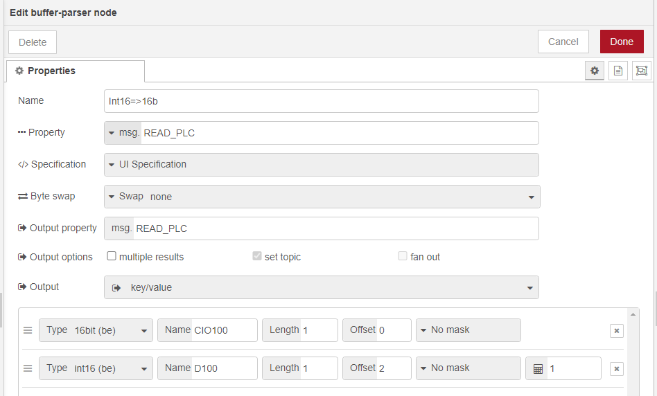

## What Is a Programmable Controller?

A programmable controller (PLC) has a microprocessor and controls devices through custom user programs.
A PLC receives signals from input devices and makes decisions based on custom programs to control output devices.

[Read more about OMRON PLC](https://www.ia.omron.com/support/guide/26/introduction.html)

## Why use a Programmable Controller with Node-RED?

A PLC is by definition Automated, which means that the role of Node-RED is to be a Human Machine Interface (HMI).
This term defines any device allowing a user to interact with a device in an industrial environment.

The role of Node-RED is going to be a **Gateway between PLC and Home.app** because an advantage of using a PLC is that its programming is not complicated. Indeed, the Ladder Diagram (LD) language is widely used and above all very easy to understand, unlike DIY solutions with their multiple language and communication protocol for example.\
Another advantage is that it is cheaper than the [KNX System](https://www.knx.org/knx-en/for-professionals/What-is-KNX/A-brief-introduction/index.php).

## Using in Node-RED

For that you must do the following points:

#### 1. Install [`node-red-contrib-omron-fins`](https://github.com/Steve-Mcl/node-red-contrib-omron-fins) and [`node-red-contrib-buffer-parser`](https://github.com/Steve-Mcl/node-red-contrib-buffer-parser) using `Manage Palette`

#### 2. Configure the `FINS Read` and `FINS Write` nodes

To put the **Read Addresses** you have two nodes:
  1. `FINS Read` in which you put a starting address and the number of addresses you want to read after it.
  2. `FINS Read Multiple` in which you put addresses you want.

And to put the **Write Address** you have `FINS Write` node.

For the bridge configuration, please visit [this instruction](https://github.com/Steve-Mcl/node-red-contrib-omron-fins#a-working-example)

**Warning! We can only write to one address at a time!**

#### 3. Configure the `Buffer-Parser` node

This node allows for our use to convert an `Int16` to `16bits`. Indeed the read nodes return an `Int16 list`.



We can exploit the response of the node with:

```
msg.payload = {
    "CIO100": msg.READ_PLC.CIO100[0].bits,
    "D100": msg.READ_PLC.D100
};
return msg;
```

To convert `16bits` back to `Int16` use this in a `Function` node:

```
let READ = msg.READ_PLC.CIO10[0].bits;

READ = READ.reverse().toString().replace(/\,/g,'');

msg.WRITE = parseInt(READ, 2).toString(10);

return msg;
```

## Example flows

Here is a list of examples that you can go to visit:

- [Contact Sensor]( "Contact Sensor - OMRON PLC")
- [Lightbulb]( "Lightbulb - OMRON PLC")
- [Motion Sensor]( "Motion Sensor - OMRON PLC")
- [Smoke Sensor]( "Smoke Sensor - OMRON PLC")
- [Valve]( "Valve - OMRON PLC")
