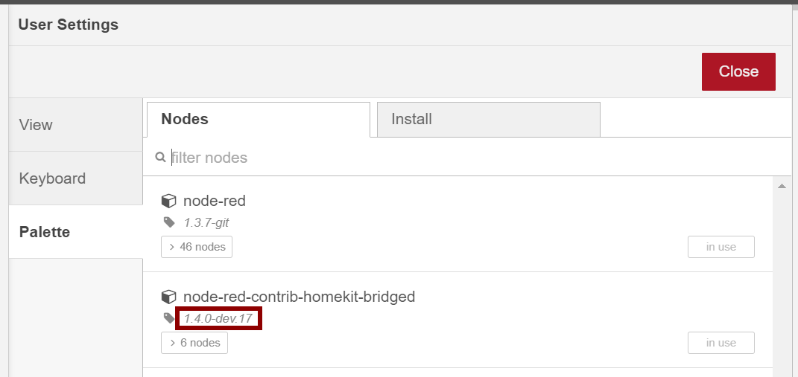
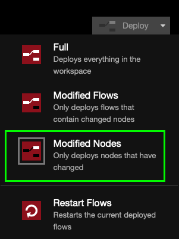

## How to check software versions

How to check versions for most common install methods:

### Our node

- `Settings/Manage palette` 

- `package.json` file in your Node-RED installation folder usually `~/.node-red` 

### Node-RED

Check in the drop-down menu in the top right of the editor.

### Node-JS

Run `node -v` in the command line

## Which format for msg.payload (JSON)

Payload messages sent and received from the HomeKit node have a **JSON** structure.
To popularize, this structure resembles a library: you search for your book (value) thanks to its title (key).

Below is an example of `msg.payload`:

```js
msg = {
  payload: {
    On: true,
    Brightness: 38,
  },
};
```

In this example we can retrieve the value of `On` with this JavaScript path: `msg.payload.On`.

Find more about [JSON](https://en.wikipedia.org/wiki/JSON).

## What's Home Hub

Home Hub is the name given to the device that acts as the gateway between your accessories and Apple's servers.
Concretely, Home Hub allows you to access your accessories from outside your home.

Find more about [Home Hub](https://support.apple.com/en-us/HT207057).

## Differentiate between passthrough or "from HomeKit" messages

In some cases, it may be useful, even essential, to differentiate a command from the previous node or Home.app to avoid a loop problem.

Find more about [Passthrough Messages]( "Passthrough Messages").

## Miscellaneous oddities...

- We **highly recommend** setting your Node-RED editor to "Deploy modified nodes" only. This will keep the backend for HomeKit nodes from restarting so often while making edits, keeping the Home app much happier.



- Sometimes Node-RED will send multiple copies of each message when you've been working on a lot of flows, simply restart Node-RED to clear the caches and you'll usually be back to normal
- If something new is struggling, the first thing to try is to remove the problem service node, deploy, then add it back. If things still struggle it might be helpful to remove the problem nodes _and_ bridge from Node-RED and the Home app - then add it all back in.
