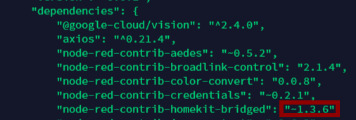

## How to check nodes versions

1. `Settings/Manage palette`

  

2. `package.json` file in your Node-RED installation folder usually `~/.node-red`

  

## Which format for msg.payload (JSON)

Payload messages sent and received from the HK node have a **JSON** structure.
To popularize, this structure resembles a library: you search for your book (value) thanks to its title (key).

Below is an example of `msg.payload`:

```js
msg = {
  "payload": {
    "Active": true,
    "StatusActive": true
  }
}
```
In this example we can retrieve the value of `Active` with this message: `msg.payload.Active`.

Find more about [JSON](https://en.wikipedia.org/wiki/JSON).

## What's Home Hub

Home Hub is the name given to the device that acts as the gateway between your accessories and Apple's servers.
Concretely, Home Hub allows you to access your accessories from outside your home.

Find more about [Home Hub](https://support.apple.com/en-us/HT207057).

## Differentiate between passthrough or "from HomeKit" messages

In some cases, it may be useful, even essential, to differentiate a command from the previous node or Home.app in order to avoid a loop problem.

Find more about [Passthrough Messages]( "Passthrough Messages").
