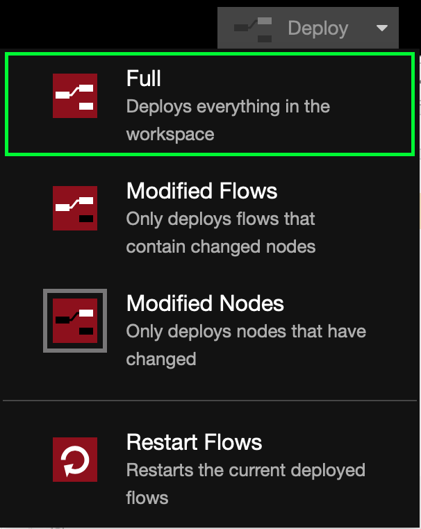

## Device paired but Service disappearing in Home.app from time to time

You managed to pair with Accessory or Bridge but after a while, it has disappeared?

1. Make sure that the device you are using to view Home status is connected to the same network that node-red (with nrchkb) is running on
2. If you are using VLAN or special firewall rules, [join us on Discord](https://discord.gg/uvYac5u) to discuss what settings should be for things to work

## Type already defined error

`Type already defined` or `Cannot register type` errors appeared in UI?

1. Make sure you are using the latest version of our node.
2. Look for other HomeKit nodes that you have installed. You will have to remove them if they collide with our node. Possible collisions with:

- `node-red-contrib-homekit-preconfigured`
- `node-red-contrib-homekit`

## Unable to associate a Bridge in Home.app

If you cannot pair with a Bridge in Home.app and `node-red/NRCHKB` logs are not indicating a problem.

For running `node-red` in DEBUG mode:

```bash
DEBUG=NRCHKB*,HAP* node-red
```

Try the steps below to solve the problem:

1. Restart Node-RED: `sudo node-red-restart`
2. Update Node-RED: [Instructions](https://nodered.org/docs/getting-started/local#upgrading-node-red)
3. Update your machine packages: `sudo apt-get update && sudo apt-get upgrade`
4. Update NodeJS to LTS: `nvm install --lts && nvm use --lts`

## Changing characteristic properties had no effect

1. Check that when you deploy you are in `full` mode. 
2. Restart Node-RED

## Sometimes multiple of the same message comes through

Restart Node-RED
