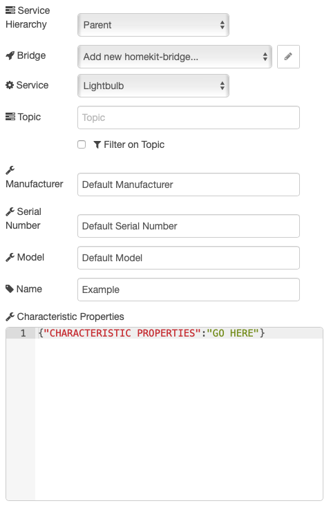

## What is that

A Service node is made up of one or more characteristics. The Characteristic Properties tell the Home.app to adapt its display to the chosen settings. It also allows you to define default values and usage limitations.

The Characteristics available for each service are displayed on each page of the [Service]( "Service") section and information about each characteristic in the [Characteristic]( "Characteristic") section.

## How to use it

Go to the section called `Characteristic Properties` of your HomeKit Service Node.



To indicate that some Characteristic is used:

`{ "Characteristic": true }`

To indicate a default value for some characteristic (20 for example):

`{ "Characteristic": {"defaultValue": 20 }}`

## Usage Limitation

To tell the Home.app some usage limitations on a characteristic:

| Option         | Description                   |
| -------------- | ----------------------------- |
| `defaultValue` | Value by default              |
| `minValue`     | Minimum value authorized      |
| `maxValue`     | Maximum value authorized      |
| `minStep`      | Minimum step (gap) authorized |
| `validValues`  | Value authorized [ ]          |

### Examples

Below is an example list of characteristics.

### Window covering with tilt option and default value

```json
{
  "TargetHorizontalTiltAngle": {
    "defaultValue": 45,
    "minValue": 0,
    "maxValue": 90
  }
}
```

### On/off bulb (No optional characteristics: empty JSON object)

```json
{}
```

### Dimmable bulb (Enable optional characteristic _Brightness_)

```json
{
  "Brightness": true
}
```

### Color changing bulb (Enable optional characteristics _Brightness, Hue, Saturation_)

```json
{
  "Brightness": true,
  "Hue": true,
  "Saturation": true
}
```

### Color Temperature bulb

It is also possible to define the range of the lightbulb if it has a light that can change temperature.
You should watch out, that these values are in `Reciprocal megakelvin` so you have to 'convert' to this if your lamp is using Kelvin values (1000000 / Kelvin).

```json
{
  "ColorTemperature": {
    "minValue": 150,
    "maxValue": 500
  }
}
```

### Dimmable bulb with 5% increments

```json
{
  "Brightness": {
    "minStep": 5
  }
}
```

### Security system with no "night" mode

```json
{
  "SecuritySystemCurrentState": {
    "validValues": [0, 1, 3, 4]
  },
  "SecuritySystemTargetState": {
    "validValues": [0, 1, 3, 4]
  }
}
```

### Valve with only "irrigation" valve type (will show in Home.app as sprinkler)

```json
{
  "ValveType": {
    "minValue": 1,
    "maxValue": 1
  }
}
```
