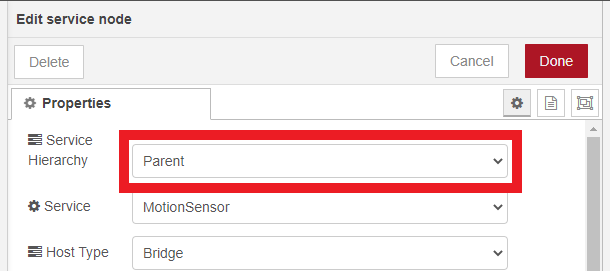
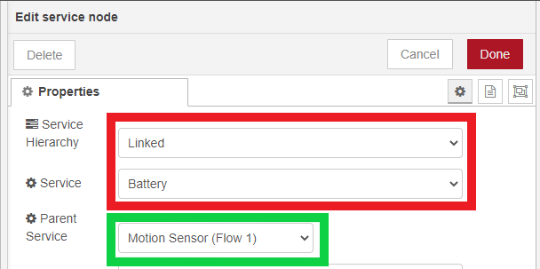
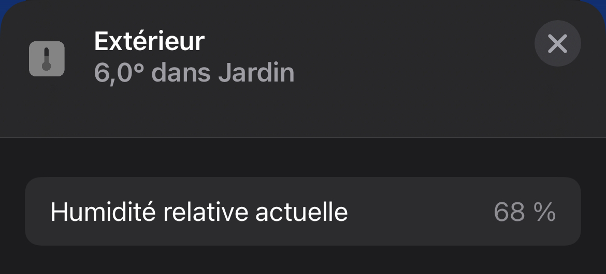

## How to create a Linked Service

To create a Linked Service, you must first create a Parent Service. For this example, the Linked Service will be a Battery and the Parent Service a Motion Sensor.



Next, you must create Linked Service and select Parent Service used.



### Characteristic Properties

Use the following JSON in your Battery Characteristic Properties so that the Home.app displays `BatteryLevel` and `StatusLowBattery`.

```json
{
  "BatteryLevel": 100,
  "StatusLowBattery": 0
}
```

## Another way

Another method is to use [Characteristic Properties]( "Characteristic Properties").
As a reminder: Characteristic Properties tell HomeKit that your Accessory will use Characteristic(s) provided.

For example, you want an Accessory that is both Temperature Sensor and Humidity Sensor, nothing could be simpler, just use the following JSON in your Characteristic Properties.



```json
{
  "CurrentTemperature": 20,
  "CurrentRelativeHumidity": 50
}
```


