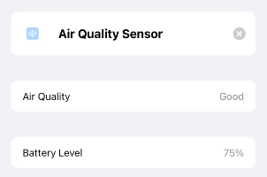
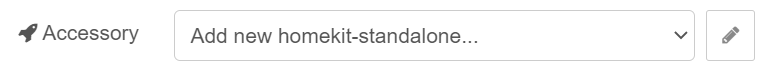

This node represents Service 2 in HomeKit.
Service 2 is an [experimental feature]( "Experimental").

When hosted behind the [Bridge]( "Host Node") it will also represent Accessory.

## Configuration

Below you can find the list of configurable parameters for Service Node (this Node can also be found as a homekit node or homekit-service).

### Service Hierarchy

Choose if this node will represent Parent (or Primary) Service or Linked one.

| Option | Description |
|---|---|
| Parent | Node will be used as Primary Service. The Primary Service must match the primary function of the accessory and must also match with the accessory category. An accessory must expose only one primary service from its list of available services. |
| Linked | Node will be used as a Linked Service. Linked Services allows accessories to specify logical relationship between services. A service can link to one or more services. A service must not link to itself. Service links have context and meaning only to the first level of services that it links to. |

### Example

We want to configure Air Quality Sensor which is battery powered.
We need to define Air Quality Sensor (Parent) and Battery (Linked).


In Home.app room view it will be displayed as one accessory.


In Home.app in accessory detail view you will also notice battery percentage.



### Service

Select Service from the [list]( "Services") which will be used to represent this node.

### Parent Service

**This field is only available when *[Service Hierarchy]( "Service Hierarchy")* is set to *Linked***

Select Parent Service from the list to which this node's Linked Service will be attached to.

### Host Type

**This field is only available when *[Service Hierarchy]( "Service Hierarchy")* is set to *Parent***

| Option | Description |
|---|---|
| Bridge | Service will be hosted behind Bridge. |
| Accessory | Service will be hosted as Standalone Accessory. |

### Accessory

**This field is only available when *[Service Hierarchy]( "Service Hierarchy")* is set to *Parent* and *[Host Type]( "Host Type")* is set to *Accessory***

You can select already created [Standalone Accessory Node]( "Host Node") or create a new one.

- By clicking button with a pencil icon next to it, you can edit currently selected Accessory
- You can also create a new one by clicking the same button when *Add new homekit-standalone...* is selected. 

### Bridge

**This field is only available when *[Service Hierarchy]( "Service Hierarchy")* is set to *Parent* and *[Host Type]( "Host Type")* is set to *Bridge***

You can select already created [Bridge Node]( "Host Node") or create a new one.

- By clicking button with a pencil icon next to it, you can edit currently selected Bridge
- You can also create a new one by clicking the same button when *Add new homekit-bridge...* is selected. 

> **Important Notice,** when you create a new Bridge for Service Node that is in a subflow, once deployed new Bridge will be created for each Subflow instance in a flow.
If you create a Bridge outside a Subflow then it will be created only once (reused).

### Manufacturer

**This field is only available when *[Service Hierarchy]( "Service Hierarchy")* is set to *Parent* and *[Host Type]( "Host Type")* is set to *Bridge***

### Serial Number

**This field is only available when *[Service Hierarchy]( "Service Hierarchy")* is set to *Parent* and *[Host Type]( "Host Type")* is set to *Bridge***

### Model

**This field is only available when *[Service Hierarchy]( "Service Hierarchy")* is set to *Parent* and *[Host Type]( "Host Type")* is set to *Bridge***

### Firmware Revision

**This field is only available when *[Service Hierarchy]( "Service Hierarchy")* is set to *Parent* and *[Host Type]( "Host Type")* is set to *Bridge***

### Hardware Revision

**This field is only available when *[Service Hierarchy]( "Service Hierarchy")* is set to *Parent* and *[Host Type]( "Host Type")* is set to *Bridge***

### Software Revision

**This field is only available when *[Service Hierarchy]( "Service Hierarchy")* is set to *Parent* and *[Host Type]( "Host Type")* is set to *Bridge***

### Topic

### Filter on Topic

### Name

### Characteristic Properties

### Wait for Setup message

### Use Event callback

When checked it will output callback requests for `get` event.
You can use `get` event to update values just in time, when requested!
When user opens Home.app it will emit `get` event which will be used to request current value of the Characteristic.

In that case Service 2 node will output `msg.hap.event`:

```json
{
  "name": "get",
  "context": {
    "callbackID": "2cc11105-734c-4951-8ab5-395d1ae4ed2f",
    "key": "Brightness"
  }
}
```

Once you receive that kind of message you can use flow to fetch value and then send it to Service 2 like. `msg.payload`:

```json
{
  "2cc11105-734c-4951-8ab5-395d1ae4ed2f": 60
}
```

Using provided callback ID (in example `2cc11105-734c-4951-8ab5-395d1ae4ed2f`) Service 2 will send get event result to Home.app saying that current `Brightness` is `60`.

## Input

## Output
