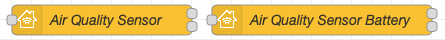

A Service or Service group (Parent and Linked) is considered like Accessory. You can choose to either link your Accessory to a Bridge or use your Standalone Accessory.
The difference is when adding in Home.app: In the case of the Bridge, adding the Bridge adds all Accessory linked to that Bridge and in the case of the Standalone Accessory, you only add itself.

## Configuration

You will find below a table showing all the parameters and when they are used, as well as the list of parameters and their usefulness.

<table>
<thead>
  <tr>
    <th></th>
    <th colspan="2" style="text-align:center;">Service Hierarchy</th>
    <th colspan="2" style="text-align:center;">Host Type</th>
  </tr>
  <tr>
    <th>Field</th>
    <th style="text-align:center;">Parent</th>
    <th style="text-align:center;">Linked</th>
    <th style="text-align:center;">Bridge</th>
    <th style="text-align:center;">Accessory</th>
  </tr>
</thead>
<tbody>
  <tr>
    <td>Service</td>
    <td style="text-align:center;">X</td>
    <td style="text-align:center;">X</td>
    <td style="text-align:center;">X</td>
    <td style="text-align:center;">X</td>
  </tr>
  <tr>
    <td>Bridge</td>
    <td style="text-align:center;">X</td>
    <td style="text-align:center;"></td>
    <td style="text-align:center;">X</td>
    <td style="text-align:center;"></td>
  </tr>
  <tr>
    <td>Accessory</td>
    <td style="text-align:center;">X</td>
    <td style="text-align:center;"></td>
    <td style="text-align:center;"></td>
    <td style="text-align:center;">X</td>
  </tr>
  <tr>
    <td>Parent Service</td>
    <td style="text-align:center;"></td>
    <td style="text-align:center;">X</td>
    <td style="text-align:center;"></td>
    <td style="text-align:center;"></td>
  </tr>
  <tr>
    <td>Manufacturer</td>
    <td style="text-align:center;">X</td>
    <td style="text-align:center;"></td>
    <td style="text-align:center;">X</td>
    <td style="text-align:center;"></td>
  </tr>
  <tr>
    <td>Serial Number</td>
    <td style="text-align:center;">X</td>
    <td style="text-align:center;"></td>
    <td style="text-align:center;">X</td>
    <td style="text-align:center;"></td>
  </tr>
  <tr>
    <td>Model</td>
    <td style="text-align:center;">X</td>
    <td style="text-align:center;"></td>
    <td style="text-align:center;">X</td>
    <td style="text-align:center;"></td>
  </tr>
  <tr>
    <td>Firmware Revision</td>
    <td style="text-align:center;">X</td>
    <td style="text-align:center;"></td>
    <td style="text-align:center;">X</td>
    <td style="text-align:center;"></td>
  </tr>
  <tr>
    <td>Hardware Revision</td>
    <td style="text-align:center;">X</td>
    <td style="text-align:center;"></td>
    <td style="text-align:center;">X</td>
    <td style="text-align:center;"></td>
  </tr>
  <tr>
    <td>Software Revision</td>
    <td style="text-align:center;">X</td>
    <td style="text-align:center;"></td>
    <td style="text-align:center;">X</td>
    <td style="text-align:center;"></td>
  </tr>
  <tr>
    <td>Topic</td>
    <td style="text-align:center;">X</td>
    <td style="text-align:center;">X</td>
    <td style="text-align:center;">X</td>
    <td style="text-align:center;">X</td>
  </tr>
  <tr>
    <td>Filter on Topic</td>
    <td style="text-align:center;">X</td>
    <td style="text-align:center;">X</td>
    <td style="text-align:center;">X</td>
    <td style="text-align:center;">X</td>
  </tr>
  <tr>
    <td>Name</td>
    <td style="text-align:center;">X</td>
    <td style="text-align:center;">X</td>
    <td style="text-align:center;">X</td>
    <td style="text-align:center;">X</td>
  </tr>
  <tr>
    <td>Characteristic Properties</td>
    <td style="text-align:center;">X</td>
    <td style="text-align:center;">X</td>
    <td style="text-align:center;">X</td>
    <td style="text-align:center;">X</td>
  </tr>
  <tr>
    <td>Wait for Setup</td>
    <td style="text-align:center;">X</td>
    <td style="text-align:center;">X</td>
    <td style="text-align:center;">X</td>
    <td style="text-align:center;">X</td>
  </tr>
</tbody>
</table>

### Service Hierarchy

Choose if this node will represent Parent (or Primary) Service or Linked one.

| Option | Description |
|---|---|
| Parent | Node will be used as Primary Service. The Primary Service must match the primary function of the accessory and must also match with the accessory category. An accessory must expose only one primary service from its list of available services. |
| Linked | Node will be used as a Linked Service. Linked Services allows accessories to specify logical relationship between services. A service can link to one or more services. A service must not link to itself. Service links have context and meaning only to the first level of services that it links to. |

Learn more about [Linked Service]( "Linked Service").

#### Example

We want to configure Air Quality Sensor which is battery powered. We need to define Air Quality Sensor (Parent) and Battery (Linked).



In Home.app room view it will be displayed as one accessory.


In Home.app in accessory detail view you will also notice battery percentage.


### Service

Select Service from the [list]( "Services") which will be used to represent this node.

### Parent Service

Select Parent Service from the list to which this node's Linked Service will be attached to.

### Host Type

| Option | Description |
|---|---|
| Bridge | Service will be hosted behind Bridge. |
| Accessory | Service will be hosted as Standalone Accessory. |

### Bridge

You can select already created [Bridge Node]( "Host Node") or create a new one.

- By clicking button with a pencil icon next to it, you can edit currently selected Bridge
- You can also create a new one by clicking the same button when *Add new homekit-bridge...* is selected. 

**Important Notice,** when you create a new Bridge for Service Node that is in a subflow, once deployed new Bridge will be created for each Subflow instance in a flow. If you create a Bridge outside a Subflow then it will be created only once (reused)..

### Accessory

You can select already created [Standalone Accessory Node]( "Host Node") or create a new one.

- By clicking button with a pencil icon next to it, you can edit currently selected Accessory
- You can also create a new one by clicking the same button when *Add new homekit-standalone...* is selected. 

Accessory is used for particular services (Television, Smart Speaker) in order to create a bridge specific to this service and thus avoid display problems in Home.app.

### Fields

Below is a list of fields that you can fill, it is not mandatory but it can be used to identify the characteristics of your services.

- Manufacturer
- Serial Number
- Model
- Firmware Revision
- Hardware Revision
- Software Revision

### Topic

The topic does two things:
- at the entrance of the HomeKit node, it allows you to filter incoming messages.
- at the exit of the HomeKit node, it identifies which node sent a command.

Learn more about [Topic]( "Topic").

### Filter on Topic

This option is used to filter messages entering the HomeKit node. It will only pass messages with the matching `msg.topic`.

### Name

This name will be displayed on your node and also in Home.app. It is also possible to change the name in Home.app of your service but this will not change the name of your node.

**Warning:** if you rename a service, it will be initialized by HomeKit. This means that it is considered a new service and will have lost the configurations saved in Home.app (room, automation, scene). In order to avoid this, it is recommended to create one bridge per room.

### Characteristic Properties

Characteristic Properties tell HomeKit that the service will use that characteristic and set desired limits.

Learn more about [Characteristic Properties]( "Characteristics").

### Wait for Setup

Wait for Setup is ....?

Learn more about [Wait for Setup]( "Wait for Setup").

## Input Messages

Input messages have the following structure:

```js
msg = { 
    "payload": {
        "Characteristics": Value
    }
}
```



## Output Messages

Output Messages use the structure of the Input Messages with the particularity of having in addition `msg.hap` when the request comes from HomeKit and of having the possibility of being able to allow or disallow Passthrough Messages.

Learn more about [Output Messages]( "Output Messages").
