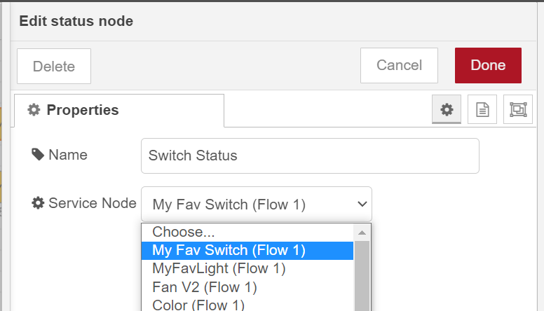
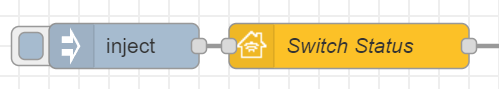

This node outputs status of the HomeKit Service.

## Configuration



Below you can find the list of configurable parameters for Service Node (this Node can also be found as a homekit node or homekit-service).

### Service Node

Select Service node from the list of already configured nodes which will be used in this node to return status.

## Input

There is no input payload required.
Input port is just used to trigger status output.
You can either connect inject node or make some login in your flow to trigger it.


## Output

Once triggered, Status node will output payload containing:

| Field | Description |
|---|---|
| displayName | Service display name. |
| UUID | Service UUID according to HAP specification. |
| subtype | Value generated for nrchkb internal use. |
| constructorName | Service name according to HAP specification. |
| hiddenService | If the Service is hidden service. |
| primaryService | If the Service is primary service. |
| characteristics | Characteristics that Service is currently using. |
| optionalCharacteristics | All optional Characteristics that Service could use. For currently used please refer to `characteristics` |

### Example output

```json
{
  "payload":{
    "displayName":"My Fav Switch",
    "UUID":"00000049-0000-1000-8000-0026BB765291",
    "subtype":"01b45824-9beb-4b19-bb0c-3b4c9e3fe2ba",
    "constructorName":"Switch",
    "hiddenService":false,
    "primaryService":false,
    "characteristics":[
      {
        "displayName":"Name",
        "UUID":"00000023-0000-1000-8000-0026BB765291",
        "eventOnlyCharacteristic":false,
        "constructorName":"Name",
        "value":"My Fav Switch",
        "props":{
          "format":"string",
          "perms":[
            "pr"
          ],
          "maxLen":64
        }
      },
      {
        "displayName":"On",
        "UUID":"00000025-0000-1000-8000-0026BB765291",
        "eventOnlyCharacteristic":false,
        "constructorName":"On",
        "value":false,
        "props":{
          "format":"bool",
          "perms":[
            "ev",
            "pr",
            "pw"
          ]
        }
      }
    ],
    "optionalCharacteristics":[
      {
        "displayName":"Name",
        "UUID":"00000023-0000-1000-8000-0026BB765291",
        "eventOnlyCharacteristic":false,
        "constructorName":"Name",
        "value":"",
        "props":{
          "format":"string",
          "perms":[
            "pr"
          ],
          "maxLen":64
        }
      }
    ]
  },
  "_msgid":"12353123.f7ba2f"
}
```
