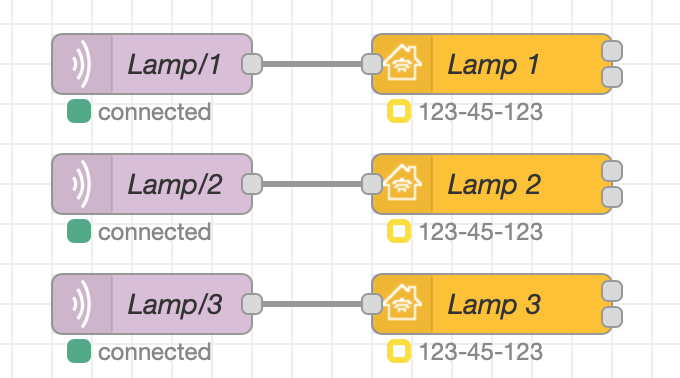
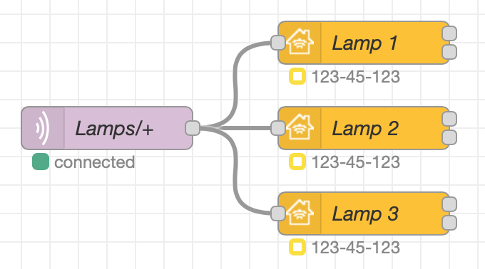

## What is that

The Topic serves two purposes:

- at the entrance to the HomeKit node, it allows messages to be filtered.
- at the exit of the HomeKit node, it identifies where the message came from.

## When to use it

We use the `Filter on Topic` option when you want to redirect your messages to the correct service without using `function node` or `switch node`.

Below is an example of a flow structure without Topic and another with.





As you can see the usefulness of using the Topic reduced to only one node `Lamps/+`.

## Message Structure

Below is the structure of a message with a Topic.

```js
msg = {
  payload: {
    On: true,
  },
  topic: "Your Topic",
};
```
