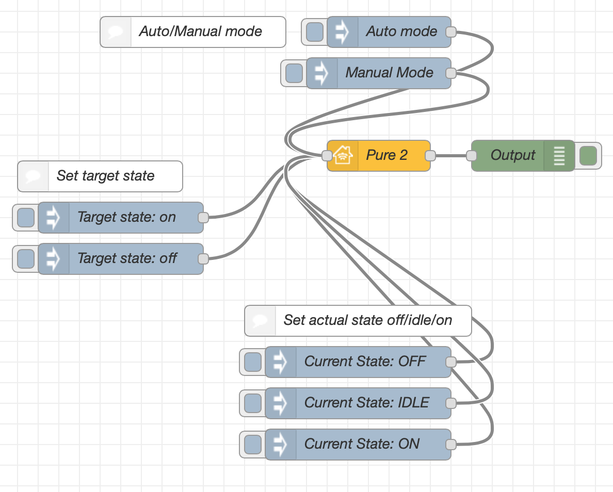
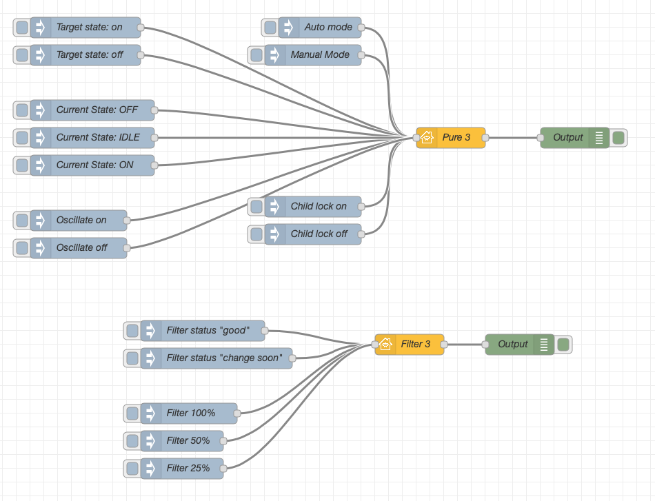

## Basic Principle

This is the simplest example of a Air Purifier item. There are 3 sets of input nodes.

**Auto/Manual Mode** will determine whether the Home.app displays that the Purifier is in Automatic or Manual Mode. This is set by sending a value of 0 or 1 to `TargetAirPurifierState`.

**Set Target State** will dictate whether the user wants the Purifier to be On or Off. This is set by sending a value of 0 or 1 to `Active`.

**Set Current State Off/Idle/On** this will dictate whether the Purifier is actually Off, Idle, or On. This is set by sending a value of 0, 1, or 2 to `CurrentAirPurifierState`.



Copyable Node-RED flow:

```json
[{"id":"23658c6b.4bf7fc","type":"debug","z":"3e0d11cf.29e996","name":"Output","active":true,"tosidebar":true,"console":false,"tostatus":false,"complete":"payload","x":570,"y":220,"wires":[]},{"id":"48715e2b.edde4","type":"inject","z":"3e0d11cf.29e996","name":"Target state: on","topic":"","payload":"{\"Active\":true}","payloadType":"json","repeat":"","crontab":"","once":false,"onceDelay":0.1,"x":180,"y":280,"wires":[["b76a15e.cbd98e8"]]},{"id":"6c58b865.cbe098","type":"inject","z":"3e0d11cf.29e996","name":"Target state: off","topic":"","payload":"{\"Active\":false}","payloadType":"json","repeat":"","crontab":"","once":false,"onceDelay":0.1,"x":180,"y":320,"wires":[["b76a15e.cbd98e8"]]},{"id":"c80db304.c4e","type":"inject","z":"3e0d11cf.29e996","name":"Auto mode","topic":"","payload":"{\"TargetAirPurifierState\":1}","payloadType":"json","repeat":"","crontab":"","once":false,"onceDelay":0.1,"x":440,"y":100,"wires":[["b76a15e.cbd98e8"]]},{"id":"2188d196.d711e6","type":"inject","z":"3e0d11cf.29e996","name":"Current State: ON","topic":"","payload":"{\"CurrentAirPurifierState\":2}","payloadType":"json","repeat":"","crontab":"","once":false,"onceDelay":0.1,"x":410,"y":500,"wires":[["b76a15e.cbd98e8"]]},{"id":"b76a15e.cbd98e8","type":"homekit-service","z":"3e0d11cf.29e996","bridge":"f0825aeb.9064a8","name":"Pure 2","serviceName":"AirPurifier","topic":"","filter":false,"manufacturer":"Default Manufacturer","model":"Default Model","serialNo":"Default Serial Number","characteristicProperties":"{}","x":430,"y":220,"wires":[["23658c6b.4bf7fc"]]},{"id":"5c80309d.22e278","type":"inject","z":"3e0d11cf.29e996","name":"Manual Mode","topic":"","payload":"{\"TargetAirPurifierState\":0}","payloadType":"json","repeat":"","crontab":"","once":false,"onceDelay":0.1,"x":430,"y":140,"wires":[["b76a15e.cbd98e8"]]},{"id":"44a8a93d.b0b51","type":"inject","z":"3e0d11cf.29e996","name":"Current State: OFF","topic":"","payload":"{\"CurrentAirPurifierState\":0}","payloadType":"json","repeat":"","crontab":"","once":false,"onceDelay":0.1,"x":410,"y":420,"wires":[["b76a15e.cbd98e8"]]},{"id":"e090d2b0.110df8","type":"inject","z":"3e0d11cf.29e996","name":"Current State: IDLE","topic":"","payload":"{\"CurrentAirPurifierState\":1}","payloadType":"json","repeat":"","crontab":"","once":false,"onceDelay":0.1,"x":410,"y":460,"wires":[["b76a15e.cbd98e8"]]},{"id":"633c58dd.2f2dc8","type":"comment","z":"3e0d11cf.29e996","name":"Auto/Manual mode","info":"","x":250,"y":100,"wires":[]},{"id":"9a55b755.665a2","type":"comment","z":"3e0d11cf.29e996","name":"Set target state","info":"","x":160,"y":240,"wires":[]},{"id":"6d243594.778f14","type":"comment","z":"3e0d11cf.29e996","name":"Set actual state off/idle/on","info":"","x":410,"y":380,"wires":[]},{"id":"f0825aeb.9064a8","type":"homekit-bridge","z":"","bridgeName":"Dev","pinCode":"111-11-111","port":"","allowInsecureRequest":false,"manufacturer":"Default Manufacturer","model":"Default Model","serialNo":"Default Serial Number"}]
```

## Possible Combinations

The combination of `Active` and `CurrentAirPurifierState` Characteristics will determine what the Home.app shows for the Air Purifier item. Here is a table showing all (known) combinations:

| Active | CurrentAirPurifierState | Home.app Shows |
| --- | --- | --- |
| `{"Active":0}` | `{"CurrentAirPurifierState":0}` | Off |
| `{"Active":0}` | `{"CurrentAirPurifierState":1}` | Turning Off |
| `{"Active":0}` | `{"CurrentAirPurifierState":2}` | Turning Off |
| `{"Active":1}` | `{"CurrentAirPurifierState":0}` | Turning On |
| `{"Active":1}` | `{"CurrentAirPurifierState":1}` | Idle |
| `{"Active":1}` | `{"CurrentAirPurifierState":2}` | On |

## Examples

Below is a list of examples intended to be copied into your Node-RED system and adapted to your setup:

### Full Featured Air Purifier

This example shows a full-featured Air Purifier. It has a Parent Service (Air Purifier) and a Linked Service (Filter Maintenance). The basic operation is the same as described above, additions are child lock, oscillate, fan speed, and filter status.



Copyable Node-RED flow:

```json
[{"id":"da2a35b4.0d91b8","type":"inject","z":"8ab94716.868738","name":"Target state: on","topic":"","payload":"{\"Active\":true}","payloadType":"json","repeat":"","crontab":"","once":false,"onceDelay":0.1,"x":420,"y":220,"wires":[["398e1722.d7d75"]]},{"id":"540677.f2cce988","type":"inject","z":"8ab94716.868738","name":"Target state: off","topic":"","payload":"{\"Active\":false}","payloadType":"json","repeat":"","crontab":"","once":false,"onceDelay":0.1,"x":420,"y":260,"wires":[["398e1722.d7d75"]]},{"id":"69a97e8a.7ebd38","type":"inject","z":"8ab94716.868738","name":"Auto mode","topic":"","payload":"{\"TargetAirPurifierState\":1}","payloadType":"json","repeat":"","crontab":"","once":false,"onceDelay":0.1,"x":760,"y":220,"wires":[["398e1722.d7d75"]]},{"id":"a4cb981f.b073e8","type":"inject","z":"8ab94716.868738","name":"Current State: ON","topic":"","payload":"{\"CurrentAirPurifierState\":2}","payloadType":"json","repeat":"","crontab":"","once":false,"onceDelay":0.1,"x":430,"y":420,"wires":[["398e1722.d7d75"]]},{"id":"fe6ad4ec.93bb4","type":"debug","z":"8ab94716.868738","name":"Output","active":true,"tosidebar":true,"console":false,"tostatus":false,"complete":"payload","x":1130,"y":380,"wires":[]},{"id":"6a05b0b7.37461","type":"inject","z":"8ab94716.868738","name":"Manual Mode","topic":"","payload":"{\"TargetAirPurifierState\":0}","payloadType":"json","repeat":"","crontab":"","once":false,"onceDelay":0.1,"x":750,"y":260,"wires":[["398e1722.d7d75"]]},{"id":"4acb1078.1f32f","type":"inject","z":"8ab94716.868738","name":"Current State: OFF","topic":"","payload":"{\"CurrentAirPurifierState\":0}","payloadType":"json","repeat":"","crontab":"","once":false,"onceDelay":0.1,"x":430,"y":340,"wires":[["398e1722.d7d75"]]},{"id":"c3b76c5e.e6f79","type":"inject","z":"8ab94716.868738","name":"Current State: IDLE","topic":"","payload":"{\"CurrentAirPurifierState\":1}","payloadType":"json","repeat":"","crontab":"","once":false,"onceDelay":0.1,"x":430,"y":380,"wires":[["398e1722.d7d75"]]},{"id":"398e1722.d7d75","type":"homekit-service","z":"8ab94716.868738","isParent":true,"bridge":"63a21f39.7ace9","parentService":"","name":"Pure 3","serviceName":"AirPurifier","topic":"","filter":false,"manufacturer":"Default Manufacturer","model":"Default Model","serialNo":"Default Serial Number","characteristicProperties":"{\"LockPhysicalControls\":true,\"TargetAirPurifierState\":true,\"SwingMode\":true,\"RotationSpeed\":true}","x":950,"y":380,"wires":[["fe6ad4ec.93bb4"]]},{"id":"cff6bdee.1f70f8","type":"homekit-service","z":"8ab94716.868738","isParent":false,"bridge":"","parentService":"398e1722.d7d75","name":"Filter 3","serviceName":"FilterMaintenance","topic":"","filter":false,"manufacturer":"Default Manufacturer","model":"Default Model","serialNo":"Default Serial Number","characteristicProperties":"{\"FilterChangeIndication\":true,\"FilterLifeLevel\":true}","x":890,"y":680,"wires":[["8aa0096d.e588e8"]]},{"id":"8aa0096d.e588e8","type":"debug","z":"8ab94716.868738","name":"Output","active":true,"tosidebar":true,"console":false,"tostatus":false,"complete":"payload","x":1050,"y":680,"wires":[]},{"id":"783fe155.d7d918","type":"inject","z":"8ab94716.868738","name":"Filter status \"good\"","topic":"","payload":"{\"FilterChangeIndication\":0}","payloadType":"json","repeat":"","crontab":"","once":false,"onceDelay":0.1,"x":590,"y":660,"wires":[["cff6bdee.1f70f8"]]},{"id":"c1707758.67db4","type":"inject","z":"8ab94716.868738","name":"Filter 50%","topic":"","payload":"{\"FilterLifeLevel\":50}","payloadType":"json","repeat":"","crontab":"","once":false,"onceDelay":0.1,"x":560,"y":820,"wires":[["cff6bdee.1f70f8"]]},{"id":"d97179f0.11e858","type":"inject","z":"8ab94716.868738","name":"Filter status \"change soon\"","topic":"","payload":"{\"FilterChangeIndication\":1}","payloadType":"json","repeat":"","crontab":"","once":false,"onceDelay":0.1,"x":610,"y":700,"wires":[["cff6bdee.1f70f8"]]},{"id":"d96e59a2.56599","type":"inject","z":"8ab94716.868738","name":"Child lock on","topic":"","payload":"{\"LockPhysicalControls\":1}","payloadType":"json","repeat":"","crontab":"","once":false,"onceDelay":0.1,"x":750,"y":480,"wires":[["398e1722.d7d75"]]},{"id":"574213d3.f674ac","type":"inject","z":"8ab94716.868738","name":"Child lock off","topic":"","payload":"{\"LockPhysicalControls\":0}","payloadType":"json","repeat":"","crontab":"","once":false,"onceDelay":0.1,"x":750,"y":520,"wires":[["398e1722.d7d75"]]},{"id":"9b3b5012.c83e8","type":"inject","z":"8ab94716.868738","name":"Oscillate on","topic":"","payload":"{\"SwingMode\":1}","payloadType":"json","repeat":"","crontab":"","once":false,"onceDelay":0.1,"x":410,"y":500,"wires":[["398e1722.d7d75"]]},{"id":"cbe28d4c.7cc14","type":"inject","z":"8ab94716.868738","name":"Oscillate off","topic":"","payload":"{\"SwingMode\":0}","payloadType":"json","repeat":"","crontab":"","once":false,"onceDelay":0.1,"x":410,"y":540,"wires":[["398e1722.d7d75"]]},{"id":"d436243d.bd8a2","type":"inject","z":"8ab94716.868738","name":"Filter 25%","topic":"","payload":"{\"FilterLifeLevel\":25}","payloadType":"json","repeat":"","crontab":"","once":false,"onceDelay":0.1,"x":560,"y":860,"wires":[["cff6bdee.1f70f8"]]},{"id":"229b4a0f.e5bad6","type":"inject","z":"8ab94716.868738","name":"Filter 100%","topic":"","payload":"{\"FilterLifeLevel\":100}","payloadType":"json","repeat":"","crontab":"","once":false,"onceDelay":0.1,"x":570,"y":780,"wires":[["cff6bdee.1f70f8"]]},{"id":"63a21f39.7ace9","type":"homekit-bridge","z":"","bridgeName":"Dev2","pinCode":"111-11-111","port":"","allowInsecureRequest":false,"manufacturer":"Default Manufacturer","model":"Default Model","serialNo":"Default Serial Number","customMdnsConfig":false,"mdnsMulticast":true,"mdnsInterface":"","mdnsPort":"","mdnsIp":"","mdnsTtl":"","mdnsLoopback":true,"mdnsReuseAddr":true}]
```
