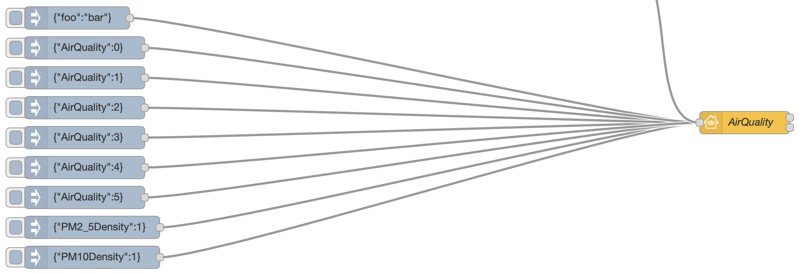
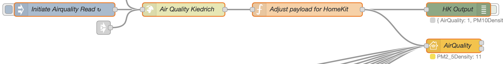
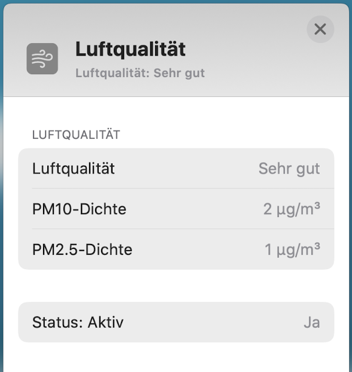



## Basic Principle

This is the simplest example of an Air Quality Sensor item passing the Characteristics value for testing purposes.



Copyable Node-RED flow:

```json
[{"id":"ffa9ddb4.26a9e8","type":"homekit-service","z":"7138f7e3.add4a8","isParent":true,"bridge":"60729d35.03880c","accessoryCategory":"OTHER","parentService":"","name":"AirQuality","serviceName":"AirQualitySensor","topic":"","filter":false,"manufacturer":"Default Manufacturer","model":"Default Model","serialNo":"Default Serial Number","cameraConfigVideoProcessor":"ffmpeg","cameraConfigSource":"","cameraConfigStillImageSource":"","cameraConfigMaxStreams":2,"cameraConfigMaxWidth":1280,"cameraConfigMaxHeight":720,"cameraConfigMaxFPS":10,"cameraConfigMaxBitrate":300,"cameraConfigVideoCodec":"libx264","cameraConfigAudioCodec":"libfdk_aac","cameraConfigAudio":false,"cameraConfigPacketSize":1316,"cameraConfigVerticalFlip":false,"cameraConfigHorizontalFlip":false,"cameraConfigMapVideo":"0:0","cameraConfigMapAudio":"0:1","cameraConfigVideoFilter":"scale=1280:720","cameraConfigAdditionalCommandLine":"-tune zerolatency","cameraConfigDebug":false,"cameraConfigSnapshotOutput":"disabled","characteristicProperties":"{\n   \"AirQuality\" : 0,\n   \"PM2_5Density\" : 1.0,\n   \"PM10Density\" : 2.0,\n   \"StatusActive\" : 1\n}","x":1120,"y":1340,"wires":[[],[]]},{"id":"56a1e83b.c2441","type":"inject","z":"7138f7e3.add4a8","name":"","topic":"","payload":"{\"foo\":\"bar\"}","payloadType":"json","repeat":"","crontab":"","once":false,"onceDelay":0.1,"x":230,"y":1200,"wires":[["ffa9ddb4.26a9e8"]]},{"id":"f9907030.d93868","type":"inject","z":"7138f7e3.add4a8","name":"","topic":"","payload":"{\"AirQuality\":3}","payloadType":"json","repeat":"","crontab":"","once":false,"onceDelay":0.1,"x":240,"y":1360,"wires":[["ffa9ddb4.26a9e8"]]},{"id":"17c07925.fe45a7","type":"inject","z":"7138f7e3.add4a8","name":"","topic":"","payload":"{\"PM2_5Density\":1}","payloadType":"json","repeat":"","crontab":"","once":false,"onceDelay":0.1,"x":250,"y":1480,"wires":[["ffa9ddb4.26a9e8"]]},{"id":"e2706164.e33e5","type":"inject","z":"7138f7e3.add4a8","name":"","topic":"","payload":"{\"PM10Density\":1}","payloadType":"json","repeat":"","crontab":"","once":false,"onceDelay":0.1,"x":250,"y":1520,"wires":[["ffa9ddb4.26a9e8"]]},{"id":"35ca8872.7b877","type":"inject","z":"7138f7e3.add4a8","name":"","topic":"","payload":"{\"AirQuality\":1}","payloadType":"json","repeat":"","crontab":"","once":false,"onceDelay":0.1,"x":240,"y":1280,"wires":[["ffa9ddb4.26a9e8"]]},{"id":"3e5ee1ad.6fd466","type":"inject","z":"7138f7e3.add4a8","name":"","topic":"","payload":"{\"AirQuality\":5}","payloadType":"json","repeat":"","crontab":"","once":false,"onceDelay":0.1,"x":240,"y":1440,"wires":[["ffa9ddb4.26a9e8"]]},{"id":"829b371b.08c6d","type":"inject","z":"7138f7e3.add4a8","name":"","topic":"","payload":"{\"AirQuality\":2}","payloadType":"json","repeat":"","crontab":"","once":false,"onceDelay":0.1,"x":240,"y":1320,"wires":[["ffa9ddb4.26a9e8"]]},{"id":"6b87d568.54d98c","type":"inject","z":"7138f7e3.add4a8","name":"","topic":"","payload":"{\"AirQuality\":0}","payloadType":"json","repeat":"","crontab":"","once":false,"onceDelay":0.1,"x":240,"y":1240,"wires":[["ffa9ddb4.26a9e8"]]},{"id":"e539751f.24eeb","type":"inject","z":"7138f7e3.add4a8","name":"","topic":"","payload":"{\"AirQuality\":4}","payloadType":"json","repeat":"","crontab":"","once":false,"onceDelay":0.1,"x":240,"y":1400,"wires":[["ffa9ddb4.26a9e8"]]},{"id":"60729d35.03880c","type":"homekit-bridge","z":"","bridgeName":"RedMatic-HAP-02","pinCode":"002-01-001","port":"","allowInsecureRequest":false,"manufacturer":"Default Manufacturer","model":"Default Model","serialNo":"Default Serial Number","customMdnsConfig":false,"mdnsMulticast":true,"mdnsInterface":"","mdnsPort":"","mdnsIp":"","mdnsTtl":"","mdnsLoopback":true,"mdnsReuseAddr":true,"allowMessagePassthrough":true}]
```

A value of 4 or 5 for **Air Quality** will trigger a notification on the device running the Home.app.

## Example

Below is a list of examples intended to be copied into your Node-RED system and adapted to your setup:

### Full Featured Air Quality Sensor with real data

This is an example of an Air Quality Sensor captures real-time data from a simple web service using a http-request:



There are a couple of publicly available websites providing real-time data to monitor pollution in publicly available areas. The author of this Wiki has been chosen the service [luftdaten.info](https://luftdaten.info/en/home-en/) for the setup above, a service provided by the OK Lab Stuttgart. The OK Lab Stuttgart is part of the program _Code for Germany_ of the _Open Knowledge Foundation Germany_. The program aims to promote developments in the areas of transparency, Open Data, and Citizen Science.

As such the service is providing a web-based [accessible network](https://deutschland.maps.sensor.community/#6/51.165/10.455) of Air Quality Sensors, distributed across Germany. A few sensors are also located outside of Germany across Europe.

This service is providing real-time values for PM 10 and PM 2.5 particulate density. A URL (e.g. `https://data.sensor.community/airrohr/v1/sensor/{{SENSOR_ID}}/`) can be called by a http request node in Node-RED to retrieve a parsed payload with sensor data, formed as an analyzed JSON-object.

**Update**:~~`http://api.luftdaten.info/v1/sensor/`~~ change to `https://data.sensor.community/airrohr/v1/sensor/`.
\
Copyable Node-RED flow:

```json
[{"id":"cae95a6c.0010d8","type":"inject","z":"7138f7e3.add4a8","name":"Initiate Airquality Read","topic":"","payload":"true","payloadType":"bool","repeat":"1200","crontab":"","once":true,"onceDelay":"10","x":270,"y":1120,"wires":[["8dee64b7.b1cd"]]},{"id":"9f84bead.b2093","type":"debug","z":"7138f7e3.add4a8","name":"HK Output","active":false,"tosidebar":true,"console":false,"tostatus":true,"complete":"payload","targetType":"msg","x":1130,"y":1120,"wires":[]},{"id":"8dee64b7.b1cd","type":"http request","z":"7138f7e3.add4a8","name":"Air Quality Kiedrich","method":"GET","ret":"obj","paytoqs":false,"url":"https://data.sensor.community/airrohr/v1/sensor/23490/","tls":"","persist":false,"proxy":"","authType":"","x":530,"y":1120,"wires":[["3d68d0ef.68703"]],"info":"Source: [Kiedrich](https://luftdaten.info)"},{"id":"3d68d0ef.68703","type":"function","z":"7138f7e3.add4a8","name":"Adjust payload for HomeKit","func":"var hkMsg = {};\n\nvar pm10 = Number(msg.payload[0].sensordatavalues[0].value);\nvar pm2 = Number(msg.payload[0].sensordatavalues[1].value);\nvar airQualityPM10, airQualityPM2, airQuality;\n\n// Banding AirQiality based on US AQI to provide HomeKit Levels\n//   Source: https://aqicn.org/calculator\n\nif (pm10 < 55) {\n    airQualityPM10 = 1;\n} else if (pm10 < 155) {\n    airQualityPM10 = 2\n} else if (pm10 < 255) {\n    airQualityPM10 = 3\n} else if (pm10 < 355) {\n    airQualityPM10 = 4\n} else if (pm10 >= 425) {\n    airQualityPM10 = 5;\n} else {\n  airQualityPM10 = 0;  \n}\n\nif (pm2 < 12) {\n    airQualityPM2 = 1;\n} else if (pm2 < 35.5) {\n    airQualityPM2 = 2\n} else if (pm2 < 55.5) {\n    airQualityPM2 = 3\n} else if (pm2 < 150.5) {\n    airQualityPM2 = 4\n} else if (pm2 >= 250.5) {\n    airQualityPM2 = 5;\n} else {\n  airQualityPM2 = 0;  \n}\n\n// Average airQuality derived from PM2 and PM10\n\nairQuality = (airQualityPM10 + airQualityPM2) / 2;\n\nhkMsg.payload = {\n    \"AirQuality\" : Number(airQuality.toFixed(0)),\n    \"PM10Density\" : pm10,\n    \"PM2_5Density\" : pm2,\n    \"StatusActive\" : 1\n    };\n\nreturn hkMsg;","outputs":1,"noerr":0,"x":800,"y":1120,"wires":[["9f84bead.b2093","ffa9ddb4.26a9e8"]]},{"id":"ffa9ddb4.26a9e8","type":"homekit-service","z":"7138f7e3.add4a8","isParent":true,"bridge":"60729d35.03880c","accessoryCategory":"OTHER","parentService":"","name":"AirQuality","serviceName":"AirQualitySensor","topic":"","filter":false,"manufacturer":"Default Manufacturer","model":"Default Model","serialNo":"Default Serial Number","cameraConfigVideoProcessor":"ffmpeg","cameraConfigSource":"","cameraConfigStillImageSource":"","cameraConfigMaxStreams":2,"cameraConfigMaxWidth":1280,"cameraConfigMaxHeight":720,"cameraConfigMaxFPS":10,"cameraConfigMaxBitrate":300,"cameraConfigVideoCodec":"libx264","cameraConfigAudioCodec":"libfdk_aac","cameraConfigAudio":false,"cameraConfigPacketSize":1316,"cameraConfigVerticalFlip":false,"cameraConfigHorizontalFlip":false,"cameraConfigMapVideo":"0:0","cameraConfigMapAudio":"0:1","cameraConfigVideoFilter":"scale=1280:720","cameraConfigAdditionalCommandLine":"-tune zerolatency","cameraConfigDebug":false,"cameraConfigSnapshotOutput":"disabled","characteristicProperties":"{\n   \"AirQuality\" : 0,\n   \"PM2_5Density\" : 1.0,\n   \"PM10Density\" : 2.0,\n   \"StatusActive\" : 1\n}","x":1120,"y":1200,"wires":[[],[]]},{"id":"60729d35.03880c","type":"homekit-bridge","z":"","bridgeName":"RedMatic-HAP-02","pinCode":"002-01-001","port":"","allowInsecureRequest":false,"manufacturer":"Default Manufacturer","model":"Default Model","serialNo":"Default Serial Number","customMdnsConfig":false,"mdnsMulticast":true,"mdnsInterface":"","mdnsPort":"","mdnsIp":"","mdnsTtl":"","mdnsLoopback":true,"mdnsReuseAddr":true,"allowMessagePassthrough":true}]
```



The PM 10 and PM 2.5 value is directly mapped to the appropriate HomeKit Characteristics value, using a _function node_.

```js
var pm10 = Number(msg.payload[0].sensordatavalues[0].value);
var pm2 = Number(msg.payload[0].sensordatavalues[1].value);

...
hkMsg.payload = {
    "AirQuality" : Number(airQuality.toFixed(0)),
    "PM10Density" : pm10,
    "PM2_5Density" : pm2,
    "StatusActive" : 1
    };
```

A special calculation is applied for the `AirQuality` value itself.
Since the HAP Specification doesn't necessarily dictate _how_ the value has to be calculated it is up to the Accessory to determine the subject assessment of the Air Quality. For the example above the author decide to calculate a mean value derived from the different scales of the PM 10 and PM 2.5 particulate density US AQI scale.

Find more about the [Calculator](https://aqicn.org/calculator).

However, with such a setup you can decide for yourself, whether your windows open/closes automatically based on Air Quality outside. In addition to that, the project encourages you to become part of the network by [building your own](https://luftdaten.info/en/construction-manual/) Air Quality Sensor.

Find more about [US EPA Scale](https://aqicn.org).
