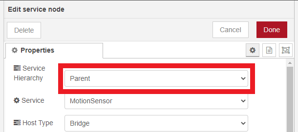
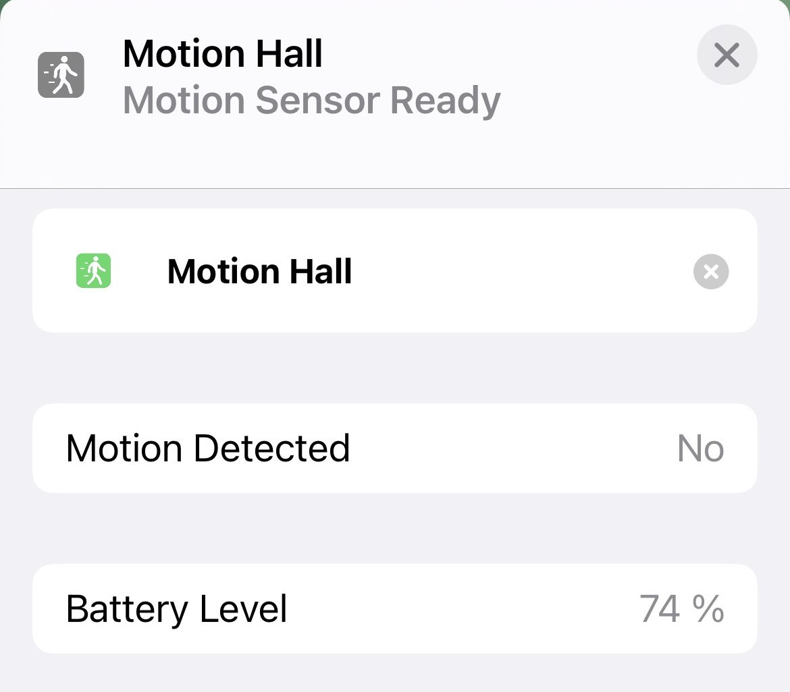

**Note:** This service is to be used as a Linked Service as status of the parent's battery level.


## Creating Battery Service

To display a battery service you must first create a parent service. Motion Sensor for this example.



Next you must create a battery linked service and select parent service used.


### Characteristic Properties

Use the following JSON in your battery characteristic properties so that the Home application displays a `BatteryLevel`, `ChargingState` and `StatusLowBattery`.

```json
{ 
  "BatteryLevel": 100,
  "ChargingState":0,
  "StatusLowBattery":0
}
```
### Example

Here is a screenshot of the Home app.



And a second of the flow used.


Copyable Node-RED flow:

```json
[{"id":"270ea76e9e210579","type":"homekit-service","z":"de6039c4f1b12e14","isParent":true,"hostType":"0","bridge":"5b5f6f73.10106","accessoryId":"","parentService":"","name":"Motion Sensor","serviceName":"MotionSensor","topic":"","filter":false,"manufacturer":"NRCHKB","model":"1.4.2","serialNo":"Default Serial Number","firmwareRev":"1.4.2","hardwareRev":"1.4.2","softwareRev":"1.4.2","cameraConfigVideoProcessor":"ffmpeg","cameraConfigSource":"","cameraConfigStillImageSource":"","cameraConfigMaxStreams":2,"cameraConfigMaxWidth":1280,"cameraConfigMaxHeight":720,"cameraConfigMaxFPS":10,"cameraConfigMaxBitrate":300,"cameraConfigVideoCodec":"libx264","cameraConfigAudioCodec":"libfdk_aac","cameraConfigAudio":false,"cameraConfigPacketSize":1316,"cameraConfigVerticalFlip":false,"cameraConfigHorizontalFlip":false,"cameraConfigMapVideo":"0:0","cameraConfigMapAudio":"0:1","cameraConfigVideoFilter":"scale=1280:720","cameraConfigAdditionalCommandLine":"-tune zerolatency","cameraConfigDebug":false,"cameraConfigSnapshotOutput":"disabled","cameraConfigInterfaceName":"","characteristicProperties":"{\"MotionDetected\":0}","waitForSetupMsg":false,"outputs":2,"x":520,"y":140,"wires":[[],[]]},{"id":"5229300c2735e424","type":"homekit-service","z":"de6039c4f1b12e14","isParent":false,"hostType":"0","bridge":"","accessoryId":"","parentService":"270ea76e9e210579","name":"Motion Sensor' Battery","serviceName":"Battery","topic":"","filter":false,"manufacturer":"NRCHKB","model":"1.4.2","serialNo":"Default Serial Number","firmwareRev":"1.4.2","hardwareRev":"1.4.2","softwareRev":"1.4.2","cameraConfigVideoProcessor":"ffmpeg","cameraConfigSource":"","cameraConfigStillImageSource":"","cameraConfigMaxStreams":2,"cameraConfigMaxWidth":1280,"cameraConfigMaxHeight":720,"cameraConfigMaxFPS":10,"cameraConfigMaxBitrate":300,"cameraConfigVideoCodec":"libx264","cameraConfigAudioCodec":"libfdk_aac","cameraConfigAudio":false,"cameraConfigPacketSize":1316,"cameraConfigVerticalFlip":false,"cameraConfigHorizontalFlip":false,"cameraConfigMapVideo":"0:0","cameraConfigMapAudio":"0:1","cameraConfigVideoFilter":"scale=1280:720","cameraConfigAdditionalCommandLine":"-tune zerolatency","cameraConfigDebug":false,"cameraConfigSnapshotOutput":"disabled","cameraConfigInterfaceName":"","characteristicProperties":"{\"BatteryLevel\":100,\"ChargingState\":0,\"StatusLowBattery\":0}","waitForSetupMsg":false,"outputs":2,"x":540,"y":300,"wires":[[],[]]},{"id":"e9b3d2fc.cdc198","type":"inject","z":"de6039c4f1b12e14","name":"Battery 100%","repeat":"","crontab":"","once":false,"onceDelay":0.1,"topic":"","payload":"{\"BatteryLevel\":100}","payloadType":"json","x":250,"y":300,"wires":[["5229300c2735e424"]]},{"id":"8e8b2d9a.b08f38","type":"inject","z":"de6039c4f1b12e14","name":"Battery 80%","props":[{"p":"payload"},{"p":"topic","vt":"str"}],"repeat":"","crontab":"","once":false,"onceDelay":0.1,"topic":"","payload":"{\"BatteryLevel\":80}","payloadType":"json","x":250,"y":340,"wires":[["5229300c2735e424"]]},{"id":"b28a9d8b.1ebdc8","type":"inject","z":"de6039c4f1b12e14","name":"Battery 50%","props":[{"p":"payload"},{"p":"topic","vt":"str"}],"repeat":"","crontab":"","once":false,"onceDelay":0.1,"topic":"","payload":"{\"BatteryLevel\":50}","payloadType":"json","x":250,"y":380,"wires":[["5229300c2735e424"]]},{"id":"967c2a2c.09ec3","type":"inject","z":"de6039c4f1b12e14","name":"Battery 10%","props":[{"p":"payload"},{"p":"topic","vt":"str"}],"repeat":"","crontab":"","once":false,"onceDelay":0.1,"topic":"","payload":"{\"BatteryLevel\":10}","payloadType":"json","x":250,"y":420,"wires":[["5229300c2735e424"]]},{"id":"2f863d43.01130a","type":"inject","z":"de6039c4f1b12e14","name":"Normal Battery","repeat":"","crontab":"","once":false,"onceDelay":0.1,"topic":"","payload":"{\"StatusLowBattery\":0}","payloadType":"json","x":240,"y":700,"wires":[["5229300c2735e424"]]},{"id":"daab91c1.ceffa","type":"inject","z":"de6039c4f1b12e14","name":"Low Battery","props":[{"p":"payload"},{"p":"topic","vt":"str"}],"repeat":"","crontab":"","once":false,"onceDelay":0.1,"topic":"","payload":"{\"StatusLowBattery\":1}","payloadType":"json","x":250,"y":740,"wires":[["5229300c2735e424"]]},{"id":"664d1272.88338c","type":"inject","z":"de6039c4f1b12e14","name":"Charging","props":[{"p":"payload"},{"p":"topic","vt":"str"}],"repeat":"","crontab":"","once":false,"onceDelay":0.1,"topic":"","payload":"{\"ChargingState\":1}","payloadType":"json","x":260,"y":540,"wires":[["5229300c2735e424"]]},{"id":"e672ec23.6106c8","type":"inject","z":"de6039c4f1b12e14","name":"Not Charging","repeat":"","crontab":"","once":false,"onceDelay":0.1,"topic":"","payload":"{\"ChargingState\":0}","payloadType":"json","x":250,"y":580,"wires":[["5229300c2735e424"]]},{"id":"cb380cba.a506b8","type":"comment","z":"de6039c4f1b12e14","name":"Send Battery Level","info":"","x":230,"y":240,"wires":[]},{"id":"7e840dd2.3c7b04","type":"comment","z":"de6039c4f1b12e14","name":"Set Charging/ Not Charging","info":"","x":200,"y":480,"wires":[]},{"id":"f6e13a0.c08e8c8","type":"comment","z":"de6039c4f1b12e14","name":"Low Battery Warn","info":"","x":230,"y":640,"wires":[]},{"id":"69c53b5d625253c9","type":"inject","z":"de6039c4f1b12e14","name":"No Motion","props":[{"p":"payload"}],"repeat":"","crontab":"","once":false,"onceDelay":0.1,"topic":"","payload":"{\"MotionDetected\":0}","payloadType":"json","x":260,"y":140,"wires":[["270ea76e9e210579"]]},{"id":"9b116214e494c26e","type":"inject","z":"de6039c4f1b12e14","name":"Motion","props":[{"p":"payload"}],"repeat":"","crontab":"","once":false,"onceDelay":0.1,"topic":"","payload":"{\"MotionDetected\":1}","payloadType":"json","x":270,"y":180,"wires":[["270ea76e9e210579"]]},{"id":"6bbc7ad48e2dbb20","type":"comment","z":"de6039c4f1b12e14","name":"Set Motion/ Not Motion","info":"","x":220,"y":80,"wires":[]},{"id":"5b5f6f73.10106","type":"homekit-bridge","bridgeName":"Pont Node-Red","pinCode":"123-45-321","port":"","allowInsecureRequest":true,"manufacturer":"NRCHKB","model":"1.2.0","serialNo":"Raspberry Pi 3 B+","firmwareRev":"1.2.0","hardwareRev":"1.2.0","softwareRev":"1.2.0","customMdnsConfig":false,"mdnsMulticast":true,"mdnsInterface":"","mdnsPort":"","mdnsIp":"","mdnsTtl":"","mdnsLoopback":true,"mdnsReuseAddr":true,"allowMessagePassthrough":true}]
```

## Incompatible Services

Incompatible means that Battery will not attach to Parent and will be displayed as separate Service in Home.app

It is tested that Battery Service cannot be used as Linked for listed Services (in progress):

- [Switch]( "Switch")
