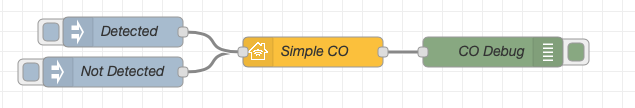
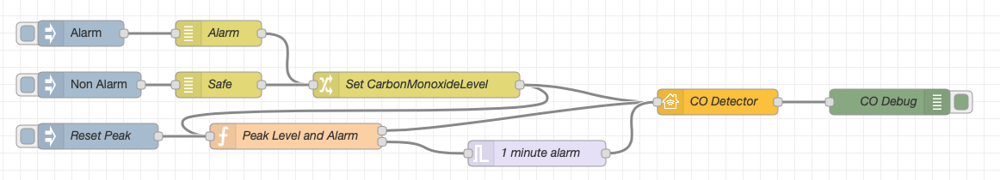



## Basic Principle

This is the simplest example of a CO Sensor item. The input nodes are `Detected` and `Not Detected`.



Copyable Node-RED flow:

```json
[{"id":"ac79f4f4.906df8","type":"homekit-service","z":"54339415.36f384","bridge":"d334490b.40dac","name":"Simple CO","serviceName":"CarbonMonoxideSensor","topic":"","manufacturer":"Default Manufacturer","model":"Default Model","serialNo":"Default Serial Number","characteristicProperties":"{}","x":670,"y":800,"wires":[["933cc1a6.dc8c98"]]},{"id":"7fe97674.cbc19","type":"inject","z":"54339415.36f384","name":"Not Detected","topic":"","payload":"{\"CarbonMonoxideDetected\":0}","payloadType":"json","repeat":"","crontab":"","once":false,"onceDelay":0.1,"x":470,"y":820,"wires":[["ac79f4f4.906df8"]]},{"id":"933cc1a6.dc8c98","type":"debug","z":"54339415.36f384","name":"CO Debug","active":true,"tosidebar":true,"console":false,"tostatus":false,"complete":"payload","x":850,"y":800,"wires":[]},{"id":"3efd37a6.392f78","type":"inject","z":"54339415.36f384","name":"Detected","topic":"","payload":"{\"CarbonMonoxideDetected\":1}","payloadType":"json","repeat":"","crontab":"","once":false,"onceDelay":0.1,"x":480,"y":780,"wires":[["ac79f4f4.906df8"]]},{"id":"d334490b.40dac","type":"homekit-bridge","z":"","bridgeName":"Example Bridge","pinCode":"111-11-111","port":"","allowInsecureRequest":false,"manufacturer":"Default Manufacturer","model":"Default Model","serialNo":"Default Serial Number"}]
```

## Example

Below is a list of examples intended to be copied into your Node-RED system and adapted to your setup:

### Full Featured Carbon Monoxide Sensor

This is an example of a carbon monoxide detector that reports the current amount of carbon monoxide in the air as parts per million (PPM). A threshold level of 35 has been set as the "alarm level". This level was chosen because it is the limit of what OSHA has decided is unsafe for 8 hour exposure. Please adjust to the threshold you would like in your system.

There are three inject nodes in this example:

**The `Alarm` inject node** will cause an alarm to trigger in the Home.app. The flow will cause 2 values to be sent to HomeKit immediately, the `CarbonMonoxideLevel` and `{"CarbonMonoxideDetected":1}`. If the new level is higher than the previous peak level (saved in the function as a context variable) then an additional `CarbonMonoxidePeakLevel` message will be sent. The alarm inject button also starts a 1-minute timer before a `{"CarbonMonoxideDetected":0}` message is sent; this message serves to turn off the Home.app alarm.

**The `Non Alarm` inject node** will simply update the `CarbonMonoxideLevel` reported and the `CarbonMonoxidePeakLevel` if it is a new high value since the `Reset` has been pressed. No alarm will be triggered.

**The `Reset` inject node** will send a value of 0 to both `CarbonMonoxideDetected` and `CarbonMonoxidePeakLevel` - used to clear the system after alarms have been dealt with and carbon monoxide sources have been stopped.



Copyable Node-RED flow:

```json
[{"id":"64c75b4e.98b30c","type":"trigger","z":"54339415.36f384","op1":"","op2":"{\"CarbonMonoxideDetected\":0}","op1type":"pay","op2type":"json","duration":"1","extend":true,"units":"min","reset":"","bytopic":"all","name":"1 minute alarm","x":640,"y":640,"wires":[["72bdfc6c.5a604c"]]},{"id":"c756aa6.24b10d8","type":"function","z":"54339415.36f384","name":"Peak Level and Alarm","func":"var co = context.get('co')||0;\nvar NEWco;\nif(msg.payload==\"RESET\"){\n    co=0;\n    context.set('co',co);\n    msg.payload={\"CarbonMonoxidePeakLevel\":co,\"CarbonMonoxideLevel\":co};\n    return [msg,null];\n}\nvar alarm={};\nalarm.payload={\"CarbonMonoxideDetected\":1};\n\nif(msg.payload.CarbonMonoxideLevel){\n    NEWco=msg.payload.CarbonMonoxideLevel;\n    if(NEWco>co){\n        co=NEWco;\n        context.set('co',co);\n        msg.payload={\"CarbonMonoxidePeakLevel\":co};\n    }\n    if(NEWco>=35){\n        return [msg,alarm];\n    } else {\n        return [msg,null];\n    }\n}","outputs":2,"noerr":0,"x":360,"y":620,"wires":[["72bdfc6c.5a604c"],["64c75b4e.98b30c"]]},{"id":"72bdfc6c.5a604c","type":"homekit-service","z":"54339415.36f384","bridge":"d334490b.40dac","name":"CO Detector","serviceName":"CarbonMonoxideSensor","topic":"","manufacturer":"Default Manufacturer","model":"Default Model","serialNo":"Default Serial Number","characteristicProperties":"{}","x":850,"y":580,"wires":[["fea7d8fa.ab258"]]},{"id":"b40fc0e.d2705c","type":"change","z":"54339415.36f384","name":"Set CarbonMonoxideLevel","rules":[{"t":"move","p":"payload","pt":"msg","to":"payload.CarbonMonoxideLevel","tot":"msg"}],"action":"","property":"","from":"","to":"","reg":false,"x":500,"y":560,"wires":[["c756aa6.24b10d8","72bdfc6c.5a604c"]]},{"id":"edf5ddad.07bb","type":"inject","z":"54339415.36f384","name":"Reset Peak","topic":"","payload":"RESET","payloadType":"str","repeat":"","crontab":"","once":false,"onceDelay":0.1,"x":130,"y":620,"wires":[["c756aa6.24b10d8"]]},{"id":"fea7d8fa.ab258","type":"debug","z":"54339415.36f384","name":"CO Debug","active":true,"tosidebar":true,"console":false,"tostatus":false,"complete":"payload","x":1050,"y":580,"wires":[]},{"id":"bfc486e0.5c10f","type":"random","z":"54339415.36f384","name":"Alarm","low":"35","high":"100","inte":"true","property":"payload","x":270,"y":500,"wires":[["b40fc0e.d2705c"]]},{"id":"cbe3274b.6d20c8","type":"random","z":"54339415.36f384","name":"Safe","low":"0","high":"34","inte":"true","property":"payload","x":270,"y":560,"wires":[["b40fc0e.d2705c"]]},{"id":"7411d6ba.d69788","type":"inject","z":"54339415.36f384","name":"","topic":"","payload":"Alarm","payloadType":"str","repeat":"","crontab":"","once":false,"onceDelay":0.1,"x":110,"y":500,"wires":[["bfc486e0.5c10f"]]},{"id":"97e5b66.bc89448","type":"inject","z":"54339415.36f384","name":"","topic":"","payload":"Non Alarm","payloadType":"str","repeat":"","crontab":"","once":false,"onceDelay":0.1,"x":120,"y":560,"wires":[["cbe3274b.6d20c8"]]},{"id":"d334490b.40dac","type":"homekit-bridge","z":"","bridgeName":"Example Bridge","pinCode":"111-11-111","port":"","allowInsecureRequest":false,"manufacturer":"Default Manufacturer","model":"Default Model","serialNo":"Default Serial Number"}]
```
