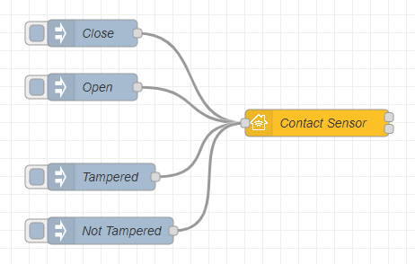
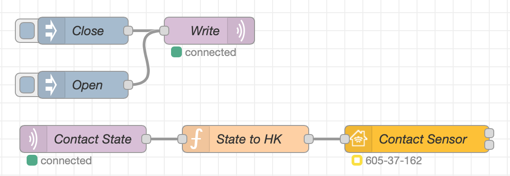
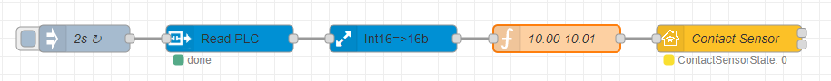

## Basic principle

This is the simplest example of a Contact Sensor item. The input nodes are `Open`, `Close`, `Tampered` and `Not Tampered`.



Copyable Node-RED flow:

```json
[{"id":"d666fb54ed871feb","type":"inject","z":"12e297aed19dd6f4","name":"Close","props":[{"p":"payload"}],"repeat":"","crontab":"","once":false,"onceDelay":"0.5","topic":"","payload":"{\"ContactSensorState\":0}","payloadType":"json","x":170,"y":60,"wires":[["9e486680d55835a5"]]},{"id":"9e486680d55835a5","type":"homekit-service","z":"12e297aed19dd6f4","isParent":true,"hostType":"0","bridge":"5b5f6f73.10106","accessoryId":"","parentService":"","name":"Contact Sensor","serviceName":"ContactSensor","topic":"","filter":false,"manufacturer":"NRCHKB","model":"1.2.0","serialNo":"Default Serial Number","firmwareRev":"1.2.0","hardwareRev":"1.2.0","softwareRev":"1.2.0","cameraConfigVideoProcessor":"ffmpeg","cameraConfigSource":"","cameraConfigStillImageSource":"","cameraConfigMaxStreams":2,"cameraConfigMaxWidth":1280,"cameraConfigMaxHeight":720,"cameraConfigMaxFPS":10,"cameraConfigMaxBitrate":300,"cameraConfigVideoCodec":"libx264","cameraConfigAudioCodec":"libfdk_aac","cameraConfigAudio":false,"cameraConfigPacketSize":1316,"cameraConfigVerticalFlip":false,"cameraConfigHorizontalFlip":false,"cameraConfigMapVideo":"0:0","cameraConfigMapAudio":"0:1","cameraConfigVideoFilter":"scale=1280:720","cameraConfigAdditionalCommandLine":"-tune zerolatency","cameraConfigDebug":false,"cameraConfigSnapshotOutput":"disabled","cameraConfigInterfaceName":"","characteristicProperties":"{\"ContactSensorState\":0,\"StatusTampered\":false}","waitForSetupMsg":false,"outputs":2,"x":420,"y":160,"wires":[[],[]]},{"id":"af920b06516e5680","type":"inject","z":"12e297aed19dd6f4","name":"Open","props":[{"p":"payload"}],"repeat":"","crontab":"","once":false,"onceDelay":"0.5","topic":"","payload":"{\"ContactSensorState\":1}","payloadType":"json","x":170,"y":120,"wires":[["9e486680d55835a5"]]},{"id":"8e6cbaee4b087ccb","type":"inject","z":"12e297aed19dd6f4","name":"Tampered","props":[{"p":"payload"}],"repeat":"","crontab":"","once":false,"onceDelay":"0.5","topic":"","payload":"{\"StatusTampered\":true}","payloadType":"json","x":180,"y":220,"wires":[["9e486680d55835a5"]]},{"id":"5bd9bdfeb5c1e653","type":"inject","z":"12e297aed19dd6f4","name":"Not Tampered","props":[{"p":"payload"}],"repeat":"","crontab":"","once":false,"onceDelay":"0.5","topic":"","payload":"{\"StatusTampered\":false}","payloadType":"json","x":190,"y":280,"wires":[["9e486680d55835a5"]]},{"id":"5b5f6f73.10106","type":"homekit-bridge","bridgeName":"Pont Node-Red","pinCode":"123-45-321","port":"","allowInsecureRequest":true,"manufacturer":"NRCHKB","model":"1.2.0","serialNo":"Raspberry Pi 3 B+","firmwareRev":"1.2.0","hardwareRev":"1.2.0","softwareRev":"1.2.0","customMdnsConfig":false,"mdnsMulticast":true,"mdnsInterface":"","mdnsPort":"","mdnsIp":"","mdnsTtl":"","mdnsLoopback":true,"mdnsReuseAddr":true,"allowMessagePassthrough":true}]
```

### Characteristic Properties

Use the following JSON in your Characteristic Properties so that the Home.app displays a Contact Sensor with Status Tampered.

```json
{
  "ContactSensorState": 0,
  "StatusTampered": false
}
```

## Example

Below is a list of examples intended to be copied into your Node-RED system and adapted to your setup:

### MQTT Example

This is an example of a Contact Sensor item. The input nodes are `Open` and `Close`.



Copyable Node-RED flow:

```json
[{"id":"c775950460a1ce62","type":"function","z":"d57f90c91936790e","name":"State to HK","func":"const State = msg.payload.doorcontact_state;\nmsg.payload = {\"ContactSensorState\":State};\nreturn msg;","outputs":1,"noerr":0,"initialize":"","finalize":"","libs":[],"x":330,"y":1760,"wires":[["e655dc58594a534f"]]},{"id":"39f5723c2f8cf9e1","type":"inject","z":"d57f90c91936790e","name":"Close","props":[{"p":"payload"}],"repeat":"","crontab":"","once":false,"onceDelay":"0.5","topic":"","payload":"{\"doorcontact_state\":0}","payloadType":"json","x":150,"y":1640,"wires":[["2fe650548dfb3f03"]]},{"id":"e655dc58594a534f","type":"homekit-service","z":"d57f90c91936790e","isParent":true,"hostType":"0","bridge":"4a2a4fc162440a41","accessoryId":"","parentService":"","name":"Contact Sensor","serviceName":"ContactSensor","topic":"","filter":false,"manufacturer":"NRCHKB","model":"1.2.0","serialNo":"Default Serial Number","firmwareRev":"1.2.0","hardwareRev":"1.2.0","softwareRev":"1.2.0","cameraConfigVideoProcessor":"ffmpeg","cameraConfigSource":"","cameraConfigStillImageSource":"","cameraConfigMaxStreams":2,"cameraConfigMaxWidth":1280,"cameraConfigMaxHeight":720,"cameraConfigMaxFPS":10,"cameraConfigMaxBitrate":300,"cameraConfigVideoCodec":"libx264","cameraConfigAudioCodec":"libfdk_aac","cameraConfigAudio":false,"cameraConfigPacketSize":1316,"cameraConfigVerticalFlip":false,"cameraConfigHorizontalFlip":false,"cameraConfigMapVideo":"0:0","cameraConfigMapAudio":"0:1","cameraConfigVideoFilter":"scale=1280:720","cameraConfigAdditionalCommandLine":"-tune zerolatency","cameraConfigDebug":false,"cameraConfigSnapshotOutput":"disabled","cameraConfigInterfaceName":"","characteristicProperties":"{\"ContactSensorState\":0}","waitForSetupMsg":false,"outputs":2,"x":520,"y":1760,"wires":[[],[]]},{"id":"752e34d9f9bd2c80","type":"inject","z":"d57f90c91936790e","name":"Open","props":[{"p":"payload"}],"repeat":"","crontab":"","once":false,"onceDelay":"0.5","topic":"","payload":"{\"doorcontact_state\":1}","payloadType":"json","x":150,"y":1700,"wires":[["2fe650548dfb3f03"]]},{"id":"03dc40ae4d42b92b","type":"mqtt in","z":"d57f90c91936790e","name":"Contact State","topic":"tele/CONTACT_DOOR/SENSOR","qos":"2","datatype":"auto","broker":"e17954568d0e969f","nl":false,"rap":true,"rh":0,"inputs":0,"x":150,"y":1760,"wires":[["c775950460a1ce62"]]},{"id":"2fe650548dfb3f03","type":"mqtt out","z":"d57f90c91936790e","name":"Write","topic":"tele/CONTACT_DOOR/SENSOR","qos":"","retain":"","respTopic":"","contentType":"","userProps":"","correl":"","expiry":"","broker":"e17954568d0e969f","x":290,"y":1640,"wires":[]},{"id":"4a2a4fc162440a41","type":"homekit-bridge","bridgeName":"Bridge Node-RED","pinCode":"605-37-162","port":"","advertiser":"ciao","allowInsecureRequest":false,"manufacturer":"NRCHKB","model":"1.4.3","serialNo":"Default Serial Number","firmwareRev":"1.4.3","hardwareRev":"1.4.3","softwareRev":"1.4.3","customMdnsConfig":false,"mdnsMulticast":true,"mdnsInterface":"","mdnsPort":"","mdnsIp":"","mdnsTtl":"","mdnsLoopback":true,"mdnsReuseAddr":true,"allowMessagePassthrough":true},{"id":"e17954568d0e969f","type":"mqtt-broker","name":"Mosquitto","broker":"localhost","port":"1883","clientid":"","autoConnect":true,"usetls":false,"protocolVersion":"4","keepalive":"60","cleansession":true,"birthTopic":"","birthQos":"0","birthRetain":"false","birthPayload":"","birthMsg":{},"closeTopic":"","closeQos":"0","closeRetain":"false","closePayload":"","closeMsg":{},"willTopic":"","willQos":"0","willRetain":"false","willPayload":"","willMsg":{},"sessionExpiry":""}]
```

### Implementation with an Omron PLC
<!-- Please leave this example at the bottom of the page -->
This is an example of a Contact Sensor element wired in NO with a safety if the cable is cut.



In this example our PLC address is `CIO10`

Copyable Node-RED flow:

```json
[{"id":"d666fb54ed871feb","type":"inject","z":"12e297aed19dd6f4","name":"2s","props":[{"p":"time","v":"true","vt":"bool"}],"repeat":"2","crontab":"","once":false,"onceDelay":"0.5","topic":"","x":110,"y":60,"wires":[["93b4e6bbe3b1a7b2"]]},{"id":"93b4e6bbe3b1a7b2","type":"FINS Read Multiple","z":"12e297aed19dd6f4","name":"Read PLC","connection":"11b8375b.b1ee31","addressType":"str","address":"CIO10","msgPropertyType":"msg","msgProperty":"CIO_READ","outputFormatType":"signed","outputFormat":"","x":270,"y":60,"wires":[["60edd09485c09cf0"]]},{"id":"60edd09485c09cf0","type":"buffer-parser","z":"12e297aed19dd6f4","name":"Int16=>16b","data":"CIO_READ","dataType":"msg","specification":"spec","specificationType":"ui","items":[{"type":"16bitbe","name":"CIO10","offset":0,"length":1,"offsetbit":0,"scale":"1","mask":""}],"swap1":"","swap2":"","swap3":"","swap1Type":"swap","swap2Type":"swap","swap3Type":"swap","msgProperty":"CIO_READ","msgPropertyType":"str","resultType":"keyvalue","resultTypeType":"output","multipleResult":false,"fanOutMultipleResult":false,"setTopic":true,"outputs":1,"x":450,"y":60,"wires":[["1b23e6a98e61d44c"]]},{"id":"9e486680d55835a5","type":"homekit-service","z":"12e297aed19dd6f4","isParent":true,"hostType":"0","bridge":"5b5f6f73.10106","accessoryId":"","parentService":"","name":"Contact Sensor","serviceName":"ContactSensor","topic":"","filter":false,"manufacturer":"NRCHKB","model":"1.2.0","serialNo":"Default Serial Number","firmwareRev":"1.2.0","hardwareRev":"1.2.0","softwareRev":"1.2.0","cameraConfigVideoProcessor":"ffmpeg","cameraConfigSource":"","cameraConfigStillImageSource":"","cameraConfigMaxStreams":2,"cameraConfigMaxWidth":1280,"cameraConfigMaxHeight":720,"cameraConfigMaxFPS":10,"cameraConfigMaxBitrate":300,"cameraConfigVideoCodec":"libx264","cameraConfigAudioCodec":"libfdk_aac","cameraConfigAudio":false,"cameraConfigPacketSize":1316,"cameraConfigVerticalFlip":false,"cameraConfigHorizontalFlip":false,"cameraConfigMapVideo":"0:0","cameraConfigMapAudio":"0:1","cameraConfigVideoFilter":"scale=1280:720","cameraConfigAdditionalCommandLine":"-tune zerolatency","cameraConfigDebug":false,"cameraConfigSnapshotOutput":"disabled","cameraConfigInterfaceName":"","characteristicProperties":"{\"ContactSensorState\":0,\"StatusTampered\":false}","waitForSetupMsg":false,"outputs":2,"x":820,"y":60,"wires":[[],[]]},{"id":"1b23e6a98e61d44c","type":"function","z":"12e297aed19dd6f4","name":"10.00-10.01","func":"var ContactState = msg.CIO_READ.CIO10[0].bits[0];   //10.00\nvar TamperedState = msg.CIO_READ.CIO10[0].bits[1];  //10.01\n\nmsg = {payload:{\n    \"StatusTampered\":Math.abs(TamperedState -1),\n    \"ContactSensorState\":ContactState\n    }\n};\n\nreturn msg;","outputs":1,"noerr":0,"initialize":"","finalize":"","libs":[],"x":630,"y":60,"wires":[["9e486680d55835a5"]]},{"id":"11b8375b.b1ee31","type":"FINS Connection","name":"PLC","host":"192.168.1.2","port":"9600","MODE":"","MODEType":"CS","protocol":"","protocolType":"udp","ICF":"","DNA":"","DA1":"2","DA2":"","SNA":"","SA1":"20","SA2":"","autoConnect":true},{"id":"5b5f6f73.10106","type":"homekit-bridge","bridgeName":"Bridge Node-Red","pinCode":"605-37-162","port":"","allowInsecureRequest":true,"manufacturer":"NRCHKB","model":"1.2.0","serialNo":"Raspberry Pi 3 B+","firmwareRev":"1.2.0","hardwareRev":"1.2.0","softwareRev":"1.2.0","customMdnsConfig":false,"mdnsMulticast":true,"mdnsInterface":"","mdnsPort":"","mdnsIp":"","mdnsTtl":"","mdnsLoopback":true,"mdnsReuseAddr":true,"allowMessagePassthrough":true}]
```

Find more about [OMRON PLC in Node-RED]( "OMRON PLC in Node-RED")
