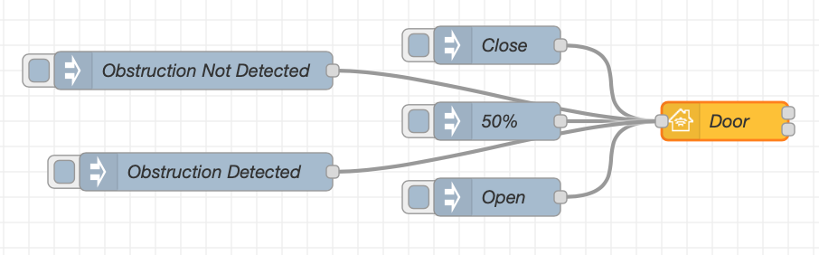



## Precaution

Door can be dangerous because it can damage your systeme.
This is why it is advisable to have at least 3 sensors:

* Door fully Opened
* Door fully Closed
* Obstruction Sensor

Button inside to open it manually also is optional.



## Basic principle

This is the simplest example of a Door item. The input nodes are `Open`, `50%`, `Close`, `Obstruction Detected` and `Obstruction Not Detected`.



Copyable Node-RED flow:

```json
[{"id":"a89064dcd9fe30fc","type":"inject","z":"d57f90c91936790e","name":"Close","props":[{"p":"payload"}],"repeat":"","crontab":"","once":false,"onceDelay":0.1,"topic":"","payload":"{\"TargetPosition\":0}","payloadType":"json","x":510,"y":2320,"wires":[["f63844ce6df26dca"]]},{"id":"f63844ce6df26dca","type":"homekit-service","z":"d57f90c91936790e","isParent":true,"hostType":"0","bridge":"4a2a4fc162440a41","accessoryId":"","parentService":"","name":"Door","serviceName":"Door","topic":"","filter":false,"manufacturer":"NRCHKB","model":"1.4.3","serialNo":"Default Serial Number","firmwareRev":"1.4.3","hardwareRev":"1.4.3","softwareRev":"1.4.3","cameraConfigVideoProcessor":"ffmpeg","cameraConfigSource":"","cameraConfigStillImageSource":"","cameraConfigMaxStreams":2,"cameraConfigMaxWidth":1280,"cameraConfigMaxHeight":720,"cameraConfigMaxFPS":10,"cameraConfigMaxBitrate":300,"cameraConfigVideoCodec":"libx264","cameraConfigAudioCodec":"libfdk_aac","cameraConfigAudio":false,"cameraConfigPacketSize":1316,"cameraConfigVerticalFlip":false,"cameraConfigHorizontalFlip":false,"cameraConfigMapVideo":"0:0","cameraConfigMapAudio":"0:1","cameraConfigVideoFilter":"scale=1280:720","cameraConfigAdditionalCommandLine":"-tune zerolatency","cameraConfigDebug":false,"cameraConfigSnapshotOutput":"disabled","cameraConfigInterfaceName":"","characteristicProperties":"{\"CurrentPosition\":0,\"ObstructionDetected\":0,\"PositionState\":0,\"TargetPosition\":0}","waitForSetupMsg":false,"outputs":2,"x":690,"y":2380,"wires":[[],[]]},{"id":"d5d18f10f171b60c","type":"inject","z":"d57f90c91936790e","name":"50%","props":[{"p":"payload"}],"repeat":"","crontab":"","once":false,"onceDelay":0.1,"topic":"","payload":"{\"TargetPosition\":50}","payloadType":"json","x":510,"y":2380,"wires":[["f63844ce6df26dca"]]},{"id":"b79f52691308bc7e","type":"inject","z":"d57f90c91936790e","name":"Open","props":[{"p":"payload"}],"repeat":"","crontab":"","once":false,"onceDelay":0.1,"topic":"","payload":"{\"TargetPosition\":100}","payloadType":"json","x":510,"y":2440,"wires":[["f63844ce6df26dca"]]},{"id":"a4753a173a46f3c2","type":"inject","z":"d57f90c91936790e","name":"Obstruction Not Detected","props":[{"p":"payload"}],"repeat":"","crontab":"","once":false,"onceDelay":0.1,"topic":"","payload":"{\"ObstructionDetected\":0}","payloadType":"json","x":270,"y":2340,"wires":[["f63844ce6df26dca"]]},{"id":"1dd47b920c166830","type":"inject","z":"d57f90c91936790e","name":"Obstruction Detected","props":[{"p":"payload"}],"repeat":"","crontab":"","once":false,"onceDelay":0.1,"topic":"","payload":"{\"ObstructionDetected\":1}","payloadType":"json","x":280,"y":2420,"wires":[["f63844ce6df26dca"]]},{"id":"4a2a4fc162440a41","type":"homekit-bridge","bridgeName":"Bridge Node-RED","pinCode":"605-37-162","port":"","advertiser":"ciao","allowInsecureRequest":false,"manufacturer":"NRCHKB","model":"1.4.3","serialNo":"Default Serial Number","firmwareRev":"1.4.3","hardwareRev":"1.4.3","softwareRev":"1.4.3","customMdnsConfig":false,"mdnsMulticast":true,"mdnsInterface":"","mdnsPort":"","mdnsIp":"","mdnsTtl":"","mdnsLoopback":true,"mdnsReuseAddr":true,"allowMessagePassthrough":true}]
```

### Characteristic Properties

Use the following JSON in your Characteristic Properties so that the Home.app displays a Door with `ObstructionDetected`.

```js
{
    "CurrentPosition": 0,
    "ObstructionDetected": 0,
    "PositionState": 0,
    "TargetPosition": 0
}
```
<!--  Uncomment me when adding an example
## Example

Below is a list of examples intended to be copied into your Node-RED system and adapted to your setup:
-->
