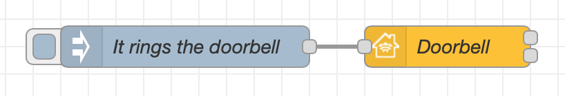
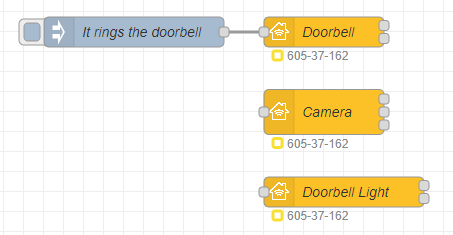

## Basic Principle

This is the simplest example of a doorbell item. The input node is `It rings the doorbell`. When someone rings, you get a notification on all your devices.



Copyable Node-RED flow:

```json
[{"id":"982834fc39a55372","type":"inject","z":"96be518d.693a18","name":"It rings the doorbell","props":[{"p":"payload"}],"repeat":"","crontab":"","once":false,"onceDelay":0.1,"topic":"","payload":"{\"ProgrammableSwitchEvent\":0}","payloadType":"json","x":170,"y":80,"wires":[["51b1b58a56ec5caf"]]},{"id":"51b1b58a56ec5caf","type":"homekit-service","z":"96be518d.693a18","isParent":true,"hostType":"0","bridge":"4a2a4fc162440a41","accessoryId":"","parentService":"","name":"Doorbell","serviceName":"Doorbell","topic":"","filter":false,"manufacturer":"NRCHKB","model":"1.4.3","serialNo":"Default Serial Number","firmwareRev":"1.4.3","hardwareRev":"1.4.3","softwareRev":"1.4.3","cameraConfigVideoProcessor":"ffmpeg","cameraConfigSource":"","cameraConfigStillImageSource":"","cameraConfigMaxStreams":2,"cameraConfigMaxWidth":1280,"cameraConfigMaxHeight":720,"cameraConfigMaxFPS":10,"cameraConfigMaxBitrate":300,"cameraConfigVideoCodec":"libx264","cameraConfigAudioCodec":"libfdk_aac","cameraConfigAudio":false,"cameraConfigPacketSize":1316,"cameraConfigVerticalFlip":false,"cameraConfigHorizontalFlip":false,"cameraConfigMapVideo":"0:0","cameraConfigMapAudio":"0:1","cameraConfigVideoFilter":"scale=1280:720","cameraConfigAdditionalCommandLine":"-tune zerolatency","cameraConfigDebug":false,"cameraConfigSnapshotOutput":"disabled","cameraConfigInterfaceName":"","characteristicProperties":"{}","waitForSetupMsg":false,"outputs":2,"x":360,"y":80,"wires":[[],[]]},{"id":"4a2a4fc162440a41","type":"homekit-bridge","bridgeName":"Bridge Node-RED","pinCode":"605-37-162","port":"","advertiser":"bonjour-hap","allowInsecureRequest":false,"manufacturer":"NRCHKB","model":"1.4.3","serialNo":"Default Serial Number","firmwareRev":"1.4.3","hardwareRev":"1.4.3","softwareRev":"1.4.3","customMdnsConfig":false,"mdnsMulticast":true,"mdnsInterface":"","mdnsPort":"","mdnsIp":"","mdnsTtl":"","mdnsLoopback":true,"mdnsReuseAddr":true,"allowMessagePassthrough":true}]
```

**Note :** An icon with the mention unmanaged appears in the home app. This is due to the fact that a linked service must be added. For example, you can add a light or a camera.

## Example

### Implementation with a Camera and a Light

This example is a doorbell with a Camera and a Light. When someone rings, you get a notification on all your devices as well as a preview of your camera. You will also have the option to view the camera and to turn on the light.



Copyable Node-RED flow:

```json
[{"id":"982834fc39a55372","type":"inject","z":"059c8fe3e80307be","name":"It rings the doorbell","props":[{"p":"payload"}],"repeat":"","crontab":"","once":false,"onceDelay":0.1,"topic":"","payload":"{\"ProgrammableSwitchEvent\":0}","payloadType":"json","x":190,"y":100,"wires":[["51b1b58a56ec5caf"]]},{"id":"51b1b58a56ec5caf","type":"homekit-service","z":"059c8fe3e80307be","isParent":true,"hostType":"0","bridge":"4a2a4fc162440a41","accessoryId":"","parentService":"","name":"Doorbell","serviceName":"Doorbell","topic":"","filter":false,"manufacturer":"NRCHKB","model":"1.4.3","serialNo":"Default Serial Number","firmwareRev":"1.4.3","hardwareRev":"1.4.3","softwareRev":"1.4.3","cameraConfigVideoProcessor":"ffmpeg","cameraConfigSource":"","cameraConfigStillImageSource":"","cameraConfigMaxStreams":2,"cameraConfigMaxWidth":1280,"cameraConfigMaxHeight":720,"cameraConfigMaxFPS":10,"cameraConfigMaxBitrate":300,"cameraConfigVideoCodec":"libx264","cameraConfigAudioCodec":"libfdk_aac","cameraConfigAudio":false,"cameraConfigPacketSize":1316,"cameraConfigVerticalFlip":false,"cameraConfigHorizontalFlip":false,"cameraConfigMapVideo":"0:0","cameraConfigMapAudio":"0:1","cameraConfigVideoFilter":"scale=1280:720","cameraConfigAdditionalCommandLine":"-tune zerolatency","cameraConfigDebug":false,"cameraConfigSnapshotOutput":"disabled","cameraConfigInterfaceName":"","characteristicProperties":"{}","waitForSetupMsg":false,"outputs":2,"x":380,"y":100,"wires":[[],[]]},{"id":"d128163b5aa8167c","type":"homekit-service","z":"059c8fe3e80307be","isParent":false,"hostType":"0","bridge":"4a2a4fc162440a41","accessoryId":"","parentService":"51b1b58a56ec5caf","name":"Camera","serviceName":"CameraControl","topic":"","filter":false,"manufacturer":"Default Manufacturer","model":"Default Model","serialNo":"Default Serial Number","firmwareRev":"","hardwareRev":"","softwareRev":"","cameraConfigVideoProcessor":"ffmpeg","cameraConfigSource":"-i rtsp://admin:password@IP address:554/cam/realmonitor?channel=1&subtype=0","cameraConfigStillImageSource":"","cameraConfigMaxStreams":"1","cameraConfigMaxWidth":"1920","cameraConfigMaxHeight":"1080","cameraConfigMaxFPS":"30","cameraConfigMaxBitrate":"300","cameraConfigVideoCodec":"libx264","cameraConfigAudioCodec":"libfdk_aac","cameraConfigAudio":false,"cameraConfigPacketSize":"1316","cameraConfigVerticalFlip":false,"cameraConfigHorizontalFlip":false,"cameraConfigMapVideo":"0:0","cameraConfigMapAudio":"0:1","cameraConfigVideoFilter":"","cameraConfigAdditionalCommandLine":"","cameraConfigDebug":true,"cameraConfigSnapshotOutput":"disabled","cameraConfigInterfaceName":"","characteristicProperties":"{}","waitForSetupMsg":false,"outputs":3,"x":380,"y":180,"wires":[[],[],[]]},{"id":"5ddcad2e932c2ffe","type":"homekit-service","z":"059c8fe3e80307be","isParent":false,"hostType":"0","bridge":"4a2a4fc162440a41","accessoryId":"","parentService":"51b1b58a56ec5caf","name":"Doorbell Light","serviceName":"Lightbulb","topic":"","filter":false,"manufacturer":"NRCHKB","model":"1.4.2","serialNo":"Default Serial Number","firmwareRev":"1.4.2","hardwareRev":"1.4.2","softwareRev":"1.4.2","cameraConfigVideoProcessor":"ffmpeg","cameraConfigSource":"","cameraConfigStillImageSource":"","cameraConfigMaxStreams":2,"cameraConfigMaxWidth":1280,"cameraConfigMaxHeight":720,"cameraConfigMaxFPS":10,"cameraConfigMaxBitrate":300,"cameraConfigVideoCodec":"libx264","cameraConfigAudioCodec":"libfdk_aac","cameraConfigAudio":false,"cameraConfigPacketSize":1316,"cameraConfigVerticalFlip":false,"cameraConfigHorizontalFlip":false,"cameraConfigMapVideo":"0:0","cameraConfigMapAudio":"0:1","cameraConfigVideoFilter":"scale=1280:720","cameraConfigAdditionalCommandLine":"-tune zerolatency","cameraConfigDebug":false,"cameraConfigSnapshotOutput":"disabled","cameraConfigInterfaceName":"","characteristicProperties":"{}","waitForSetupMsg":false,"outputs":2,"x":400,"y":260,"wires":[[],[]]},{"id":"4a2a4fc162440a41","type":"homekit-bridge","bridgeName":"Bridge Node-RED","pinCode":"605-37-162","port":"","advertiser":"bonjour-hap","allowInsecureRequest":false,"manufacturer":"NRCHKB","model":"1.4.3","serialNo":"Default Serial Number","firmwareRev":"1.4.3","hardwareRev":"1.4.3","softwareRev":"1.4.3","customMdnsConfig":false,"mdnsMulticast":true,"mdnsInterface":"","mdnsPort":"","mdnsIp":"","mdnsTtl":"","mdnsLoopback":true,"mdnsReuseAddr":true,"allowMessagePassthrough":true}]
```

**Note :** For more information, you can visit the following sites [RTSP URL Example](https://www.getscw.com/decoding/rtsp) and [Camera Configuration]( "Camera Control").
