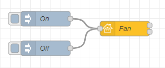
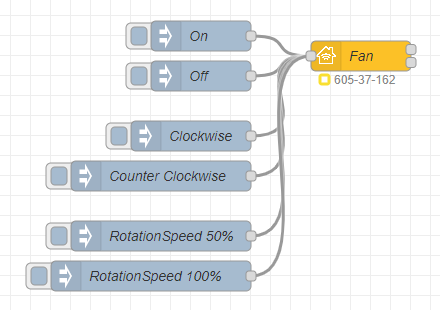

## Basic Principle

This is the simplest example of a fan item. The input nodes are `On` and `Off`.



Copyable Node-RED flow:

```json
[{"id":"f5962036c6aca6ef","type":"homekit-service","z":"88f2be491d2251c8","isParent":true,"hostType":"0","bridge":"4a2a4fc162440a41","accessoryId":"","parentService":"","name":"Fan","serviceName":"Fan","topic":"","filter":false,"manufacturer":"NRCHKB","model":"1.4.2","serialNo":"Default Serial Number","firmwareRev":"1.4.2","hardwareRev":"1.4.2","softwareRev":"1.4.2","cameraConfigVideoProcessor":"ffmpeg","cameraConfigSource":"","cameraConfigStillImageSource":"","cameraConfigMaxStreams":2,"cameraConfigMaxWidth":1280,"cameraConfigMaxHeight":720,"cameraConfigMaxFPS":10,"cameraConfigMaxBitrate":300,"cameraConfigVideoCodec":"libx264","cameraConfigAudioCodec":"libfdk_aac","cameraConfigAudio":false,"cameraConfigPacketSize":1316,"cameraConfigVerticalFlip":false,"cameraConfigHorizontalFlip":false,"cameraConfigMapVideo":"0:0","cameraConfigMapAudio":"0:1","cameraConfigVideoFilter":"scale=1280:720","cameraConfigAdditionalCommandLine":"-tune zerolatency","cameraConfigDebug":false,"cameraConfigSnapshotOutput":"disabled","cameraConfigInterfaceName":"","characteristicProperties":"{}","waitForSetupMsg":false,"outputs":2,"x":290,"y":180,"wires":[[],[]]},{"id":"ec6d38fa2aa0211f","type":"inject","z":"88f2be491d2251c8","name":"On","props":[{"p":"payload"}],"repeat":"","crontab":"","once":false,"onceDelay":0.1,"topic":"","payload":"{\"On\":1}","payloadType":"json","x":130,"y":160,"wires":[["f5962036c6aca6ef"]]},{"id":"54de2c93c1ec5477","type":"inject","z":"88f2be491d2251c8","name":"Off","props":[{"p":"payload"}],"repeat":"","crontab":"","once":false,"onceDelay":0.1,"topic":"","payload":"{\"On\":0}","payloadType":"json","x":130,"y":220,"wires":[["f5962036c6aca6ef"]]},{"id":"4a2a4fc162440a41","type":"homekit-bridge","bridgeName":"Bridge Node-RED","pinCode":"605-37-162","port":"","advertiser":"bonjour-hap","allowInsecureRequest":false,"manufacturer":"NRCHKB","model":"1.4.3","serialNo":"Default Serial Number","firmwareRev":"1.4.3","hardwareRev":"1.4.3","softwareRev":"1.4.3","customMdnsConfig":false,"mdnsMulticast":true,"mdnsInterface":"","mdnsPort":"","mdnsIp":"","mdnsTtl":"","mdnsLoopback":true,"mdnsReuseAddr":true,"allowMessagePassthrough":true}]
```

### Characteristic Properties

Use the following JSON in your characteristic properties so that the Home application displays a fan with `RotationDirection` and `RotationSpeed`.



```json
{
    "RotationDirection": {
        "minValue": 0,
        "maxValue": 1
    },
    "RotationSpeed": {
        "minValue": 0,
        "maxValue": 100
    }
}
```

Copyable Node-RED flow:

```json
[{"id":"f5962036c6aca6ef","type":"homekit-service","z":"88f2be491d2251c8","isParent":true,"hostType":"0","bridge":"4a2a4fc162440a41","accessoryId":"","parentService":"","name":"Fan","serviceName":"Fan","topic":"","filter":false,"manufacturer":"NRCHKB","model":"1.4.2","serialNo":"Default Serial Number","firmwareRev":"1.4.2","hardwareRev":"1.4.2","softwareRev":"1.4.2","cameraConfigVideoProcessor":"ffmpeg","cameraConfigSource":"","cameraConfigStillImageSource":"","cameraConfigMaxStreams":2,"cameraConfigMaxWidth":1280,"cameraConfigMaxHeight":720,"cameraConfigMaxFPS":10,"cameraConfigMaxBitrate":300,"cameraConfigVideoCodec":"libx264","cameraConfigAudioCodec":"libfdk_aac","cameraConfigAudio":false,"cameraConfigPacketSize":1316,"cameraConfigVerticalFlip":false,"cameraConfigHorizontalFlip":false,"cameraConfigMapVideo":"0:0","cameraConfigMapAudio":"0:1","cameraConfigVideoFilter":"scale=1280:720","cameraConfigAdditionalCommandLine":"-tune zerolatency","cameraConfigDebug":false,"cameraConfigSnapshotOutput":"disabled","cameraConfigInterfaceName":"","characteristicProperties":"{\"RotationDirection\":{\"minValue\":0,\"maxValue\":1},\"RotationSpeed\":{\"minValue\":0,\"maxValue\":100}}","waitForSetupMsg":false,"outputs":2,"x":390,"y":120,"wires":[[],[]]},{"id":"ec6d38fa2aa0211f","type":"inject","z":"88f2be491d2251c8","name":"On","props":[{"p":"payload"}],"repeat":"","crontab":"","once":false,"onceDelay":0.1,"topic":"","payload":"{\"On\":1}","payloadType":"json","x":230,"y":100,"wires":[["f5962036c6aca6ef"]]},{"id":"54de2c93c1ec5477","type":"inject","z":"88f2be491d2251c8","name":"Off","props":[{"p":"payload"}],"repeat":"","crontab":"","once":false,"onceDelay":0.1,"topic":"","payload":"{\"On\":0}","payloadType":"json","x":230,"y":140,"wires":[["f5962036c6aca6ef"]]},{"id":"e8bd84d9808b946c","type":"inject","z":"88f2be491d2251c8","name":"Clockwise","props":[{"p":"payload"}],"repeat":"","crontab":"","once":false,"onceDelay":0.1,"topic":"","payload":"{\"RotationDirection\":0}","payloadType":"json","x":220,"y":200,"wires":[["f5962036c6aca6ef"]]},{"id":"c215fad87763bf08","type":"inject","z":"88f2be491d2251c8","name":"Counter Clockwise","props":[{"p":"payload"}],"repeat":"","crontab":"","once":false,"onceDelay":0.1,"topic":"","payload":"{\"RotationDirection\":1}","payloadType":"json","x":190,"y":240,"wires":[["f5962036c6aca6ef"]]},{"id":"883182190e09a26c","type":"inject","z":"88f2be491d2251c8","name":"RotationSpeed 50%","props":[{"p":"payload"}],"repeat":"","crontab":"","once":false,"onceDelay":0.1,"topic":"","payload":"{\"RotationSpeed\":50}","payloadType":"json","x":190,"y":300,"wires":[["f5962036c6aca6ef"]]},{"id":"989fda230d4b25b7","type":"inject","z":"88f2be491d2251c8","name":"RotationSpeed 100%","props":[{"p":"payload"}],"repeat":"","crontab":"","once":false,"onceDelay":0.1,"topic":"","payload":"{\"RotationSpeed\":100}","payloadType":"json","x":180,"y":340,"wires":[["f5962036c6aca6ef"]]},{"id":"4a2a4fc162440a41","type":"homekit-bridge","bridgeName":"Bridge Node-RED","pinCode":"605-37-162","port":"","advertiser":"bonjour-hap","allowInsecureRequest":false,"manufacturer":"NRCHKB","model":"1.4.3","serialNo":"Default Serial Number","firmwareRev":"1.4.3","hardwareRev":"1.4.3","softwareRev":"1.4.3","customMdnsConfig":false,"mdnsMulticast":true,"mdnsInterface":"","mdnsPort":"","mdnsIp":"","mdnsTtl":"","mdnsLoopback":true,"mdnsReuseAddr":true,"allowMessagePassthrough":true}]
```
