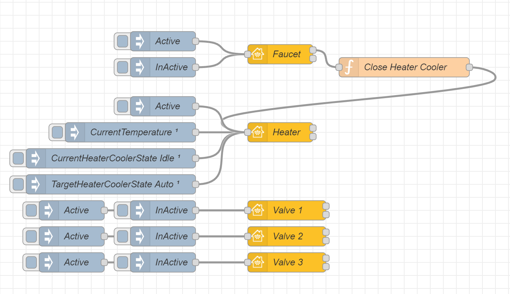

This service must only be included when an accessory has either a linked [Heater Cooler]( "Heater Cooler") with single linked [Valve]( "Valve") service or multiple linked Valve services (with/without Heater Cooler service) to describe water outlets. This service serves as a top level service for such accessories

## Basic principle

This is example of a faucet item. The input nodes are `Open` and `Close`.



Copyable Node-RED flow:

```json
[{"id":"711687f4aec7b87f","type":"homekit-service","z":"96be518d.693a18","isParent":true,"hostType":"0","bridge":"4a2a4fc162440a41","accessoryId":"","parentService":"","name":"Faucet","serviceName":"Faucet","topic":"","filter":false,"manufacturer":"NRCHKB","model":"1.4.3","serialNo":"Default Serial Number","firmwareRev":"1.4.3","hardwareRev":"1.4.3","softwareRev":"1.4.3","cameraConfigVideoProcessor":"ffmpeg","cameraConfigSource":"","cameraConfigStillImageSource":"","cameraConfigMaxStreams":2,"cameraConfigMaxWidth":1280,"cameraConfigMaxHeight":720,"cameraConfigMaxFPS":10,"cameraConfigMaxBitrate":300,"cameraConfigVideoCodec":"libx264","cameraConfigAudioCodec":"libfdk_aac","cameraConfigAudio":false,"cameraConfigPacketSize":1316,"cameraConfigVerticalFlip":false,"cameraConfigHorizontalFlip":false,"cameraConfigMapVideo":"0:0","cameraConfigMapAudio":"0:1","cameraConfigVideoFilter":"scale=1280:720","cameraConfigAdditionalCommandLine":"-tune zerolatency","cameraConfigDebug":false,"cameraConfigSnapshotOutput":"disabled","cameraConfigInterfaceName":"","characteristicProperties":"{}","waitForSetupMsg":false,"outputs":2,"x":310,"y":120,"wires":[[],[]]},{"id":"04c963093073daea","type":"inject","z":"96be518d.693a18","name":"Close","props":[{"p":"payload"}],"repeat":"","crontab":"","once":false,"onceDelay":0.1,"topic":"","payload":"{\"Active\":0}","payloadType":"json","x":130,"y":80,"wires":[["711687f4aec7b87f"]]},{"id":"a6cd9bf2c6c16195","type":"inject","z":"96be518d.693a18","name":"Open","props":[{"p":"payload"}],"repeat":"","crontab":"","once":false,"onceDelay":0.1,"topic":"","payload":"{\"Active\":1}","payloadType":"json","x":130,"y":160,"wires":[["711687f4aec7b87f"]]},{"id":"4a2a4fc162440a41","type":"homekit-bridge","bridgeName":"Bridge Node-RED","pinCode":"605-37-162","port":"","advertiser":"bonjour-hap","allowInsecureRequest":false,"manufacturer":"NRCHKB","model":"1.4.3","serialNo":"Default Serial Number","firmwareRev":"1.4.3","hardwareRev":"1.4.3","softwareRev":"1.4.3","customMdnsConfig":false,"mdnsMulticast":true,"mdnsInterface":"","mdnsPort":"","mdnsIp":"","mdnsTtl":"","mdnsLoopback":true,"mdnsReuseAddr":true,"allowMessagePassthrough":true}]
```
