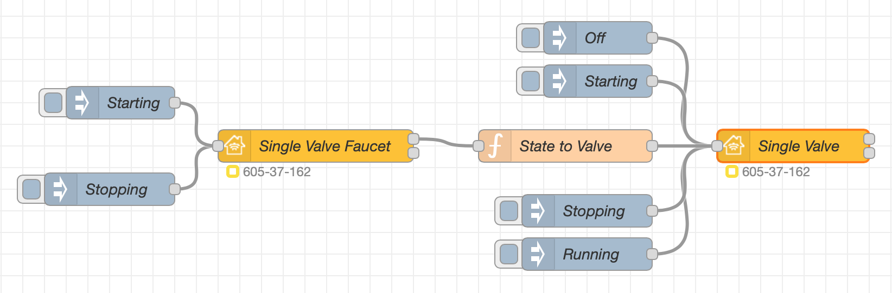
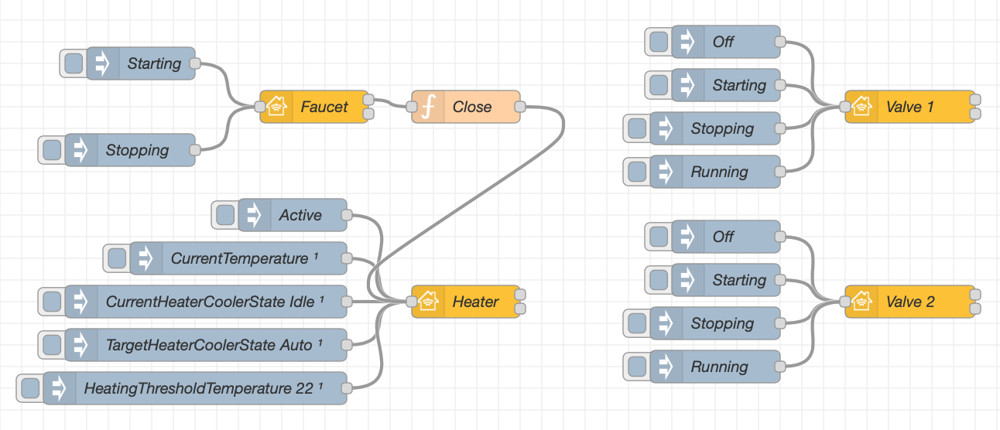

This service must only be included when an accessory has either a linked [Heater Cooler]( "Heater Cooler") with single linked [Valve]( "Valve") service or multiple linked Valve services (with/without Heater Cooler service) to describe water outlets. This service serves as a top level service for such accessories

## Status Icon

Depending on the cirumstances Faucet will present different status in Home.app:

| Faucet - Linked Valves | Home.app Shows |
| --- | --- |
| `{"Active":0}` - `{"InUse":0}` |  |
| `{"Active":1}` - If all `{"InUse":0}` |  |
| `{"Active":1}` - If any `{"InUse":1}` |  |
| `{"Active":0}` - If any `{"InUse":1}` |  |

## Basic principle

This is example of a faucet item with heater and multiple valves.



Copyable Node-RED flow:

```json
[{"id":"3288f6947422b693","type":"homekit-service","z":"677ab7b023898f3c","isParent":true,"hostType":"0","bridge":"4a2a4fc162440a41","accessoryId":"","parentService":"","name":"Single Valve Faucet","serviceName":"Faucet","topic":"","filter":false,"manufacturer":"NRCHKB","model":"1.4.3","serialNo":"Default Serial Number","firmwareRev":"1.4.3","hardwareRev":"1.4.3","softwareRev":"1.4.3","cameraConfigVideoProcessor":"ffmpeg","cameraConfigSource":"","cameraConfigStillImageSource":"","cameraConfigMaxStreams":2,"cameraConfigMaxWidth":1280,"cameraConfigMaxHeight":720,"cameraConfigMaxFPS":10,"cameraConfigMaxBitrate":300,"cameraConfigVideoCodec":"libx264","cameraConfigAudioCodec":"libfdk_aac","cameraConfigAudio":false,"cameraConfigPacketSize":1316,"cameraConfigVerticalFlip":false,"cameraConfigHorizontalFlip":false,"cameraConfigMapVideo":"0:0","cameraConfigMapAudio":"0:1","cameraConfigVideoFilter":"scale=1280:720","cameraConfigAdditionalCommandLine":"-tune zerolatency","cameraConfigDebug":false,"cameraConfigSnapshotOutput":"disabled","cameraConfigInterfaceName":"","characteristicProperties":"{}","waitForSetupMsg":false,"outputs":2,"x":1030,"y":780,"wires":[[],[]]},{"id":"0e1576b865e502fb","type":"inject","z":"677ab7b023898f3c","name":"InActive","props":[{"p":"payload"}],"repeat":"","crontab":"","once":false,"onceDelay":0.1,"topic":"","payload":"{\"Active\":0}","payloadType":"json","x":810,"y":800,"wires":[["3288f6947422b693"]]},{"id":"f7d602ae4a658eb4","type":"inject","z":"677ab7b023898f3c","name":"Active","props":[{"p":"payload"}],"repeat":"","crontab":"","once":false,"onceDelay":0.1,"topic":"","payload":"{\"Active\":1}","payloadType":"json","x":810,"y":760,"wires":[["3288f6947422b693"]]},{"id":"1bdfd569e98740bf","type":"homekit-service","z":"677ab7b023898f3c","isParent":false,"hostType":"0","bridge":"","accessoryId":"","parentService":"3288f6947422b693","name":"Single Valve","serviceName":"Valve","topic":"","filter":false,"manufacturer":"NRCHKB","model":"1.4.3","serialNo":"Default Serial Number","firmwareRev":"1.4.3","hardwareRev":"1.4.3","softwareRev":"1.4.3","cameraConfigVideoProcessor":"ffmpeg","cameraConfigSource":"","cameraConfigStillImageSource":"","cameraConfigMaxStreams":2,"cameraConfigMaxWidth":1280,"cameraConfigMaxHeight":720,"cameraConfigMaxFPS":10,"cameraConfigMaxBitrate":300,"cameraConfigVideoCodec":"libx264","cameraConfigAudioCodec":"libfdk_aac","cameraConfigAudio":false,"cameraConfigPacketSize":1316,"cameraConfigVerticalFlip":false,"cameraConfigHorizontalFlip":false,"cameraConfigMapVideo":"0:0","cameraConfigMapAudio":"0:1","cameraConfigVideoFilter":"scale=1280:720","cameraConfigAdditionalCommandLine":"-tune zerolatency","cameraConfigDebug":false,"cameraConfigSnapshotOutput":"disabled","cameraConfigInterfaceName":"","characteristicProperties":"{\"Name\":true}","waitForSetupMsg":false,"outputs":2,"x":1010,"y":840,"wires":[[],[]]},{"id":"1c10364eef5d7105","type":"inject","z":"677ab7b023898f3c","name":"InActive","props":[{"p":"payload"}],"repeat":"","crontab":"","once":false,"onceDelay":0.1,"topic":"","payload":"{\"Active\":0}","payloadType":"json","x":530,"y":840,"wires":[["1bdfd569e98740bf"]]},{"id":"5d56c765b35261db","type":"inject","z":"677ab7b023898f3c","name":"Active","props":[{"p":"payload"}],"repeat":"","crontab":"","once":false,"onceDelay":0.1,"topic":"","payload":"{\"Active\":1}","payloadType":"json","x":390,"y":840,"wires":[["1bdfd569e98740bf"]]},{"id":"6c0e2edd43ae6b31","type":"inject","z":"677ab7b023898f3c","name":"InUse 1","props":[{"p":"payload"}],"repeat":"","crontab":"","once":false,"onceDelay":0.1,"topic":"","payload":"{\"InUse\":1}","payloadType":"json","x":670,"y":840,"wires":[["1bdfd569e98740bf"]]},{"id":"56d5bfda010b1362","type":"inject","z":"677ab7b023898f3c","name":"InUse 0","props":[{"p":"payload"}],"repeat":"","crontab":"","once":false,"onceDelay":0.1,"topic":"","payload":"{\"InUse\":0}","payloadType":"json","x":810,"y":840,"wires":[["1bdfd569e98740bf"]]},{"id":"4a2a4fc162440a41","type":"homekit-bridge","bridgeName":"Bridge Node-RED","pinCode":"605-37-162","port":"","advertiser":"ciao","allowInsecureRequest":false,"manufacturer":"NRCHKB","model":"1.4.3","serialNo":"Default Serial Number","firmwareRev":"1.4.3","hardwareRev":"1.4.3","softwareRev":"1.4.3","customMdnsConfig":false,"mdnsMulticast":true,"mdnsInterface":"","mdnsPort":"","mdnsIp":"","mdnsTtl":"","mdnsLoopback":true,"mdnsReuseAddr":true,"allowMessagePassthrough":true}]
```

## Examples

### Faucet with Heater and multiple Valves

This is example of a faucet item with heater and multiple valves.



Copyable Node-RED flow:

```json
[{"id":"677ab7b023898f3c","type":"tab","label":"Flow 1","disabled":false,"info":""},{"id":"711687f4aec7b87f","type":"homekit-service","z":"677ab7b023898f3c","isParent":true,"hostType":"0","bridge":"4a2a4fc162440a41","accessoryId":"","parentService":"23062bc410529e1a","name":"Faucet","serviceName":"Faucet","topic":"","filter":false,"manufacturer":"NRCHKB","model":"1.4.3","serialNo":"Default Serial Number","firmwareRev":"1.4.3","hardwareRev":"1.4.3","softwareRev":"1.4.3","cameraConfigVideoProcessor":"ffmpeg","cameraConfigSource":"","cameraConfigStillImageSource":"","cameraConfigMaxStreams":2,"cameraConfigMaxWidth":1280,"cameraConfigMaxHeight":720,"cameraConfigMaxFPS":10,"cameraConfigMaxBitrate":300,"cameraConfigVideoCodec":"libx264","cameraConfigAudioCodec":"libfdk_aac","cameraConfigAudio":false,"cameraConfigPacketSize":1316,"cameraConfigVerticalFlip":false,"cameraConfigHorizontalFlip":false,"cameraConfigMapVideo":"0:0","cameraConfigMapAudio":"0:1","cameraConfigVideoFilter":"scale=1280:720","cameraConfigAdditionalCommandLine":"-tune zerolatency","cameraConfigDebug":false,"cameraConfigSnapshotOutput":"disabled","cameraConfigInterfaceName":"","characteristicProperties":"{}","waitForSetupMsg":false,"outputs":2,"x":970,"y":240,"wires":[["0bdaa502a99b40a7"],[]]},{"id":"04c963093073daea","type":"inject","z":"677ab7b023898f3c","name":"InActive","props":[{"p":"payload"}],"repeat":"","crontab":"","once":false,"onceDelay":0.1,"topic":"","payload":"{\"Active\":0}","payloadType":"json","x":790,"y":260,"wires":[["711687f4aec7b87f"]]},{"id":"a6cd9bf2c6c16195","type":"inject","z":"677ab7b023898f3c","name":"Active","props":[{"p":"payload"}],"repeat":"","crontab":"","once":false,"onceDelay":0.1,"topic":"","payload":"{\"Active\":1}","payloadType":"json","x":790,"y":220,"wires":[["711687f4aec7b87f"]]},{"id":"23062bc410529e1a","type":"homekit-service","z":"677ab7b023898f3c","isParent":false,"hostType":"0","bridge":"4a2a4fc162440a41","accessoryId":"","parentService":"711687f4aec7b87f","name":"Heater","serviceName":"HeaterCooler","topic":"","filter":false,"manufacturer":"NRCHKB","model":"1.4.3","serialNo":"Default Serial Number","firmwareRev":"1.4.3","hardwareRev":"1.4.3","softwareRev":"1.4.3","cameraConfigVideoProcessor":"ffmpeg","cameraConfigSource":"","cameraConfigStillImageSource":"","cameraConfigMaxStreams":2,"cameraConfigMaxWidth":1280,"cameraConfigMaxHeight":720,"cameraConfigMaxFPS":10,"cameraConfigMaxBitrate":300,"cameraConfigVideoCodec":"libx264","cameraConfigAudioCodec":"libfdk_aac","cameraConfigAudio":false,"cameraConfigPacketSize":1316,"cameraConfigVerticalFlip":false,"cameraConfigHorizontalFlip":false,"cameraConfigMapVideo":"0:0","cameraConfigMapAudio":"0:1","cameraConfigVideoFilter":"scale=1280:720","cameraConfigAdditionalCommandLine":"-tune zerolatency","cameraConfigDebug":false,"cameraConfigSnapshotOutput":"disabled","cameraConfigInterfaceName":"","characteristicProperties":"{\"HeatingThresholdTemperature\":true}","waitForSetupMsg":false,"outputs":2,"x":970,"y":360,"wires":[[],[]]},{"id":"9339f0c70091dfb2","type":"homekit-service","z":"677ab7b023898f3c","isParent":false,"hostType":"0","bridge":"","accessoryId":"","parentService":"711687f4aec7b87f","name":"Valve 1","serviceName":"Valve","topic":"","filter":false,"manufacturer":"NRCHKB","model":"1.4.3","serialNo":"Default Serial Number","firmwareRev":"1.4.3","hardwareRev":"1.4.3","softwareRev":"1.4.3","cameraConfigVideoProcessor":"ffmpeg","cameraConfigSource":"","cameraConfigStillImageSource":"","cameraConfigMaxStreams":2,"cameraConfigMaxWidth":1280,"cameraConfigMaxHeight":720,"cameraConfigMaxFPS":10,"cameraConfigMaxBitrate":300,"cameraConfigVideoCodec":"libx264","cameraConfigAudioCodec":"libfdk_aac","cameraConfigAudio":false,"cameraConfigPacketSize":1316,"cameraConfigVerticalFlip":false,"cameraConfigHorizontalFlip":false,"cameraConfigMapVideo":"0:0","cameraConfigMapAudio":"0:1","cameraConfigVideoFilter":"scale=1280:720","cameraConfigAdditionalCommandLine":"-tune zerolatency","cameraConfigDebug":false,"cameraConfigSnapshotOutput":"disabled","cameraConfigInterfaceName":"","characteristicProperties":"{\"Name\":true}","waitForSetupMsg":false,"outputs":2,"x":980,"y":520,"wires":[[],[]]},{"id":"199154e6e6e7e5b8","type":"homekit-service","z":"677ab7b023898f3c","isParent":false,"hostType":"0","bridge":"","accessoryId":"","parentService":"711687f4aec7b87f","name":"Valve 2","serviceName":"Valve","topic":"","filter":false,"manufacturer":"NRCHKB","model":"1.4.3","serialNo":"Default Serial Number","firmwareRev":"1.4.3","hardwareRev":"1.4.3","softwareRev":"1.4.3","cameraConfigVideoProcessor":"ffmpeg","cameraConfigSource":"","cameraConfigStillImageSource":"","cameraConfigMaxStreams":2,"cameraConfigMaxWidth":1280,"cameraConfigMaxHeight":720,"cameraConfigMaxFPS":10,"cameraConfigMaxBitrate":300,"cameraConfigVideoCodec":"libx264","cameraConfigAudioCodec":"libfdk_aac","cameraConfigAudio":false,"cameraConfigPacketSize":1316,"cameraConfigVerticalFlip":false,"cameraConfigHorizontalFlip":false,"cameraConfigMapVideo":"0:0","cameraConfigMapAudio":"0:1","cameraConfigVideoFilter":"scale=1280:720","cameraConfigAdditionalCommandLine":"-tune zerolatency","cameraConfigDebug":false,"cameraConfigSnapshotOutput":"disabled","cameraConfigInterfaceName":"","characteristicProperties":"{\"Name\":true}","waitForSetupMsg":false,"outputs":2,"x":980,"y":560,"wires":[[],[]]},{"id":"bab79aa96402933a","type":"homekit-service","z":"677ab7b023898f3c","isParent":false,"hostType":"0","bridge":"","accessoryId":"","parentService":"711687f4aec7b87f","name":"Valve 3","serviceName":"Valve","topic":"","filter":false,"manufacturer":"NRCHKB","model":"1.4.3","serialNo":"Default Serial Number","firmwareRev":"1.4.3","hardwareRev":"1.4.3","softwareRev":"1.4.3","cameraConfigVideoProcessor":"ffmpeg","cameraConfigSource":"","cameraConfigStillImageSource":"","cameraConfigMaxStreams":2,"cameraConfigMaxWidth":1280,"cameraConfigMaxHeight":720,"cameraConfigMaxFPS":10,"cameraConfigMaxBitrate":300,"cameraConfigVideoCodec":"libx264","cameraConfigAudioCodec":"libfdk_aac","cameraConfigAudio":false,"cameraConfigPacketSize":1316,"cameraConfigVerticalFlip":false,"cameraConfigHorizontalFlip":false,"cameraConfigMapVideo":"0:0","cameraConfigMapAudio":"0:1","cameraConfigVideoFilter":"scale=1280:720","cameraConfigAdditionalCommandLine":"-tune zerolatency","cameraConfigDebug":false,"cameraConfigSnapshotOutput":"disabled","cameraConfigInterfaceName":"","characteristicProperties":"{\"Name\":true}","waitForSetupMsg":false,"outputs":2,"x":980,"y":600,"wires":[[],[]]},{"id":"20fe0dba62a756a3","type":"inject","z":"677ab7b023898f3c","name":"CurrentTemperature","props":[{"p":"payload"}],"repeat":"","crontab":"","once":true,"onceDelay":"4","topic":"","payload":"{\"CurrentTemperature\":20}","payloadType":"json","x":740,"y":360,"wires":[["23062bc410529e1a"]]},{"id":"b48c5012ec1f3ad1","type":"inject","z":"677ab7b023898f3c","name":"CurrentHeaterCoolerState Idle","props":[{"p":"payload"}],"repeat":"","crontab":"","once":true,"onceDelay":"4","topic":"","payload":"{\"CurrentHeaterCoolerState\":1}","payloadType":"json","x":710,"y":400,"wires":[["23062bc410529e1a"]]},{"id":"1449475b1554d031","type":"inject","z":"677ab7b023898f3c","name":"TargetHeaterCoolerState Auto","props":[{"p":"payload"}],"repeat":"","crontab":"","once":true,"onceDelay":"4","topic":"","payload":"{\"TargetHeaterCoolerState\":0}","payloadType":"json","x":710,"y":440,"wires":[["23062bc410529e1a"]]},{"id":"7204dd883e12ba93","type":"inject","z":"677ab7b023898f3c","name":"InActive","props":[{"p":"payload"}],"repeat":"","crontab":"","once":false,"onceDelay":0.1,"topic":"","payload":"{\"Active\":0}","payloadType":"json","x":510,"y":520,"wires":[["9339f0c70091dfb2"]]},{"id":"d4c47fd5bedd2e8a","type":"inject","z":"677ab7b023898f3c","name":"Active","props":[{"p":"payload"}],"repeat":"","crontab":"","once":false,"onceDelay":0.1,"topic":"","payload":"{\"Active\":1}","payloadType":"json","x":370,"y":520,"wires":[["9339f0c70091dfb2"]]},{"id":"cca65eafe8310fb7","type":"inject","z":"677ab7b023898f3c","name":"InActive","props":[{"p":"payload"}],"repeat":"","crontab":"","once":false,"onceDelay":0.1,"topic":"","payload":"{\"Active\":0}","payloadType":"json","x":510,"y":560,"wires":[["199154e6e6e7e5b8"]]},{"id":"2f31f6bacd6a513c","type":"inject","z":"677ab7b023898f3c","name":"Active","props":[{"p":"payload"}],"repeat":"","crontab":"","once":false,"onceDelay":0.1,"topic":"","payload":"{\"Active\":1}","payloadType":"json","x":370,"y":560,"wires":[["199154e6e6e7e5b8"]]},{"id":"95960955d9a4fb07","type":"inject","z":"677ab7b023898f3c","name":"InActive","props":[{"p":"payload"}],"repeat":"","crontab":"","once":false,"onceDelay":0.1,"topic":"","payload":"{\"Active\":0}","payloadType":"json","x":510,"y":600,"wires":[["bab79aa96402933a"]]},{"id":"797720ae53e7a85f","type":"inject","z":"677ab7b023898f3c","name":"Active","props":[{"p":"payload"}],"repeat":"","crontab":"","once":false,"onceDelay":0.1,"topic":"","payload":"{\"Active\":1}","payloadType":"json","x":370,"y":600,"wires":[["bab79aa96402933a"]]},{"id":"4c05ffa59fc0da4e","type":"inject","z":"677ab7b023898f3c","name":"Active","props":[{"p":"payload"}],"repeat":"","crontab":"","once":false,"onceDelay":0.1,"topic":"","payload":"{\"Active\":1}","payloadType":"json","x":790,"y":320,"wires":[["23062bc410529e1a"]]},{"id":"299ad19d592a6f7a","type":"inject","z":"677ab7b023898f3c","name":"HeatingThresholdTemperature 22","props":[{"p":"payload"}],"repeat":"","crontab":"","once":true,"onceDelay":"4","topic":"","payload":"{\"HeatingThresholdTemperature\":22}","payloadType":"json","x":700,"y":480,"wires":[["23062bc410529e1a"]]},{"id":"0bdaa502a99b40a7","type":"function","z":"677ab7b023898f3c","name":"Close","func":"if (msg.payload.Active == false)\n    return msg;","outputs":1,"noerr":0,"initialize":"","finalize":"","libs":[],"x":1110,"y":240,"wires":[["23062bc410529e1a"]]},{"id":"c8293d3443d74e26","type":"inject","z":"677ab7b023898f3c","name":"InUse 1","props":[{"p":"payload"}],"repeat":"","crontab":"","once":false,"onceDelay":0.1,"topic":"","payload":"{\"InUse\":1}","payloadType":"json","x":650,"y":520,"wires":[["9339f0c70091dfb2"]]},{"id":"441d0392b77451b9","type":"inject","z":"677ab7b023898f3c","name":"InUse 1","props":[{"p":"payload"}],"repeat":"","crontab":"","once":false,"onceDelay":0.1,"topic":"","payload":"{\"InUse\":1}","payloadType":"json","x":650,"y":560,"wires":[["199154e6e6e7e5b8"]]},{"id":"7c2ecf70b96a02cb","type":"inject","z":"677ab7b023898f3c","name":"InUse 1","props":[{"p":"payload"}],"repeat":"","crontab":"","once":false,"onceDelay":0.1,"topic":"","payload":"{\"InUse\":1}","payloadType":"json","x":650,"y":600,"wires":[["bab79aa96402933a"]]},{"id":"e85117c7b94aeb73","type":"inject","z":"677ab7b023898f3c","name":"InUse 0","props":[{"p":"payload"}],"repeat":"","crontab":"","once":false,"onceDelay":0.1,"topic":"","payload":"{\"InUse\":0}","payloadType":"json","x":790,"y":520,"wires":[["9339f0c70091dfb2"]]},{"id":"46971df321a4c307","type":"inject","z":"677ab7b023898f3c","name":"InUse 0","props":[{"p":"payload"}],"repeat":"","crontab":"","once":false,"onceDelay":0.1,"topic":"","payload":"{\"InUse\":0}","payloadType":"json","x":790,"y":560,"wires":[["199154e6e6e7e5b8"]]},{"id":"e0127ea402dbc41f","type":"inject","z":"677ab7b023898f3c","name":"InUse 0","props":[{"p":"payload"}],"repeat":"","crontab":"","once":false,"onceDelay":0.1,"topic":"","payload":"{\"InUse\":0}","payloadType":"json","x":790,"y":600,"wires":[["bab79aa96402933a"]]},{"id":"4a2a4fc162440a41","type":"homekit-bridge","bridgeName":"Bridge Node-RED","pinCode":"605-37-162","port":"","advertiser":"ciao","allowInsecureRequest":false,"manufacturer":"NRCHKB","model":"1.4.3","serialNo":"Default Serial Number","firmwareRev":"1.4.3","hardwareRev":"1.4.3","softwareRev":"1.4.3","customMdnsConfig":false,"mdnsMulticast":true,"mdnsInterface":"","mdnsPort":"","mdnsIp":"","mdnsTtl":"","mdnsLoopback":true,"mdnsReuseAddr":true,"allowMessagePassthrough":true}]
```

> **Notice,** that this example is not implementing all required logic. It just simply shows basics around the Service.
