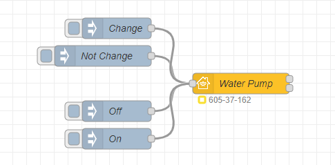
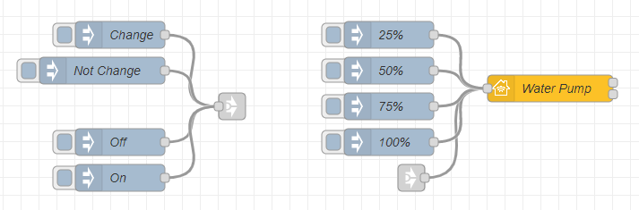

## Basic Principle

This is the simplest example of an Outlet (to which a pump is plugged) with a Filter Maintenance status. The input nodes are `On`, `Off`, `Change` and `Not Change`.



Copyable Node-RED flow:

```json
[{"id":"8bb803321ac62548","type":"inject","z":"f9fac0fe04fe754d","name":"Off","props":[{"p":"payload"}],"repeat":"","crontab":"","once":false,"onceDelay":0.1,"topic":"","payload":"{\"On\":0}","payloadType":"json","x":190,"y":200,"wires":[["9d977e31ec264823"]]},{"id":"f71fffffb206233b","type":"inject","z":"f9fac0fe04fe754d","name":"On","props":[{"p":"payload"}],"repeat":"","crontab":"","once":false,"onceDelay":0.1,"topic":"","payload":"{\"On\":1}","payloadType":"json","x":190,"y":240,"wires":[["9d977e31ec264823"]]},{"id":"9d977e31ec264823","type":"homekit-service","z":"f9fac0fe04fe754d","isParent":true,"hostType":"0","bridge":"4a2a4fc162440a41","accessoryId":"","parentService":"","name":"Water Pump","serviceName":"Outlet","topic":"","filter":false,"manufacturer":"NRCHKB","model":"1.4.3","serialNo":"Default Serial Number","firmwareRev":"1.4.3","hardwareRev":"1.4.3","softwareRev":"1.4.3","cameraConfigVideoProcessor":"ffmpeg","cameraConfigSource":"","cameraConfigStillImageSource":"","cameraConfigMaxStreams":2,"cameraConfigMaxWidth":1280,"cameraConfigMaxHeight":720,"cameraConfigMaxFPS":10,"cameraConfigMaxBitrate":300,"cameraConfigVideoCodec":"libx264","cameraConfigAudioCodec":"libfdk_aac","cameraConfigAudio":false,"cameraConfigPacketSize":1316,"cameraConfigVerticalFlip":false,"cameraConfigHorizontalFlip":false,"cameraConfigMapVideo":"0:0","cameraConfigMapAudio":"0:1","cameraConfigVideoFilter":"scale=1280:720","cameraConfigAdditionalCommandLine":"-tune zerolatency","cameraConfigDebug":false,"cameraConfigSnapshotOutput":"disabled","cameraConfigInterfaceName":"","characteristicProperties":"{\"FilterChangeIndication\":0}","waitForSetupMsg":false,"outputs":2,"x":370,"y":160,"wires":[[],[]]},{"id":"07a5fd84d433963d","type":"inject","z":"f9fac0fe04fe754d","name":"Not Change","props":[{"p":"payload"}],"repeat":"","crontab":"","once":false,"onceDelay":0.1,"topic":"","payload":"{\"FilterChangeIndication\":0}","payloadType":"json","x":170,"y":140,"wires":[["9d977e31ec264823"]]},{"id":"328873aaaeca0189","type":"inject","z":"f9fac0fe04fe754d","name":"Change","props":[{"p":"payload"}],"repeat":"","crontab":"","once":false,"onceDelay":0.1,"topic":"","payload":"{\"FilterChangeIndication\":1}","payloadType":"json","x":190,"y":100,"wires":[["9d977e31ec264823"]]},{"id":"4a2a4fc162440a41","type":"homekit-bridge","bridgeName":"Bridge Node-RED","pinCode":"605-37-162","port":"","advertiser":"bonjour-hap","allowInsecureRequest":false,"manufacturer":"NRCHKB","model":"1.4.3","serialNo":"Default Serial Number","firmwareRev":"1.4.3","hardwareRev":"1.4.3","softwareRev":"1.4.3","customMdnsConfig":false,"mdnsMulticast":true,"mdnsInterface":"","mdnsPort":"","mdnsIp":"","mdnsTtl":"","mdnsLoopback":true,"mdnsReuseAddr":true,"allowMessagePassthrough":true}]
```

### Characteristic Properties

Use the following JSON in your characteristic properties so that the Home application displays an Outlet with `FilterChangeIndication` and `FilterLifeLevel`.

```json
{
    "FilterChangeIndication": 0,
    "FilterLifeLevel": {
        "minValue": 1,
        "maxValue": 100
    }
}
```



Copyable Node-RED flow:

```json
[{"id":"8bb803321ac62548","type":"inject","z":"f9fac0fe04fe754d","name":"Off","props":[{"p":"payload"}],"repeat":"","crontab":"","once":false,"onceDelay":0.1,"topic":"","payload":"{\"On\":0}","payloadType":"json","x":190,"y":220,"wires":[["753bf78abbbca98a"]]},{"id":"f71fffffb206233b","type":"inject","z":"f9fac0fe04fe754d","name":"On","props":[{"p":"payload"}],"repeat":"","crontab":"","once":false,"onceDelay":0.1,"topic":"","payload":"{\"On\":1}","payloadType":"json","x":190,"y":260,"wires":[["753bf78abbbca98a"]]},{"id":"9d977e31ec264823","type":"homekit-service","z":"f9fac0fe04fe754d","isParent":true,"hostType":"0","bridge":"4a2a4fc162440a41","accessoryId":"","parentService":"","name":"Water Pump","serviceName":"Outlet","topic":"","filter":false,"manufacturer":"NRCHKB","model":"1.4.3","serialNo":"Default Serial Number","firmwareRev":"1.4.3","hardwareRev":"1.4.3","softwareRev":"1.4.3","cameraConfigVideoProcessor":"ffmpeg","cameraConfigSource":"","cameraConfigStillImageSource":"","cameraConfigMaxStreams":2,"cameraConfigMaxWidth":1280,"cameraConfigMaxHeight":720,"cameraConfigMaxFPS":10,"cameraConfigMaxBitrate":300,"cameraConfigVideoCodec":"libx264","cameraConfigAudioCodec":"libfdk_aac","cameraConfigAudio":false,"cameraConfigPacketSize":1316,"cameraConfigVerticalFlip":false,"cameraConfigHorizontalFlip":false,"cameraConfigMapVideo":"0:0","cameraConfigMapAudio":"0:1","cameraConfigVideoFilter":"scale=1280:720","cameraConfigAdditionalCommandLine":"-tune zerolatency","cameraConfigDebug":false,"cameraConfigSnapshotOutput":"disabled","cameraConfigInterfaceName":"","characteristicProperties":"{\"FilterChangeIndication\":0,\"FilterLifeLevel\":{\"minValue\":1,\"maxValue\":100}}","waitForSetupMsg":false,"outputs":2,"x":670,"y":160,"wires":[[],[]]},{"id":"07a5fd84d433963d","type":"inject","z":"f9fac0fe04fe754d","name":"Not Change","props":[{"p":"payload"}],"repeat":"","crontab":"","once":false,"onceDelay":0.1,"topic":"","payload":"{\"FilterChangeIndication\":0}","payloadType":"json","x":170,"y":140,"wires":[["753bf78abbbca98a"]]},{"id":"328873aaaeca0189","type":"inject","z":"f9fac0fe04fe754d","name":"Change","props":[{"p":"payload"}],"repeat":"","crontab":"","once":false,"onceDelay":0.1,"topic":"","payload":"{\"FilterChangeIndication\":1}","payloadType":"json","x":190,"y":100,"wires":[["753bf78abbbca98a"]]},{"id":"9d750a2f06a493f0","type":"inject","z":"f9fac0fe04fe754d","name":"25%","props":[{"p":"payload"}],"repeat":"","crontab":"","once":false,"onceDelay":0.1,"topic":"","payload":"{\"FilterLifeLevel\": 25}","payloadType":"json","x":490,"y":100,"wires":[["9d977e31ec264823"]]},{"id":"301cd3124c4fbe26","type":"inject","z":"f9fac0fe04fe754d","name":"50%","props":[{"p":"payload"}],"repeat":"","crontab":"","once":false,"onceDelay":0.1,"topic":"","payload":"{\"FilterLifeLevel\": 50}","payloadType":"json","x":490,"y":140,"wires":[["9d977e31ec264823"]]},{"id":"2a180c6d142bd33c","type":"inject","z":"f9fac0fe04fe754d","name":"75%","props":[{"p":"payload"}],"repeat":"","crontab":"","once":false,"onceDelay":0.1,"topic":"","payload":"{\"FilterLifeLevel\": 75}","payloadType":"json","x":490,"y":180,"wires":[["9d977e31ec264823"]]},{"id":"7567eaf6f0ede102","type":"inject","z":"f9fac0fe04fe754d","name":"100%","props":[{"p":"payload"}],"repeat":"","crontab":"","once":false,"onceDelay":0.1,"topic":"","payload":"{\"FilterLifeLevel\": 100}","payloadType":"json","x":490,"y":220,"wires":[["9d977e31ec264823"]]},{"id":"753bf78abbbca98a","type":"link out","z":"f9fac0fe04fe754d","name":"LINK","links":["54d84dd8af7a5e4c"],"x":315,"y":180,"wires":[]},{"id":"54d84dd8af7a5e4c","type":"link in","z":"f9fac0fe04fe754d","name":"","links":["753bf78abbbca98a","9dfda5d2b656cabd"],"x":515,"y":260,"wires":[["9d977e31ec264823"]]},{"id":"4a2a4fc162440a41","type":"homekit-bridge","bridgeName":"Bridge Node-RED","pinCode":"605-37-162","port":"","advertiser":"bonjour-hap","allowInsecureRequest":false,"manufacturer":"NRCHKB","model":"1.4.3","serialNo":"Default Serial Number","firmwareRev":"1.4.3","hardwareRev":"1.4.3","softwareRev":"1.4.3","customMdnsConfig":false,"mdnsMulticast":true,"mdnsInterface":"","mdnsPort":"","mdnsIp":"","mdnsTtl":"","mdnsLoopback":true,"mdnsReuseAddr":true,"allowMessagePassthrough":true}]
```
