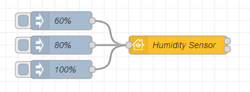
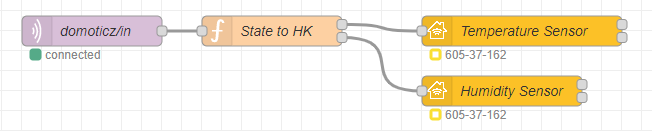

## Basic principle

This is the simplest example of a Humidity Sensor. The input nodes are `60%`, `80%` and `100%`.



Copyable Node-RED flow:

```json
[{"id":"66eea73d8bc910ae","type":"homekit-service","z":"f353fb25b1f0f56f","isParent":true,"hostType":"0","bridge":"4a2a4fc162440a41","accessoryId":"","parentService":"711903a68eaf9a4a","name":"Humidity Sensor","serviceName":"HumiditySensor","topic":"","filter":false,"manufacturer":"NRCHKB","model":"1.4.2","serialNo":"Default Serial Number","firmwareRev":"1.4.2","hardwareRev":"1.4.2","softwareRev":"1.4.2","cameraConfigVideoProcessor":"ffmpeg","cameraConfigSource":"","cameraConfigStillImageSource":"","cameraConfigMaxStreams":2,"cameraConfigMaxWidth":1280,"cameraConfigMaxHeight":720,"cameraConfigMaxFPS":10,"cameraConfigMaxBitrate":300,"cameraConfigVideoCodec":"libx264","cameraConfigAudioCodec":"libfdk_aac","cameraConfigAudio":false,"cameraConfigPacketSize":1316,"cameraConfigVerticalFlip":false,"cameraConfigHorizontalFlip":false,"cameraConfigMapVideo":"0:0","cameraConfigMapAudio":"0:1","cameraConfigVideoFilter":"scale=1280:720","cameraConfigAdditionalCommandLine":"-tune zerolatency","cameraConfigDebug":false,"cameraConfigSnapshotOutput":"disabled","cameraConfigInterfaceName":"","characteristicProperties":"{\"CurrentRelativeHumidity\": 0}","waitForSetupMsg":false,"outputs":2,"x":440,"y":300,"wires":[[],[]]},{"id":"32748362eb9c9912","type":"inject","z":"f353fb25b1f0f56f","name":"80%","props":[{"p":"payload"}],"repeat":"","crontab":"","once":false,"onceDelay":0.1,"topic":"","payload":"{\"CurrentRelativeHumidity\": 80}","payloadType":"json","x":250,"y":300,"wires":[["66eea73d8bc910ae"]]},{"id":"2850daaf13996a5d","type":"inject","z":"f353fb25b1f0f56f","name":"100%","props":[{"p":"payload"}],"repeat":"","crontab":"","once":false,"onceDelay":0.1,"topic":"","payload":"{\"CurrentRelativeHumidity\": 100}","payloadType":"json","x":250,"y":340,"wires":[["66eea73d8bc910ae"]]},{"id":"be42eb20b404bb49","type":"inject","z":"f353fb25b1f0f56f","name":"60%","props":[{"p":"payload"}],"repeat":"","crontab":"","once":false,"onceDelay":0.1,"topic":"","payload":"{\"CurrentRelativeHumidity\": 60}","payloadType":"json","x":250,"y":260,"wires":[["66eea73d8bc910ae"]]},{"id":"4a2a4fc162440a41","type":"homekit-bridge","bridgeName":"Bridge Node-RED","pinCode":"605-37-162","port":"","advertiser":"bonjour-hap","allowInsecureRequest":false,"manufacturer":"NRCHKB","model":"1.4.3","serialNo":"Default Serial Number","firmwareRev":"1.4.3","hardwareRev":"1.4.3","softwareRev":"1.4.3","customMdnsConfig":false,"mdnsMulticast":true,"mdnsInterface":"","mdnsPort":"","mdnsIp":"","mdnsTtl":"","mdnsLoopback":true,"mdnsReuseAddr":true,"allowMessagePassthrough":true}]
```

### Characteristic Properties

Use the following JSON in your characteristic properties so that the Home application displays a Humidity Sensor.

```json
{
  "CurrentRelativeHumidity": 0
}
```

## Example

### Implementation with Sonoff Basic (and DHT11) Flashed by [Tasmota](https://tasmota.github.io/docs/DHT11/)

This is a Node-RED flow to integrate a Sonoff-Tasmota with DHT11 flashed WiFi Temperature and Humidity Sensor with HomeKit.



Copyable Node-RED flow:

```json
[{"id":"2419ca7a.aa80e6","type":"mqtt in","z":"f353fb25b1f0f56f","name":"domoticz/in","topic":"domoticz/in","qos":"2","datatype":"json","broker":"e17954568d0e969f","nl":false,"rap":false,"x":130,"y":80,"wires":[["3815142529500692"]]},{"id":"3815142529500692","type":"function","z":"f353fb25b1f0f56f","name":"State to HK","func":"let Read = msg.payload.svalue.split(/\\;/g);\n\nmsg1 = {\"payload\": {\n    \"CurrentTemperature\": Read[0]\n}};\nmsg2 = {\"payload\": {\n    \"CurrentRelativeHumidity\": Read[1]\n}};\n\nif (msg.payload.idx == 1){\n    return [msg1,msg2];\n} else {\n    return;\n}","outputs":2,"noerr":0,"initialize":"","finalize":"","libs":[],"x":310,"y":80,"wires":[["711903a68eaf9a4a"],["b27e62cafacd35d1"]],"outputLabels":["Temperature","Humidity"]},{"id":"711903a68eaf9a4a","type":"homekit-service","z":"f353fb25b1f0f56f","isParent":true,"hostType":"0","bridge":"4a2a4fc162440a41","accessoryId":"","parentService":"","name":"Temperature Sensor","serviceName":"TemperatureSensor","topic":"","filter":false,"manufacturer":"NRCHKB","model":"1.4.2","serialNo":"Default Serial Number","firmwareRev":"1.4.2","hardwareRev":"1.4.2","softwareRev":"1.4.2","cameraConfigVideoProcessor":"ffmpeg","cameraConfigSource":"","cameraConfigStillImageSource":"","cameraConfigMaxStreams":2,"cameraConfigMaxWidth":1280,"cameraConfigMaxHeight":720,"cameraConfigMaxFPS":10,"cameraConfigMaxBitrate":300,"cameraConfigVideoCodec":"libx264","cameraConfigAudioCodec":"libfdk_aac","cameraConfigAudio":false,"cameraConfigPacketSize":1316,"cameraConfigVerticalFlip":false,"cameraConfigHorizontalFlip":false,"cameraConfigMapVideo":"0:0","cameraConfigMapAudio":"0:1","cameraConfigVideoFilter":"scale=1280:720","cameraConfigAdditionalCommandLine":"-tune zerolatency","cameraConfigDebug":false,"cameraConfigSnapshotOutput":"disabled","cameraConfigInterfaceName":"","characteristicProperties":"{\"CurrentTemperature\": 0}","waitForSetupMsg":false,"outputs":2,"x":560,"y":80,"wires":[[],[]]},{"id":"b27e62cafacd35d1","type":"homekit-service","z":"f353fb25b1f0f56f","isParent":false,"hostType":"0","bridge":"","accessoryId":"","parentService":"711903a68eaf9a4a","name":"Humidity Sensor","serviceName":"HumiditySensor","topic":"","filter":false,"manufacturer":"NRCHKB","model":"1.4.2","serialNo":"Default Serial Number","firmwareRev":"1.4.2","hardwareRev":"1.4.2","softwareRev":"1.4.2","cameraConfigVideoProcessor":"ffmpeg","cameraConfigSource":"","cameraConfigStillImageSource":"","cameraConfigMaxStreams":2,"cameraConfigMaxWidth":1280,"cameraConfigMaxHeight":720,"cameraConfigMaxFPS":10,"cameraConfigMaxBitrate":300,"cameraConfigVideoCodec":"libx264","cameraConfigAudioCodec":"libfdk_aac","cameraConfigAudio":false,"cameraConfigPacketSize":1316,"cameraConfigVerticalFlip":false,"cameraConfigHorizontalFlip":false,"cameraConfigMapVideo":"0:0","cameraConfigMapAudio":"0:1","cameraConfigVideoFilter":"scale=1280:720","cameraConfigAdditionalCommandLine":"-tune zerolatency","cameraConfigDebug":false,"cameraConfigSnapshotOutput":"disabled","cameraConfigInterfaceName":"","characteristicProperties":"{\"CurrentRelativeHumidity\": 0}","waitForSetupMsg":false,"outputs":2,"x":540,"y":140,"wires":[[],[]]},{"id":"e17954568d0e969f","type":"mqtt-broker","name":"Mosquitto","broker":"192.168.1.20","port":"1883","clientid":"","usetls":false,"protocolVersion":"4","keepalive":"60","cleansession":true,"birthTopic":"","birthQos":"0","birthRetain":"false","birthPayload":"","birthMsg":{},"closeTopic":"","closeQos":"0","closeRetain":"false","closePayload":"","closeMsg":{},"willTopic":"","willQos":"0","willRetain":"false","willPayload":"","willMsg":{},"sessionExpiry":"","credentials":{"user":"","password":""}},{"id":"4a2a4fc162440a41","type":"homekit-bridge","bridgeName":"Bridge Node-RED","pinCode":"605-37-162","port":"","advertiser":"bonjour-hap","allowInsecureRequest":false,"manufacturer":"NRCHKB","model":"1.4.3","serialNo":"Default Serial Number","firmwareRev":"1.4.3","hardwareRev":"1.4.3","softwareRev":"1.4.3","customMdnsConfig":false,"mdnsMulticast":true,"mdnsInterface":"","mdnsPort":"","mdnsIp":"","mdnsTtl":"","mdnsLoopback":true,"mdnsReuseAddr":true,"allowMessagePassthrough":true}]
```
