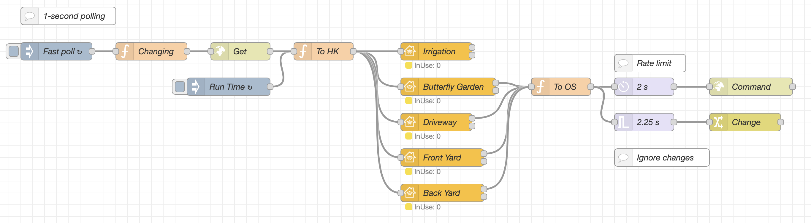

Used as an Irrigation accessory with program scheduling and manual mode. This service is meant to be used with a full external irrigation controller which could be some piece of hardware (rachio, skydrop, orbit, etc), it could be an open source setup (OpenSprinkler is good), or it could be simply a set of flows which is controlling your irrigation system. Note that from Home.app it is *not* possible to make a schedule, it is *not* possible to enable/disable a schedule, and it is *not* possible to start a manual schedule. From Home.app this service simply will display your system, state if it is on "manual" or "scheduled" mode, and allow you to control each valve individually.

## Examples

These examples are meant to be copied into your Node-RED system and adapted to your setup.

### 4 Valve System with OpenSprinkler

Updated 30 September 2021, [@crxporter](https://github.com/crxporter)

This is a variation of [this example]( "Multi valves example") but is using the `IrrigationSystem` service. It ends up being quite similar but with some key differences to combine it into an "Irrigation System" instead of 4 individual valves.

#### Prerequisites

If you want to simply copy-paste this into your nodered setup, you will need to do these things first:

1. Install [OpenSprinkler](https://opensprinkler.com) on the same machine as your Node-RED instance. Ideally this would be a `Raspberry Pi`. This is important because this setup is polling OpenSprinkler every one second at `localhost:8080`
2. Remove the password from your OpenSprinkler setup
3. Create at least one program in OpenSprinkler. It does not have to be enabled but it should exist.

#### Setup

Honestly I think this one can just be copied right into your nodered - be sure to rename the HomeKit nodes according to your yard.

Some key things to note if you are adding more than 4 zones:
-The "topic" in HomeKit valve nodes is the OpenSprinkler zone number minus one
-The `ServiceLabelIndex` in HomeKit valve nodes is the OpenSprinkler zone number (important for the zones to appear under one irrigation system service)

Quick walk through of the services we are using...

**IrrigationSystem:** this is *not* a bridged but a standalone accessory. `IrrigationSystem` will be the parent service to each of your valves. The `RemainingDuration` doesn't actually have any effect on Apple's Home.app but it might show in the Eve or another HomeKit app.

**Valve:** these are linked services with your `IrrigationSystem` as the parent. The Characteristic Properties here are very important. An example set is shown below.

JSON keys and what they do:
`ValveType` is locked at `1`, to make the icon show as "sprinkler". Change to `0` if you want a generic faucet icon.
`SetDuration` is the least important, use this as the minimum and maximum set times you want for each valve (in seconds).
`ServiceLabelIndex` makes these valves show up "in order" under the `IrrigationSystem` service.
`IsConfigured` changing this to `0` will make it "disappear" from `IrrigationSystem` - best to lock it as `1`.

```json
{
    "ValveType": {
        "minValue": 1,
        "maxValue": 1
    },
    "SetDuration": {
        "maxValue": 1800,
        "minValue": 300,
        "minStep": 300
    },
    "ServiceLabelIndex": {
        "minValue": 1,
        "maxValue": 1
    },
    "IsConfigured": {
        "minValue": 1,
        "maxValue": 1
    }
}
```

And now the fun part. Screenshot and a copyable flow!



```json
[{"id":"4c85e9b.088be98","type":"function","z":"6a25fd81.cbc9b4","name":"To OS","func":"// Zone = zone number - 1, based on incoming topic\nlet Zone = parseInt(msg.topic, 10);\n\n// Pull duration\nlet duration = flow.get(\"duration\");\n\n// Handle set duration messages\nif (msg.payload.SetDuration !== undefined) {\n    duration[Zone] = msg.payload.SetDuration;\n}\n\nflow.set(\"duration\", duration);\n\n// If the message is from home app, send command to opensprinkler\nif ('hap' in msg && 'session' in msg.hap && 'Active' in msg.payload) {\n    let ip = \"http://localhost:8080/\";\n    let cmd = \"cm?sid=\" + Zone + \"&en=\" + msg.payload.Active + \"&t=\" + duration[Zone];\n    return {\"url\": ip + cmd};\n}\n\nreturn;","outputs":1,"noerr":0,"initialize":"var duration = {\n    0: 300,\n    1: 300,\n    2: 300,\n    3: 300\n};\n\nflow.set('duration',duration);\n","finalize":"","libs":[],"x":950,"y":180,"wires":[["a97a4094.0fbb98","884b8f0a.678038"]]},{"id":"a97a4094.0fbb98","type":"delay","z":"6a25fd81.cbc9b4","name":"2 s","pauseType":"rate","timeout":"5","timeoutUnits":"seconds","rate":"1","nbRateUnits":"2","rateUnits":"second","randomFirst":"1","randomLast":"5","randomUnits":"seconds","drop":false,"allowrate":false,"x":1090,"y":180,"wires":[["802c6c2.f1ecb1"]]},{"id":"b085967b.cf31c","type":"inject","z":"6a25fd81.cbc9b4","name":"Run Time","props":[{"p":"payload"},{"p":"topic","vt":"str"}],"repeat":"","crontab":"00 22 * * *","once":false,"onceDelay":"10","topic":"RunTime","payload":"600","payloadType":"num","x":390,"y":180,"wires":[["fd2df8e7.ad69a8"]]},{"id":"f648d112.690e58","type":"http request","z":"6a25fd81.cbc9b4","name":"Get","method":"GET","ret":"obj","paytoqs":"ignore","url":"http://localhost:8080/ja","tls":"","persist":false,"proxy":"","authType":"","x":410,"y":120,"wires":[["fd2df8e7.ad69a8"]]},{"id":"802c6c2.f1ecb1","type":"http request","z":"6a25fd81.cbc9b4","name":"Command","method":"GET","ret":"obj","paytoqs":"ignore","url":"","tls":"","persist":false,"proxy":"","authType":"","x":1270,"y":180,"wires":[[]]},{"id":"7b42735d.fcc23c","type":"inject","z":"6a25fd81.cbc9b4","name":"Fast poll","props":[{"p":"payload"},{"p":"topic","vt":"str"}],"repeat":"2","crontab":"","once":true,"onceDelay":"10","topic":"","payloadType":"date","x":100,"y":120,"wires":[["478ff1f6.4875a8"]]},{"id":"fd2df8e7.ad69a8","type":"function","z":"6a25fd81.cbc9b4","name":"To HK","func":"// How many zones do you have?\nconst zoneCount = 4\n\nlet out = [];\n\n// Setup message is topic \"RunTime\" to set default duration\nif (msg.topic === \"RunTime\") {\n    for (i = 0; i < zoneCount; i++) {\n        out.push({\n            \"payload\": {\n                \"SetDuration\": msg.payload\n            },\n            \"topic\": String(i)\n        })\n    }\n    return [out];\n}\n\n// Irrigation system message (topic = 255)\nlet system = [{\n    \"payload\": {\n        \"ProgramMode\": msg.payload.programs.pd[0][0] % 2,\n    },\n    \"topic\": \"255\"\n},{\n    \"payload\": {\n        \"Active\": msg.payload.programs.pd[0][0] % 2,\n    },\n    \"topic\": \"255\"\n},{\n    \"payload\": {\n        \"InUse\": 0\n    },\n    \"topic\": \"255\"\n}]\n\n// Push messages for each zone to output array\nfor (i = 0; i < zoneCount; i++) {\n    // Active: program \"0\" if not set to run during current program, positive otherwise\n    out.push({\n        \"payload\": {\n            \"Active\": Math.min(1, msg.payload.settings.ps[i][0]),\n        },\n        \"topic\": String(i)\n    })\n    // InUse: whether it is actually watering\n    out.push({\n        \"payload\": {\n            \"InUse\": msg.payload.status.sn[i],\n        },\n        \"topic\": String(i)\n    })\n    // Remaining duration: seconds left for each zone\n    out.push({\n        \"payload\": {\n            \"RemainingDuration\": msg.payload.settings.ps[i][1]\n        },\n        \"topic\": String(i)\n    })\n    // Set system message if any zone is running\n    if (msg.payload.settings.ps[i][0]) {\n        system[1].payload.Active = 1;\n    }\n    if (msg.payload.status.sn[i]) {\n        system[2].payload.inUse = 1;\n    }\n}\n\n// Push system message to output array\nout.push(system[0]);\nout.push(system[1]);\nout.push(system[2]);\n\nreturn [out];","outputs":1,"noerr":0,"initialize":"","finalize":"","libs":[],"x":550,"y":120,"wires":[["9b024f37d5a46c26","53dc07778914aaaa","010463c37182bb4a","aafeaeb86331ff8a","4329ab5531d5c825"]]},{"id":"884b8f0a.678038","type":"trigger","z":"6a25fd81.cbc9b4","name":"2.25 s","op1":"true","op2":"false","op1type":"bool","op2type":"bool","duration":"2250","extend":true,"overrideDelay":false,"units":"ms","reset":"","bytopic":"all","topic":"topic","outputs":1,"x":1090,"y":240,"wires":[["4176d7a4.282ab8"]]},{"id":"4176d7a4.282ab8","type":"change","z":"6a25fd81.cbc9b4","name":"Change","rules":[{"t":"set","p":"changing","pt":"flow","to":"payload","tot":"msg"}],"action":"","property":"","from":"","to":"","reg":false,"x":1260,"y":240,"wires":[[]]},{"id":"6d615e5d.e4045","type":"comment","z":"6a25fd81.cbc9b4","name":"Ignore changes","info":"This causes to ignore any changes for 2.25 seconds after Home has sent a command. This will limit the instances when Home sends a command then the sprinkler resets to \"off\" before going to \"running\".","x":1120,"y":300,"wires":[]},{"id":"e62ae78e.e89ca8","type":"comment","z":"6a25fd81.cbc9b4","name":"Rate limit","info":"Prevent too many commands at once","x":1100,"y":140,"wires":[]},{"id":"478ff1f6.4875a8","type":"function","z":"6a25fd81.cbc9b4","name":"Changing","func":"const changing = flow.get('changing') || false;\n\n// Early exit if:\n// changing\nif (changing) {\n    return;\n}\n\nreturn msg;","outputs":1,"noerr":0,"initialize":"","finalize":"","libs":[],"x":260,"y":120,"wires":[["f648d112.690e58"]]},{"id":"4329ab5531d5c825","type":"homekit-service","z":"6a25fd81.cbc9b4","isParent":true,"hostType":"1","bridge":"","accessoryId":"e6ec3f524627efd4","parentService":"","name":"Irrigation","serviceName":"IrrigationSystem","topic":"255","filter":true,"manufacturer":"NRCHKB","model":"1.3.5","serialNo":"Default Serial Number","firmwareRev":"1.3.5","hardwareRev":"1.3.5","softwareRev":"1.3.5","cameraConfigVideoProcessor":"ffmpeg","cameraConfigSource":"","cameraConfigStillImageSource":"","cameraConfigMaxStreams":2,"cameraConfigMaxWidth":1280,"cameraConfigMaxHeight":720,"cameraConfigMaxFPS":10,"cameraConfigMaxBitrate":300,"cameraConfigVideoCodec":"libx264","cameraConfigAudioCodec":"libfdk_aac","cameraConfigAudio":false,"cameraConfigPacketSize":1316,"cameraConfigVerticalFlip":false,"cameraConfigHorizontalFlip":false,"cameraConfigMapVideo":"0:0","cameraConfigMapAudio":"0:1","cameraConfigVideoFilter":"scale=1280:720","cameraConfigAdditionalCommandLine":"-tune zerolatency","cameraConfigDebug":false,"cameraConfigSnapshotOutput":"disabled","cameraConfigInterfaceName":"","characteristicProperties":"{\"RemainingDuration\":{\"maxValue\":7200}}","waitForSetupMsg":false,"outputs":2,"x":740,"y":120,"wires":[[],[]]},{"id":"9b024f37d5a46c26","type":"homekit-service","z":"6a25fd81.cbc9b4","isParent":false,"hostType":"1","bridge":"","accessoryId":"","parentService":"4329ab5531d5c825","name":"Butterfly Garden","serviceName":"Valve","topic":"0","filter":true,"manufacturer":"NRCHKB","model":"1.3.5","serialNo":"Default Serial Number","firmwareRev":"1.3.5","hardwareRev":"1.3.5","softwareRev":"1.3.5","cameraConfigVideoProcessor":"ffmpeg","cameraConfigSource":"","cameraConfigStillImageSource":"","cameraConfigMaxStreams":2,"cameraConfigMaxWidth":1280,"cameraConfigMaxHeight":720,"cameraConfigMaxFPS":10,"cameraConfigMaxBitrate":300,"cameraConfigVideoCodec":"libx264","cameraConfigAudioCodec":"libfdk_aac","cameraConfigAudio":false,"cameraConfigPacketSize":1316,"cameraConfigVerticalFlip":false,"cameraConfigHorizontalFlip":false,"cameraConfigMapVideo":"0:0","cameraConfigMapAudio":"0:1","cameraConfigVideoFilter":"scale=1280:720","cameraConfigAdditionalCommandLine":"-tune zerolatency","cameraConfigDebug":false,"cameraConfigSnapshotOutput":"disabled","cameraConfigInterfaceName":"","characteristicProperties":"{\"ValveType\":{\"minValue\":1,\"maxValue\":1},\"SetDuration\":{\"maxValue\":1800,\"minValue\":300,\"minStep\":300},\"ServiceLabelIndex\":{\"minValue\":1,\"maxValue\":1},\"IsConfigured\":{\"minValue\":1,\"maxValue\":1}}","waitForSetupMsg":false,"outputs":2,"x":760,"y":180,"wires":[["4c85e9b.088be98"],[]]},{"id":"53dc07778914aaaa","type":"homekit-service","z":"6a25fd81.cbc9b4","isParent":false,"hostType":"1","bridge":"","accessoryId":"","parentService":"4329ab5531d5c825","name":"Driveway","serviceName":"Valve","topic":"1","filter":true,"manufacturer":"NRCHKB","model":"1.3.5","serialNo":"Default Serial Number","firmwareRev":"1.3.5","hardwareRev":"1.3.5","softwareRev":"1.3.5","cameraConfigVideoProcessor":"ffmpeg","cameraConfigSource":"","cameraConfigStillImageSource":"","cameraConfigMaxStreams":2,"cameraConfigMaxWidth":1280,"cameraConfigMaxHeight":720,"cameraConfigMaxFPS":10,"cameraConfigMaxBitrate":300,"cameraConfigVideoCodec":"libx264","cameraConfigAudioCodec":"libfdk_aac","cameraConfigAudio":false,"cameraConfigPacketSize":1316,"cameraConfigVerticalFlip":false,"cameraConfigHorizontalFlip":false,"cameraConfigMapVideo":"0:0","cameraConfigMapAudio":"0:1","cameraConfigVideoFilter":"scale=1280:720","cameraConfigAdditionalCommandLine":"-tune zerolatency","cameraConfigDebug":false,"cameraConfigSnapshotOutput":"disabled","cameraConfigInterfaceName":"","characteristicProperties":"{\"ValveType\":{\"minValue\":1,\"maxValue\":1},\"SetDuration\":{\"maxValue\":1800,\"minValue\":300,\"minStep\":300},\"ServiceLabelIndex\":{\"minValue\":2,\"maxValue\":2},\"IsConfigured\":{\"minValue\":1,\"maxValue\":1}}","waitForSetupMsg":false,"outputs":2,"x":740,"y":240,"wires":[["4c85e9b.088be98"],[]]},{"id":"010463c37182bb4a","type":"homekit-service","z":"6a25fd81.cbc9b4","isParent":false,"hostType":"1","bridge":"","accessoryId":"","parentService":"4329ab5531d5c825","name":"Front Yard","serviceName":"Valve","topic":"2","filter":true,"manufacturer":"NRCHKB","model":"1.3.5","serialNo":"Default Serial Number","firmwareRev":"1.3.5","hardwareRev":"1.3.5","softwareRev":"1.3.5","cameraConfigVideoProcessor":"ffmpeg","cameraConfigSource":"","cameraConfigStillImageSource":"","cameraConfigMaxStreams":2,"cameraConfigMaxWidth":1280,"cameraConfigMaxHeight":720,"cameraConfigMaxFPS":10,"cameraConfigMaxBitrate":300,"cameraConfigVideoCodec":"libx264","cameraConfigAudioCodec":"libfdk_aac","cameraConfigAudio":false,"cameraConfigPacketSize":1316,"cameraConfigVerticalFlip":false,"cameraConfigHorizontalFlip":false,"cameraConfigMapVideo":"0:0","cameraConfigMapAudio":"0:1","cameraConfigVideoFilter":"scale=1280:720","cameraConfigAdditionalCommandLine":"-tune zerolatency","cameraConfigDebug":false,"cameraConfigSnapshotOutput":"disabled","cameraConfigInterfaceName":"","characteristicProperties":"{\"ValveType\":{\"minValue\":1,\"maxValue\":1},\"SetDuration\":{\"maxValue\":1800,\"minValue\":300,\"minStep\":300},\"ServiceLabelIndex\":{\"minValue\":3,\"maxValue\":3},\"IsConfigured\":{\"minValue\":1,\"maxValue\":1}}","waitForSetupMsg":false,"outputs":2,"x":750,"y":300,"wires":[["4c85e9b.088be98"],[]]},{"id":"aafeaeb86331ff8a","type":"homekit-service","z":"6a25fd81.cbc9b4","isParent":false,"hostType":"1","bridge":"","accessoryId":"","parentService":"4329ab5531d5c825","name":"Back Yard","serviceName":"Valve","topic":"3","filter":true,"manufacturer":"NRCHKB","model":"1.3.5","serialNo":"Default Serial Number","firmwareRev":"1.3.5","hardwareRev":"1.3.5","softwareRev":"1.3.5","cameraConfigVideoProcessor":"ffmpeg","cameraConfigSource":"","cameraConfigStillImageSource":"","cameraConfigMaxStreams":2,"cameraConfigMaxWidth":1280,"cameraConfigMaxHeight":720,"cameraConfigMaxFPS":10,"cameraConfigMaxBitrate":300,"cameraConfigVideoCodec":"libx264","cameraConfigAudioCodec":"libfdk_aac","cameraConfigAudio":false,"cameraConfigPacketSize":1316,"cameraConfigVerticalFlip":false,"cameraConfigHorizontalFlip":false,"cameraConfigMapVideo":"0:0","cameraConfigMapAudio":"0:1","cameraConfigVideoFilter":"scale=1280:720","cameraConfigAdditionalCommandLine":"-tune zerolatency","cameraConfigDebug":false,"cameraConfigSnapshotOutput":"disabled","cameraConfigInterfaceName":"","characteristicProperties":"{\"ValveType\":{\"minValue\":1,\"maxValue\":1},\"SetDuration\":{\"maxValue\":1800,\"minValue\":300,\"minStep\":300},\"ServiceLabelIndex\":{\"minValue\":4,\"maxValue\":4},\"IsConfigured\":{\"minValue\":1,\"maxValue\":1}}","waitForSetupMsg":false,"outputs":2,"x":750,"y":360,"wires":[["4c85e9b.088be98"],[]]},{"id":"217d19c9e183e4e4","type":"comment","z":"6a25fd81.cbc9b4","name":"1-second polling","info":"","x":120,"y":60,"wires":[]},{"id":"e6ec3f524627efd4","type":"homekit-standalone","accessoryCategory":"28","bridgeName":"My Toys","hostType":1,"pinCode":"619-84-592","port":"","allowInsecureRequest":false,"manufacturer":"NRCHKB","model":"0.140.10","serialNo":"Default Serial Number","firmwareRev":"0.140.10","hardwareRev":"0.140.10","softwareRev":"0.140.10","customMdnsConfig":true,"mdnsMulticast":true,"mdnsInterface":"","mdnsPort":"","mdnsIp":"","mdnsTtl":"","mdnsLoopback":true,"mdnsReuseAddr":true,"allowMessagePassthrough":true}]
```
