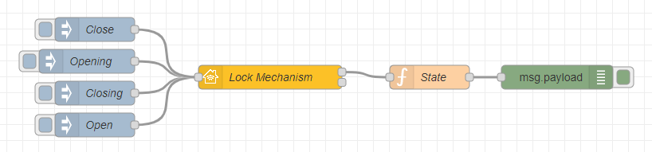
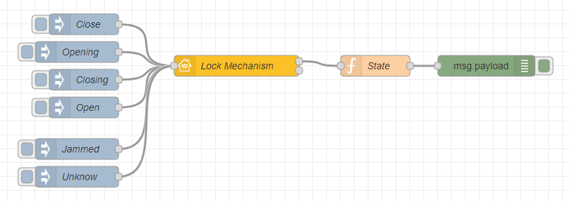

## Basic Principle

This is the simplest example of a Lock Mechanism. The input nodes are `Close`, `Opening`, `Closing` and `Open`.



Copyable Node-RED flow:

```json
[{"id":"624eee9f55f57f4e","type":"debug","z":"9ca59b8c355502fa","name":"","active":true,"tosidebar":true,"console":false,"tostatus":false,"complete":"false","statusVal":"","statusType":"auto","x":770,"y":220,"wires":[]},{"id":"5beb7916ffb182da","type":"homekit-service","z":"9ca59b8c355502fa","isParent":true,"hostType":"0","bridge":"4a2a4fc162440a41","accessoryId":"","parentService":"","name":"Lock Mechanism","serviceName":"LockMechanism","topic":"","filter":false,"manufacturer":"NRCHKB","model":"1.4.3","serialNo":"Default Serial Number","firmwareRev":"1.4.3","hardwareRev":"1.4.3","softwareRev":"1.4.3","cameraConfigVideoProcessor":"ffmpeg","cameraConfigSource":"","cameraConfigStillImageSource":"","cameraConfigMaxStreams":2,"cameraConfigMaxWidth":1280,"cameraConfigMaxHeight":720,"cameraConfigMaxFPS":10,"cameraConfigMaxBitrate":300,"cameraConfigVideoCodec":"libx264","cameraConfigAudioCodec":"libfdk_aac","cameraConfigAudio":false,"cameraConfigPacketSize":1316,"cameraConfigVerticalFlip":false,"cameraConfigHorizontalFlip":false,"cameraConfigMapVideo":"0:0","cameraConfigMapAudio":"0:1","cameraConfigVideoFilter":"scale=1280:720","cameraConfigAdditionalCommandLine":"-tune zerolatency","cameraConfigDebug":false,"cameraConfigSnapshotOutput":"disabled","cameraConfigInterfaceName":"","characteristicProperties":"{\"LockCurrentState\":0,\"LockTargetState\":0}","waitForSetupMsg":false,"outputs":2,"x":410,"y":220,"wires":[["213d692ac1578d8e"],[]]},{"id":"e37faedec9e0b9e1","type":"inject","z":"9ca59b8c355502fa","name":"Closing","props":[{"p":"payload"}],"repeat":"","crontab":"","once":false,"onceDelay":0.1,"topic":"","payload":"{\"LockTargetState\":0}","payloadType":"json","x":190,"y":240,"wires":[["5beb7916ffb182da"]]},{"id":"68d304633d45cd4d","type":"inject","z":"9ca59b8c355502fa","name":"Opening","props":[{"p":"payload"}],"repeat":"","crontab":"","once":false,"onceDelay":0.1,"topic":"","payload":"{\"LockTargetState\":1}","payloadType":"json","x":180,"y":200,"wires":[["5beb7916ffb182da"]]},{"id":"08c631942ddb522d","type":"inject","z":"9ca59b8c355502fa","name":"Close","props":[{"p":"payload"}],"repeat":"","crontab":"","once":false,"onceDelay":0.1,"topic":"","payload":"{\"LockCurrentState\": 0}","payloadType":"json","x":190,"y":160,"wires":[["5beb7916ffb182da"]]},{"id":"8dee09021dfecea4","type":"inject","z":"9ca59b8c355502fa","name":"Open","props":[{"p":"payload"}],"repeat":"","crontab":"","once":false,"onceDelay":0.1,"topic":"","payload":"{\"LockCurrentState\": 1}","payloadType":"json","x":190,"y":280,"wires":[["5beb7916ffb182da"]]},{"id":"213d692ac1578d8e","type":"function","z":"9ca59b8c355502fa","name":"State","func":"var CurrentState;\nvar TargetState;\n\nif (msg.payload.LockTargetState){\n    TargetState = 'Opening';\n} else {\n    TargetState = 'Closing';\n}\nif (msg.payload.LockCurrentState == 0){\n    CurrentState = 'Close';\n} else if (msg.payload.LockCurrentState == 1){\n    CurrentState = 'Open';\n} else if (msg.payload.LockCurrentState == 2){\n    CurrentState = 'Jammed';\n} else if (msg.payload.LockCurrentState == 2){\n    CurrentState = 'Unknow';\n}\n\nmsg = {\"payload\": {\n    \"LockCurrentState\": CurrentState,\n    \"LockTargetState\": TargetState\n    }\n}\n\nreturn msg;","outputs":1,"noerr":0,"initialize":"","finalize":"","libs":[],"x":610,"y":220,"wires":[["624eee9f55f57f4e"]]},{"id":"4a2a4fc162440a41","type":"homekit-bridge","bridgeName":"Bridge Node-RED","pinCode":"605-37-162","port":"","advertiser":"bonjour-hap","allowInsecureRequest":false,"manufacturer":"NRCHKB","model":"1.4.3","serialNo":"Default Serial Number","firmwareRev":"1.4.3","hardwareRev":"1.4.3","softwareRev":"1.4.3","customMdnsConfig":false,"mdnsMulticast":true,"mdnsInterface":"","mdnsPort":"","mdnsIp":"","mdnsTtl":"","mdnsLoopback":true,"mdnsReuseAddr":true,"allowMessagePassthrough":true}]
```
### Possible Lock Current State

The `LockCurrentState` Characteristics will determine what the Home.app shows for the Lock Mechanism.\
Here is a table showing all Lock Mechanism :

| ValveType | Home.app shows |
| --- | --- |
| `0` | `Close` |
| `1` | `Open` |
| `2` | `Jammed` |
| `3` | `Unknow` |

Below is an example of a flow with `Jammed` and `Unknow` input nodes.



Copyable Node-RED flow:

```json
[{"id":"624eee9f55f57f4e","type":"debug","z":"9ca59b8c355502fa","name":"","active":true,"tosidebar":true,"console":false,"tostatus":false,"complete":"false","statusVal":"","statusType":"auto","x":770,"y":220,"wires":[]},{"id":"5beb7916ffb182da","type":"homekit-service","z":"9ca59b8c355502fa","isParent":true,"hostType":"0","bridge":"4a2a4fc162440a41","accessoryId":"","parentService":"","name":"Lock Mechanism","serviceName":"LockMechanism","topic":"","filter":false,"manufacturer":"NRCHKB","model":"1.4.3","serialNo":"Default Serial Number","firmwareRev":"1.4.3","hardwareRev":"1.4.3","softwareRev":"1.4.3","cameraConfigVideoProcessor":"ffmpeg","cameraConfigSource":"","cameraConfigStillImageSource":"","cameraConfigMaxStreams":2,"cameraConfigMaxWidth":1280,"cameraConfigMaxHeight":720,"cameraConfigMaxFPS":10,"cameraConfigMaxBitrate":300,"cameraConfigVideoCodec":"libx264","cameraConfigAudioCodec":"libfdk_aac","cameraConfigAudio":false,"cameraConfigPacketSize":1316,"cameraConfigVerticalFlip":false,"cameraConfigHorizontalFlip":false,"cameraConfigMapVideo":"0:0","cameraConfigMapAudio":"0:1","cameraConfigVideoFilter":"scale=1280:720","cameraConfigAdditionalCommandLine":"-tune zerolatency","cameraConfigDebug":false,"cameraConfigSnapshotOutput":"disabled","cameraConfigInterfaceName":"","characteristicProperties":"{\"LockCurrentState\":0,\"LockTargetState\":0}","waitForSetupMsg":false,"outputs":2,"x":410,"y":220,"wires":[["213d692ac1578d8e"],[]]},{"id":"e37faedec9e0b9e1","type":"inject","z":"9ca59b8c355502fa","name":"Closing","props":[{"p":"payload"}],"repeat":"","crontab":"","once":false,"onceDelay":0.1,"topic":"","payload":"{\"LockTargetState\":0}","payloadType":"json","x":190,"y":240,"wires":[["5beb7916ffb182da"]]},{"id":"68d304633d45cd4d","type":"inject","z":"9ca59b8c355502fa","name":"Opening","props":[{"p":"payload"}],"repeat":"","crontab":"","once":false,"onceDelay":0.1,"topic":"","payload":"{\"LockTargetState\":1}","payloadType":"json","x":180,"y":200,"wires":[["5beb7916ffb182da"]]},{"id":"08c631942ddb522d","type":"inject","z":"9ca59b8c355502fa","name":"Close","props":[{"p":"payload"}],"repeat":"","crontab":"","once":false,"onceDelay":0.1,"topic":"","payload":"{\"LockCurrentState\": 0}","payloadType":"json","x":190,"y":160,"wires":[["5beb7916ffb182da"]]},{"id":"8dee09021dfecea4","type":"inject","z":"9ca59b8c355502fa","name":"Open","props":[{"p":"payload"}],"repeat":"","crontab":"","once":false,"onceDelay":0.1,"topic":"","payload":"{\"LockCurrentState\": 1}","payloadType":"json","x":190,"y":280,"wires":[["5beb7916ffb182da"]]},{"id":"a7b786a5ae10d7b9","type":"inject","z":"9ca59b8c355502fa","name":"Jammed","props":[{"p":"payload"}],"repeat":"","crontab":"","once":false,"onceDelay":0.1,"topic":"","payload":"{\"LockCurrentState\": 2}","payloadType":"json","x":180,"y":340,"wires":[["5beb7916ffb182da"]]},{"id":"f240c546ef19aeb5","type":"inject","z":"9ca59b8c355502fa","name":"Unknow","props":[{"p":"payload"}],"repeat":"","crontab":"","once":false,"onceDelay":0.1,"topic":"","payload":"{\"LockCurrentState\": 3}","payloadType":"json","x":180,"y":380,"wires":[["5beb7916ffb182da"]]},{"id":"213d692ac1578d8e","type":"function","z":"9ca59b8c355502fa","name":"State","func":"var CurrentState;\nvar TargetState;\n\nif (msg.payload.LockTargetState){\n    TargetState = 'Opening';\n} else {\n    TargetState = 'Closing';\n}\nif (msg.payload.LockCurrentState == 0){\n    CurrentState = 'Close';\n} else if (msg.payload.LockCurrentState == 1){\n    CurrentState = 'Open';\n} else if (msg.payload.LockCurrentState == 2){\n    CurrentState = 'Jammed';\n} else if (msg.payload.LockCurrentState == 2){\n    CurrentState = 'Unknow';\n}\n\nmsg = {\"payload\": {\n    \"LockCurrentState\": CurrentState,\n    \"LockTargetState\": TargetState\n    }\n}\n\nreturn msg;","outputs":1,"noerr":0,"initialize":"","finalize":"","libs":[],"x":610,"y":220,"wires":[["624eee9f55f57f4e"]]},{"id":"4a2a4fc162440a41","type":"homekit-bridge","bridgeName":"Bridge Node-RED","pinCode":"605-37-162","port":"","advertiser":"bonjour-hap","allowInsecureRequest":false,"manufacturer":"NRCHKB","model":"1.4.3","serialNo":"Default Serial Number","firmwareRev":"1.4.3","hardwareRev":"1.4.3","softwareRev":"1.4.3","customMdnsConfig":false,"mdnsMulticast":true,"mdnsInterface":"","mdnsPort":"","mdnsIp":"","mdnsTtl":"","mdnsLoopback":true,"mdnsReuseAddr":true,"allowMessagePassthrough":true}]
```

