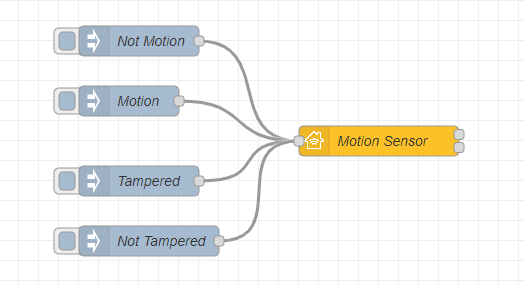
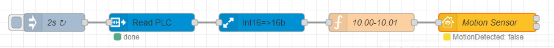

## Basic principle

This is the simplest example of a motion sensor item. The input nodes are `Motion`, `Not Motion`, `Tampered` and `Not Tampered`.



Copyable Node-RED flow:

```json
[{"id":"47426d7718423551","type":"homekit-service","z":"cc2eca629cd42ae6","isParent":true,"hostType":"0","bridge":"5b5f6f73.10106","accessoryId":"","parentService":"","name":"Motion Sensor","serviceName":"MotionSensor","topic":"","filter":false,"manufacturer":"NRCHKB","model":"1.2.0","serialNo":"Default Serial Number","firmwareRev":"1.2.0","hardwareRev":"1.2.0","softwareRev":"1.2.0","cameraConfigVideoProcessor":"ffmpeg","cameraConfigSource":"","cameraConfigStillImageSource":"","cameraConfigMaxStreams":2,"cameraConfigMaxWidth":1280,"cameraConfigMaxHeight":720,"cameraConfigMaxFPS":10,"cameraConfigMaxBitrate":300,"cameraConfigVideoCodec":"libx264","cameraConfigAudioCodec":"libfdk_aac","cameraConfigAudio":false,"cameraConfigPacketSize":1316,"cameraConfigVerticalFlip":false,"cameraConfigHorizontalFlip":false,"cameraConfigMapVideo":"0:0","cameraConfigMapAudio":"0:1","cameraConfigVideoFilter":"scale=1280:720","cameraConfigAdditionalCommandLine":"-tune zerolatency","cameraConfigDebug":false,"cameraConfigSnapshotOutput":"disabled","cameraConfigInterfaceName":"","characteristicProperties":"{\"MotionDetected\":0,\"StatusTampered\":false}","waitForSetupMsg":false,"outputs":2,"x":400,"y":180,"wires":[[],[]]},{"id":"b3c18aad34a5b507","type":"inject","z":"cc2eca629cd42ae6","name":"Not Motion","props":[{"p":"payload"}],"repeat":"","crontab":"","once":false,"onceDelay":"0.5","topic":"","payload":"{\"MotionDetected\":0}","payloadType":"json","x":160,"y":80,"wires":[["47426d7718423551"]]},{"id":"ff47e8e2992d649d","type":"inject","z":"cc2eca629cd42ae6","name":"Motion","props":[{"p":"payload"}],"repeat":"","crontab":"","once":false,"onceDelay":"0.5","topic":"","payload":"{\"MotionDetected\":1}","payloadType":"json","x":150,"y":140,"wires":[["47426d7718423551"]]},{"id":"9c76abfae3140e14","type":"inject","z":"cc2eca629cd42ae6","name":"Tampered","props":[{"p":"payload"}],"repeat":"","crontab":"","once":false,"onceDelay":"0.5","topic":"","payload":"{\"StatusTampered\":true}","payloadType":"json","x":160,"y":220,"wires":[["47426d7718423551"]]},{"id":"1e2c2355ef57ada6","type":"inject","z":"cc2eca629cd42ae6","name":"Not Tampered","props":[{"p":"payload"}],"repeat":"","crontab":"","once":false,"onceDelay":"0.5","topic":"","payload":"{\"StatusTampered\":false}","payloadType":"json","x":170,"y":280,"wires":[["47426d7718423551"]]},{"id":"5b5f6f73.10106","type":"homekit-bridge","bridgeName":"Pont Node-Red","pinCode":"123-45-321","port":"","allowInsecureRequest":true,"manufacturer":"NRCHKB","model":"1.2.0","serialNo":"Raspberry Pi 3 B+","firmwareRev":"1.2.0","hardwareRev":"1.2.0","softwareRev":"1.2.0","customMdnsConfig":false,"mdnsMulticast":true,"mdnsInterface":"","mdnsPort":"","mdnsIp":"","mdnsTtl":"","mdnsLoopback":true,"mdnsReuseAddr":true,"allowMessagePassthrough":true}]
```

### Characteristic Properties

Use the following JSON in your characteristic properties so that the Home application displays a motion sensor with status tampered.

```json
{
	"MotionDetected": 0,
	"StatusTampered": false
}
```

## Example

### Implementation with an Omron PLC

This is an example of a motion sensor element wired in NC with a safety if the sensor is open.



Copyable Node-RED flow:

```json
[{"id":"47426d7718423551","type":"homekit-service","z":"cc2eca629cd42ae6","isParent":true,"hostType":"0","bridge":"5b5f6f73.10106","accessoryId":"","parentService":"","name":"Motion Sensor","serviceName":"MotionSensor","topic":"","filter":false,"manufacturer":"NRCHKB","model":"1.2.0","serialNo":"Default Serial Number","firmwareRev":"1.2.0","hardwareRev":"1.2.0","softwareRev":"1.2.0","cameraConfigVideoProcessor":"ffmpeg","cameraConfigSource":"","cameraConfigStillImageSource":"","cameraConfigMaxStreams":2,"cameraConfigMaxWidth":1280,"cameraConfigMaxHeight":720,"cameraConfigMaxFPS":10,"cameraConfigMaxBitrate":300,"cameraConfigVideoCodec":"libx264","cameraConfigAudioCodec":"libfdk_aac","cameraConfigAudio":false,"cameraConfigPacketSize":1316,"cameraConfigVerticalFlip":false,"cameraConfigHorizontalFlip":false,"cameraConfigMapVideo":"0:0","cameraConfigMapAudio":"0:1","cameraConfigVideoFilter":"scale=1280:720","cameraConfigAdditionalCommandLine":"-tune zerolatency","cameraConfigDebug":false,"cameraConfigSnapshotOutput":"disabled","cameraConfigInterfaceName":"","characteristicProperties":"{\"MotionDetected\":0,\"StatusTampered\":false}","waitForSetupMsg":false,"outputs":2,"x":820,"y":80,"wires":[[],[]]},{"id":"4715a5ee81097c4a","type":"inject","z":"cc2eca629cd42ae6","name":"2s","props":[{"p":"time","v":"true","vt":"bool"}],"repeat":"2","crontab":"","once":false,"onceDelay":"0.5","topic":"","x":110,"y":80,"wires":[["c795acf96eafbdc4"]]},{"id":"c795acf96eafbdc4","type":"FINS Read Multiple","z":"cc2eca629cd42ae6","name":"Read PLC","connection":"11b8375b.b1ee31","addressType":"str","address":"CIO10","msgPropertyType":"msg","msgProperty":"CIO_READ","outputFormatType":"signed","outputFormat":"","x":270,"y":80,"wires":[["b62552f1358aa67b"]]},{"id":"b62552f1358aa67b","type":"buffer-parser","z":"cc2eca629cd42ae6","name":"Int16=>16b","data":"CIO_READ","dataType":"msg","specification":"spec","specificationType":"ui","items":[{"type":"16bitbe","name":"CIO10","offset":0,"length":1,"offsetbit":0,"scale":"1","mask":""}],"swap1":"","swap2":"","swap3":"","swap1Type":"swap","swap2Type":"swap","swap3Type":"swap","msgProperty":"CIO_READ","msgPropertyType":"str","resultType":"keyvalue","resultTypeType":"output","multipleResult":false,"fanOutMultipleResult":false,"setTopic":true,"outputs":1,"x":450,"y":80,"wires":[["dbb680d2da6c3186"]]},{"id":"dbb680d2da6c3186","type":"function","z":"cc2eca629cd42ae6","name":"10.00-10.01","func":"var MotionState = msg.CIO_READ.CIO10[0].bits[0];    //10.00\nvar TamperedState = msg.CIO_READ.CIO10[0].bits[1];  //10.01\n\nmsg = {payload:{\n    \"StatusTampered\":TamperedState,\n    \"MotionDetected\":MotionState\n    }\n};\n\nreturn msg;","outputs":1,"noerr":0,"initialize":"","finalize":"","libs":[],"x":630,"y":80,"wires":[["47426d7718423551"]]},{"id":"5b5f6f73.10106","type":"homekit-bridge","bridgeName":"Pont Node-Red","pinCode":"123-45-321","port":"","allowInsecureRequest":true,"manufacturer":"NRCHKB","model":"1.2.0","serialNo":"Raspberry Pi 3 B+","firmwareRev":"1.2.0","hardwareRev":"1.2.0","softwareRev":"1.2.0","customMdnsConfig":false,"mdnsMulticast":true,"mdnsInterface":"","mdnsPort":"","mdnsIp":"","mdnsTtl":"","mdnsLoopback":true,"mdnsReuseAddr":true,"allowMessagePassthrough":true},{"id":"11b8375b.b1ee31","type":"FINS Connection","name":"PLC","host":"192.168.1.2","port":"9600","MODE":"","MODEType":"CS","protocol":"","protocolType":"udp","ICF":"","DNA":"","DA1":"2","DA2":"","SNA":"","SA1":"20","SA2":"","autoConnect":true}]
```

Here you can read more about [OMRON PLC in Node-RED]( "OMRON PLC in Node-RED")
