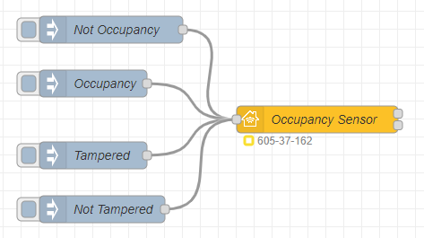

## Basic principle

This is the simplest example of a Occupancy Sensor item. The input nodes are `Occupancy`, `Not Occupancy`, `Tampered` and `Not Tampered`.



Copyable Node-RED flow:

```json
[{"id":"037524dadae99821","type":"homekit-service","z":"ca8eb198a99ccdae","isParent":true,"hostType":"0","bridge":"4a2a4fc162440a41","accessoryId":"","parentService":"","name":"Occupancy Sensor","serviceName":"OccupancySensor","topic":"","filter":false,"manufacturer":"NRCHKB","model":"1.2.0","serialNo":"Default Serial Number","firmwareRev":"1.2.0","hardwareRev":"1.2.0","softwareRev":"1.2.0","cameraConfigVideoProcessor":"ffmpeg","cameraConfigSource":"","cameraConfigStillImageSource":"","cameraConfigMaxStreams":2,"cameraConfigMaxWidth":1280,"cameraConfigMaxHeight":720,"cameraConfigMaxFPS":10,"cameraConfigMaxBitrate":300,"cameraConfigVideoCodec":"libx264","cameraConfigAudioCodec":"libfdk_aac","cameraConfigAudio":false,"cameraConfigPacketSize":1316,"cameraConfigVerticalFlip":false,"cameraConfigHorizontalFlip":false,"cameraConfigMapVideo":"0:0","cameraConfigMapAudio":"0:1","cameraConfigVideoFilter":"scale=1280:720","cameraConfigAdditionalCommandLine":"-tune zerolatency","cameraConfigDebug":false,"cameraConfigSnapshotOutput":"disabled","cameraConfigInterfaceName":"","characteristicProperties":"{\"OccupancyDetected\":0,\"StatusTampered\":false}","waitForSetupMsg":false,"outputs":2,"x":430,"y":400,"wires":[[],[]]},{"id":"5bf4958884e7fa45","type":"inject","z":"ca8eb198a99ccdae","name":"Not Occupancy","props":[{"p":"payload"}],"repeat":"","crontab":"","once":false,"onceDelay":"0.5","topic":"","payload":"{\"OccupancyDetected\":0}","payloadType":"json","x":200,"y":300,"wires":[["037524dadae99821"]]},{"id":"2ae270f003dc341a","type":"inject","z":"ca8eb198a99ccdae","name":"Occupancy","props":[{"p":"payload"}],"repeat":"","crontab":"","once":false,"onceDelay":"0.5","topic":"","payload":"{\"OccupancyDetected\":1}","payloadType":"json","x":180,"y":360,"wires":[["037524dadae99821"]]},{"id":"ed5cc3214d9160b1","type":"inject","z":"ca8eb198a99ccdae","name":"Tampered","props":[{"p":"payload"}],"repeat":"","crontab":"","once":false,"onceDelay":"0.5","topic":"","payload":"{\"StatusTampered\":true}","payloadType":"json","x":180,"y":440,"wires":[["037524dadae99821"]]},{"id":"dfbe83296722b5df","type":"inject","z":"ca8eb198a99ccdae","name":"Not Tampered","props":[{"p":"payload"}],"repeat":"","crontab":"","once":false,"onceDelay":"0.5","topic":"","payload":"{\"StatusTampered\":false}","payloadType":"json","x":190,"y":500,"wires":[["037524dadae99821"]]},{"id":"4a2a4fc162440a41","type":"homekit-bridge","bridgeName":"Bridge Node-RED","pinCode":"605-37-162","port":"","advertiser":"bonjour-hap","allowInsecureRequest":false,"manufacturer":"NRCHKB","model":"1.4.3","serialNo":"Default Serial Number","firmwareRev":"1.4.3","hardwareRev":"1.4.3","softwareRev":"1.4.3","customMdnsConfig":false,"mdnsMulticast":true,"mdnsInterface":"","mdnsPort":"","mdnsIp":"","mdnsTtl":"","mdnsLoopback":true,"mdnsReuseAddr":true,"allowMessagePassthrough":true}]
```

### Characteristic Properties

Use the following JSON in your characteristic properties so that the Home application displays a Occupancy Sensor with `StatusTampered`.

```json
{
  "OccupancyDetected": 0,
  "StatusTampered": 0
}
```

**Note:** A Occupancy Sensor is a less energy-consuming and much more sensitive Motion Sensor.

## Example

These examples are meant to be copied into your Node-RED system and adapted to your setup.

### Simple Presence Sensor

This example is a very simple occupancy sensor without any other functionality:


It de-/activates only the Occupancy sensor in the Home.app and set the `StatusActive` to true anytime: Here is the sample code:

```json
[{"id":"491167d6.3b9688","type":"change","z":"1ac5f8da.58656f","name":"Set payload to HkMsg for presence","rules":[{"t":"move","p":"payload","pt":"msg","to":"payload.OccupancyDetected","tot":"msg"},{"t":"set","p":"payload.StatusActive","pt":"msg","to":"true","tot":"bool"}],"action":"","property":"","from":"","to":"","reg":false,"x":1440,"y":360,"wires":[["7712393a.469f98"]]},{"id":"7712393a.469f98","type":"homekit-service","z":"1ac5f8da.58656f","isParent":true,"bridge":"890aedc6.d0b418","parentService":"","name":"RBRx@Home","serviceName":"OccupancySensor","topic":"","filter":false,"manufacturer":"Default Manufacturer","model":"Default Model","serialNo":"Default Serial Number","characteristicProperties":"{\n    \"OccupancyDetected\" : 0,\n    \"StatusActive\" : false\n}","x":1760,"y":360,"wires":[[]]},{"id":"14d9e017.35bd28","type":"inject","z":"1ac5f8da.58656f","name":"1","topic":"","payload":"1","payloadType":"num","repeat":"","crontab":"","once":false,"onceDelay":0.1,"x":1230,"y":320,"wires":[["491167d6.3b9688"]]},{"id":"56f0d08b.2afce8","type":"inject","z":"1ac5f8da.58656f","name":"0","topic":"","payload":"0","payloadType":"num","repeat":"","crontab":"","once":false,"onceDelay":0.1,"x":1230,"y":400,"wires":[["491167d6.3b9688"]]},{"id":"890aedc6.d0b418","type":"homekit-bridge","z":"","bridgeName":"Node-Red-HAP-Bridge-02","pinCode":"222-22-222","port":"","allowInsecureRequest":false,"manufacturer":"Default Manufacturer","model":"Default Model","serialNo":"Default Serial Number"}]
```

The Author is using a more comprehensive flow for a use case that is also a simple presence detection of a device. In that flow Node-Red regularly sends the router the MAC address of a smartphone to check whether the device is connected to the local WI-FI.


This information is than converted to the payload the occupancy sensor requires. In this example you can assume e.g. that the owner is at home.

The example was inspired by [ct-Open-Source/noderedexamples](https://github.com/ct-Open-Source/noderedexamples/tree/master/magazine/c-t%205-19-%20P.%20134%20-%20Fritzbox).
Thanks to [@merlinschumacher](https://github.com/merlinschumacher)
