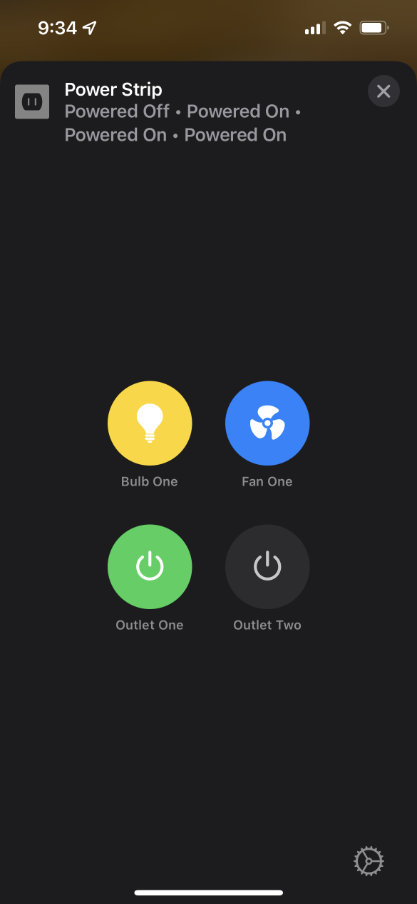

Service Label is kind of an open box for HomeKit devices. So far I (@crxporter) have seen it used in two places - a [multi-button stateless programmable switch]( "Stateless Programmable Switch") and a power strip. Surely it can be used in more places but this is what I've seen so far.

## Examples

These examples are meant to be copied into your Node-RED system and adapted to your setup.

### Power Strip

This example shows a power strip type accessory where multiple on/off items (works best with `Outlet`, `LightBulb`, or `Fan`) will be merged to show a set of small buttons in the Home.app. The example will include 4 devices: two outlets, one fan, and one bulb. Any number of these may be added similarly to have more devices shown, simply add the device with the same parent accessory.

The setup of this will require the use of a Parent/Linked setup.

* **Parent Service** will be `ServiceLabel`
* **Linked Services** will be `Outlet`, `Lightbulb`, or `Fan` (others may be possible with mixed results)

**Parent Service**

Simply create a service named however you like using the `ServiceLabel` service - this is the parent for all of your incoming devices.

**Linked Services**

Create some combination of devices to be grouped in the power strip. If it is important the order they appear, create one at a time so the "next" device will be added at the bottom of your power strip.



Copyable Node-RED flow:

```json
[{"id":"c6c87fa526e007c8","type":"homekit-service","z":"63e1c499.ef774c","isParent":true,"hostType":"0","bridge":"f6e3ae59.c33c3","accessoryId":"","parentService":"","name":"Power Strip","serviceName":"ServiceLabel","topic":"","filter":false,"manufacturer":"NRCHKB","model":"1.4.2","serialNo":"Default Serial Number","firmwareRev":"1.4.2","hardwareRev":"1.4.2","softwareRev":"1.4.2","cameraConfigVideoProcessor":"ffmpeg","cameraConfigSource":"","cameraConfigStillImageSource":"","cameraConfigMaxStreams":2,"cameraConfigMaxWidth":1280,"cameraConfigMaxHeight":720,"cameraConfigMaxFPS":10,"cameraConfigMaxBitrate":300,"cameraConfigVideoCodec":"libx264","cameraConfigAudioCodec":"libfdk_aac","cameraConfigAudio":false,"cameraConfigPacketSize":1316,"cameraConfigVerticalFlip":false,"cameraConfigHorizontalFlip":false,"cameraConfigMapVideo":"0:0","cameraConfigMapAudio":"0:1","cameraConfigVideoFilter":"scale=1280:720","cameraConfigAdditionalCommandLine":"-tune zerolatency","cameraConfigDebug":false,"cameraConfigSnapshotOutput":"disabled","cameraConfigInterfaceName":"","characteristicProperties":"{}","waitForSetupMsg":false,"outputs":2,"x":330,"y":1260,"wires":[[],[]]},{"id":"8d53c226b9595426","type":"homekit-service","z":"63e1c499.ef774c","isParent":false,"hostType":"0","bridge":"","accessoryId":"","parentService":"c6c87fa526e007c8","name":"Outlet One","serviceName":"Outlet","topic":"","filter":false,"manufacturer":"NRCHKB","model":"1.4.2","serialNo":"Default Serial Number","firmwareRev":"1.4.2","hardwareRev":"1.4.2","softwareRev":"1.4.2","cameraConfigVideoProcessor":"ffmpeg","cameraConfigSource":"","cameraConfigStillImageSource":"","cameraConfigMaxStreams":2,"cameraConfigMaxWidth":1280,"cameraConfigMaxHeight":720,"cameraConfigMaxFPS":10,"cameraConfigMaxBitrate":300,"cameraConfigVideoCodec":"libx264","cameraConfigAudioCodec":"libfdk_aac","cameraConfigAudio":false,"cameraConfigPacketSize":1316,"cameraConfigVerticalFlip":false,"cameraConfigHorizontalFlip":false,"cameraConfigMapVideo":"0:0","cameraConfigMapAudio":"0:1","cameraConfigVideoFilter":"scale=1280:720","cameraConfigAdditionalCommandLine":"-tune zerolatency","cameraConfigDebug":false,"cameraConfigSnapshotOutput":"disabled","cameraConfigInterfaceName":"","characteristicProperties":"{}","waitForSetupMsg":false,"outputs":2,"x":330,"y":1340,"wires":[["680011f8cff63427"],[]]},{"id":"5ad6495c4c4f7b41","type":"homekit-service","z":"63e1c499.ef774c","isParent":false,"hostType":"0","bridge":"","accessoryId":"","parentService":"c6c87fa526e007c8","name":"Outlet Two","serviceName":"Outlet","topic":"","filter":false,"manufacturer":"NRCHKB","model":"1.4.2","serialNo":"Default Serial Number","firmwareRev":"1.4.2","hardwareRev":"1.4.2","softwareRev":"1.4.2","cameraConfigVideoProcessor":"ffmpeg","cameraConfigSource":"","cameraConfigStillImageSource":"","cameraConfigMaxStreams":2,"cameraConfigMaxWidth":1280,"cameraConfigMaxHeight":720,"cameraConfigMaxFPS":10,"cameraConfigMaxBitrate":300,"cameraConfigVideoCodec":"libx264","cameraConfigAudioCodec":"libfdk_aac","cameraConfigAudio":false,"cameraConfigPacketSize":1316,"cameraConfigVerticalFlip":false,"cameraConfigHorizontalFlip":false,"cameraConfigMapVideo":"0:0","cameraConfigMapAudio":"0:1","cameraConfigVideoFilter":"scale=1280:720","cameraConfigAdditionalCommandLine":"-tune zerolatency","cameraConfigDebug":false,"cameraConfigSnapshotOutput":"disabled","cameraConfigInterfaceName":"","characteristicProperties":"{}","waitForSetupMsg":false,"outputs":2,"x":330,"y":1420,"wires":[["26ac940db178445d"],[]]},{"id":"879749573171379e","type":"homekit-service","z":"63e1c499.ef774c","isParent":false,"hostType":"0","bridge":"","accessoryId":"","parentService":"c6c87fa526e007c8","name":"Fan One","serviceName":"Fan","topic":"","filter":false,"manufacturer":"NRCHKB","model":"1.4.2","serialNo":"Default Serial Number","firmwareRev":"1.4.2","hardwareRev":"1.4.2","softwareRev":"1.4.2","cameraConfigVideoProcessor":"ffmpeg","cameraConfigSource":"","cameraConfigStillImageSource":"","cameraConfigMaxStreams":2,"cameraConfigMaxWidth":1280,"cameraConfigMaxHeight":720,"cameraConfigMaxFPS":10,"cameraConfigMaxBitrate":300,"cameraConfigVideoCodec":"libx264","cameraConfigAudioCodec":"libfdk_aac","cameraConfigAudio":false,"cameraConfigPacketSize":1316,"cameraConfigVerticalFlip":false,"cameraConfigHorizontalFlip":false,"cameraConfigMapVideo":"0:0","cameraConfigMapAudio":"0:1","cameraConfigVideoFilter":"scale=1280:720","cameraConfigAdditionalCommandLine":"-tune zerolatency","cameraConfigDebug":false,"cameraConfigSnapshotOutput":"disabled","cameraConfigInterfaceName":"","characteristicProperties":"{}","waitForSetupMsg":false,"outputs":2,"x":320,"y":1500,"wires":[["d4fd6c3464a0c8b3"],[]]},{"id":"36e387303a6db88e","type":"homekit-service","z":"63e1c499.ef774c","isParent":false,"hostType":"0","bridge":"","accessoryId":"","parentService":"c6c87fa526e007c8","name":"Bulb One","serviceName":"Lightbulb","topic":"","filter":false,"manufacturer":"NRCHKB","model":"1.4.2","serialNo":"Default Serial Number","firmwareRev":"1.4.2","hardwareRev":"1.4.2","softwareRev":"1.4.2","cameraConfigVideoProcessor":"ffmpeg","cameraConfigSource":"","cameraConfigStillImageSource":"","cameraConfigMaxStreams":2,"cameraConfigMaxWidth":1280,"cameraConfigMaxHeight":720,"cameraConfigMaxFPS":10,"cameraConfigMaxBitrate":300,"cameraConfigVideoCodec":"libx264","cameraConfigAudioCodec":"libfdk_aac","cameraConfigAudio":false,"cameraConfigPacketSize":1316,"cameraConfigVerticalFlip":false,"cameraConfigHorizontalFlip":false,"cameraConfigMapVideo":"0:0","cameraConfigMapAudio":"0:1","cameraConfigVideoFilter":"scale=1280:720","cameraConfigAdditionalCommandLine":"-tune zerolatency","cameraConfigDebug":false,"cameraConfigSnapshotOutput":"disabled","cameraConfigInterfaceName":"","characteristicProperties":"{}","waitForSetupMsg":false,"outputs":2,"x":320,"y":1580,"wires":[["9cad874e78b633e6"],[]]},{"id":"680011f8cff63427","type":"debug","z":"63e1c499.ef774c","name":"","active":true,"tosidebar":true,"console":false,"tostatus":false,"complete":"false","statusVal":"","statusType":"auto","x":530,"y":1340,"wires":[]},{"id":"26ac940db178445d","type":"debug","z":"63e1c499.ef774c","name":"","active":true,"tosidebar":true,"console":false,"tostatus":false,"complete":"false","statusVal":"","statusType":"auto","x":530,"y":1420,"wires":[]},{"id":"d4fd6c3464a0c8b3","type":"debug","z":"63e1c499.ef774c","name":"","active":true,"tosidebar":true,"console":false,"tostatus":false,"complete":"false","statusVal":"","statusType":"auto","x":530,"y":1500,"wires":[]},{"id":"9cad874e78b633e6","type":"debug","z":"63e1c499.ef774c","name":"","active":true,"tosidebar":true,"console":false,"tostatus":false,"complete":"false","statusVal":"","statusType":"auto","x":530,"y":1580,"wires":[]},{"id":"c5d7b4781e53496a","type":"inject","z":"63e1c499.ef774c","name":"On","props":[{"p":"payload"},{"p":"topic","vt":"str"}],"repeat":"","crontab":"","once":false,"onceDelay":0.1,"topic":"","payload":"{\"On\":true}","payloadType":"json","x":130,"y":1320,"wires":[["8d53c226b9595426"]]},{"id":"b4f36a2343a11722","type":"inject","z":"63e1c499.ef774c","name":"Off","props":[{"p":"payload"},{"p":"topic","vt":"str"}],"repeat":"","crontab":"","once":false,"onceDelay":0.1,"topic":"","payload":"{\"On\":false}","payloadType":"json","x":130,"y":1360,"wires":[["8d53c226b9595426"]]},{"id":"1ac0b8cf825c4df8","type":"inject","z":"63e1c499.ef774c","name":"On","props":[{"p":"payload"},{"p":"topic","vt":"str"}],"repeat":"","crontab":"","once":false,"onceDelay":0.1,"topic":"","payload":"{\"On\":true}","payloadType":"json","x":130,"y":1400,"wires":[["5ad6495c4c4f7b41"]]},{"id":"f882a2edcdf164c1","type":"inject","z":"63e1c499.ef774c","name":"Off","props":[{"p":"payload"},{"p":"topic","vt":"str"}],"repeat":"","crontab":"","once":false,"onceDelay":0.1,"topic":"","payload":"{\"On\":false}","payloadType":"json","x":130,"y":1440,"wires":[["5ad6495c4c4f7b41"]]},{"id":"cd6f7ec31e24d946","type":"inject","z":"63e1c499.ef774c","name":"On","props":[{"p":"payload"},{"p":"topic","vt":"str"}],"repeat":"","crontab":"","once":false,"onceDelay":0.1,"topic":"","payload":"{\"On\":true}","payloadType":"json","x":130,"y":1480,"wires":[["879749573171379e"]]},{"id":"7b3e93c70ac584cb","type":"inject","z":"63e1c499.ef774c","name":"Off","props":[{"p":"payload"},{"p":"topic","vt":"str"}],"repeat":"","crontab":"","once":false,"onceDelay":0.1,"topic":"","payload":"{\"On\":false}","payloadType":"json","x":130,"y":1520,"wires":[["879749573171379e"]]},{"id":"22e4d2be7176e431","type":"inject","z":"63e1c499.ef774c","name":"On","props":[{"p":"payload"},{"p":"topic","vt":"str"}],"repeat":"","crontab":"","once":false,"onceDelay":0.1,"topic":"","payload":"{\"On\":true}","payloadType":"json","x":130,"y":1560,"wires":[["36e387303a6db88e"]]},{"id":"0cf1450c84ac9523","type":"inject","z":"63e1c499.ef774c","name":"Off","props":[{"p":"payload"},{"p":"topic","vt":"str"}],"repeat":"","crontab":"","once":false,"onceDelay":0.1,"topic":"","payload":"{\"On\":false}","payloadType":"json","x":130,"y":1600,"wires":[["36e387303a6db88e"]]},{"id":"f6e3ae59.c33c3","type":"homekit-bridge","bridgeName":"Security","pinCode":"928-10-432","port":"","advertiser":"ciao","allowInsecureRequest":false,"manufacturer":"Garrett","model":"Software","serialNo":"001","firmwareRev":"","hardwareRev":"","softwareRev":"","customMdnsConfig":false,"mdnsMulticast":true,"mdnsInterface":"","mdnsPort":"","mdnsIp":"","mdnsTtl":"","mdnsLoopback":true,"mdnsReuseAddr":true,"allowMessagePassthrough":true}]
```
