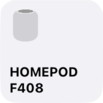
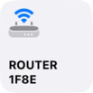
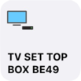

**Note:** It is recommended that beginners get comfortable with Node Red and more simple HomeKit configurations of this plugin before attempting to set up Television Service.

## Services

The Television Service is a complicated one. At its most basic it will be an on/off device that can send and receive the message `{"Active":0}` and `{"Active":1}`. In order to use additional features there needs to be linked services including (but not limited to) Input Source and Television Speaker.

Currently, the example below has:

* **Television Service**
* **Television Speaker** as child service of _Television Service_
* **Input 0** as child service of _Television Service_
* **Input 1** as child service of _Television Service_
* **Input 2** as child service of _Television Service_
* **Input 3** as child service of _Television Service_

**Note:** Such complex linked services only work properly if they are standalone accessories. Otherwise the linked services are not shown correctly in the home app.

## Example With Speaker and 4 inputs

This example will show a television service with 4 inputs and a speaker (volume control). There are two functions that should be used to name your specific devices. These functions are `Setup TV` and `Setup Inputs`.

**Setup TV:**
This function will be run 5 seconds after startup or whenever the `TV Setup` inject node is triggered. Change the name on line 1 of the function. The output message is sent to the Television Service to initialize the name and set the TV to `{"Active":0}` (TV off).

**Setup Inputs:**
This function will be run 6 seconds after startup or whenever the `Source Setup` inject node is triggered. The following variables are available:

* Lines 5 through 8 will name your sources
* Lines 24 through 27 will set the input type according to the values in lines 11 through 21

## Setting the HomeKit item based on TV state

There are various `inject` nodes which can be used to send information from your television ([Vizio API](https://github.com/exiva/Vizio_SmartCast_API), [Onkyo device](https://github.com/estbeetoo/node-red-contrib-eiscp), [Samsung TV](https://github.com/Toxblh/node-red-contrib-samsung-tv-control), [LG TV](https://github.com/hobbyquaker/node-red-contrib-lgtv), etc.). It is up to you as the user to set this up according to your hardware. Use the provided `inject` nodes as a template to begin understanding the payloads expected by the Television Service.

Please note that the Television Speaker and Input Source service items **DO NOT** receive any input after initial configuration.

## Setting TV state based on HomeKit output

There are two debug nodes provided. These can be used as examples of the output coming from HomeKit nodes to set up your system accordingly.

The `State and source output` debug node will output the following payloads:

* `{"Active":0/1}` for TV state off/on
* `{"Input":0-3}` for changing inputs from HomeKit
* `{"RemoteKey":various}` for various integers when using the control center remote (See bottom of this page for a list of known codes)

The `Volume output` debug node will output the following payloads:

* `{"VolumeSelector":0}` when control center remote press is "Increase Volume"
* `{"VolumeSelector":1}` when control center remote press is "Decrease Volume"

The Input Source services will output payloads like `{"ConfiguredName":"Name"}` if the name is changed from HomeKit. If you would like to change your input names from within HomeKit rather than the `Set up inputs` function, it can be done but is beyond the scope of this example.

## Screenshots and Node Red Code

**PLEASE NOTE** The linked services will need to re-select the parent service if the node red code below is copied to your system. This example should work with plugin version 1.0.4 or newer.

### View from Node Red


### Television Service within iOS Home.app


### Television Service child service inputs within iOS Control Center draw


### Node Red Code

Triple-click to copy. Remember to set the linked services to the correct parent service.

```json
[{"id":"a9e569de.eb508","type":"inject","z":"90412004.b1d2b","name":"TV on","topic":"","payload":"{\"Active\":1}","payloadType":"json","repeat":"","crontab":"","once":false,"onceDelay":0.1,"x":310,"y":960,"wires":[["93bc492d.3d6848"]]},{"id":"250f61e5.cdbe8e","type":"inject","z":"90412004.b1d2b","name":"TV off","topic":"","payload":"{\"Active\":0}","payloadType":"json","repeat":"","crontab":"","once":false,"onceDelay":0.1,"x":310,"y":1000,"wires":[["93bc492d.3d6848"]]},{"id":"db46bcc.eec00c","type":"debug","z":"90412004.b1d2b","name":"State and source output","active":true,"tosidebar":true,"console":false,"tostatus":false,"complete":"payload","targetType":"msg","x":990,"y":960,"wires":[]},{"id":"d01e0a4e.49da68","type":"debug","z":"90412004.b1d2b","name":"Volume output","active":true,"tosidebar":true,"console":false,"tostatus":false,"complete":"payload","targetType":"msg","x":1000,"y":1280,"wires":[]},{"id":"26b7c791.d278","type":"inject","z":"90412004.b1d2b","name":"TV Setup","topic":"","payload":"","payloadType":"date","repeat":"","crontab":"","once":true,"onceDelay":"5","x":320,"y":900,"wires":[["404e9088.92a208"]]},{"id":"2028cd20.56072a","type":"inject","z":"90412004.b1d2b","name":"Source Setup","topic":"","payload":"","payloadType":"date","repeat":"","crontab":"","once":true,"onceDelay":"6","x":320,"y":1360,"wires":[["ab0cd2f6.17b038"]]},{"id":"404e9088.92a208","type":"function","z":"90412004.b1d2b","name":"Setup TV","func":"var name = \"Television\";\n\nmsg.payload = {\n \"ConfiguredName\": name,\n \"ActiveIdentifier\" : 0,\n \"SleepDiscoveryMode\" : 0,\n \"Active\" : 0\n};\nreturn msg;","outputs":1,"noerr":0,"x":500,"y":900,"wires":[["93bc492d.3d6848"]]},{"id":"8e8be1d8.38174","type":"inject","z":"90412004.b1d2b","name":"Input 1","topic":"","payload":"{\"ActiveIdentifier\":1}","payloadType":"json","repeat":"","crontab":"","once":false,"onceDelay":0.1,"x":310,"y":1120,"wires":[["93bc492d.3d6848"]]},{"id":"27b2cba.39cb534","type":"inject","z":"90412004.b1d2b","name":"Input 0","topic":"","payload":"{\"ActiveIdentifier\":0}","payloadType":"json","repeat":"","crontab":"","once":false,"onceDelay":0.1,"x":310,"y":1080,"wires":[["93bc492d.3d6848"]]},{"id":"212a935c.2d79f4","type":"inject","z":"90412004.b1d2b","name":"Input 2","topic":"","payload":"{\"ActiveIdentifier\":2}","payloadType":"json","repeat":"","crontab":"","once":false,"onceDelay":0.1,"x":310,"y":1160,"wires":[["93bc492d.3d6848"]]},{"id":"fd8b49ca.2333b","type":"inject","z":"90412004.b1d2b","name":"Input 3","topic":"","payload":"{\"ActiveIdentifier\":3}","payloadType":"json","repeat":"","crontab":"","once":false,"onceDelay":0.1,"x":310,"y":1200,"wires":[["93bc492d.3d6848"]]},{"id":"ab0cd2f6.17b038","type":"function","z":"90412004.b1d2b","name":"Set up inputs","func":"// This function will initialize and name inputs\n// it is set to work with 4 inputs\n\n// INPUT SOURCE NAMES\nvar input0 = \"HDMI 1\";\nvar input1 = \"HDMI 2\";\nvar input2 = \"Apple TV\";\nvar input3 = \"Wii U\";\n\n// INPUT SOURCE TYPES\nvar OTHER = 0;\nvar HOME_SCREEN = 1;\nvar TUNER = 2;\nvar HDMI = 3;\nvar COMPOSITE_VIDEO = 4;\nvar S_VIDEO = 5;\nvar COMPONENT_VIDEO = 6;\nvar DVI = 7;\nvar AIRPLAY = 8;\nvar USB = 9;\nvar APPLICATION = 10;\n\n// Configure your input types based on options above\nvar input0type = HDMI;\nvar input1type = HDMI;\nvar input2type = HDMI;\nvar input3type = COMPOSITE_VIDEO;\n\n\n// Duplicate or remove sets if you have more or fewer inputs\nvar msg0={};\nvar msg1={};\nvar msg2={};\nvar msg3={};\n\nmsg0.payload = {\n    \"Identifier\": 0,\n    \"IsConfigured\" : 1,\n    \"ConfiguredName\": input0,\n    \"InputSourceType\": input0type\n};\nmsg1.payload = {\n    \"Identifier\": 1,\n    \"IsConfigured\" : 1,\n    \"ConfiguredName\": input1,\n    \"InputSourceType\": input1type\n};\nmsg2.payload = {\n    \"Identifier\": 2,\n    \"IsConfigured\" : 1,\n    \"ConfiguredName\": input2,\n    \"InputSourceType\": input2type\n};\nmsg3.payload = {\n    \"Identifier\": 3,\n    \"IsConfigured\" : 1,\n    \"ConfiguredName\" : input3,\n    \"InputSourceType\" : input3type\n};\nreturn [msg0,msg1,msg2,msg3];","outputs":4,"noerr":0,"x":530,"y":1360,"wires":[["8ff895bc.7b935"],["f74be9ff.fa82a8"],["497e4a93.2cfab4"],["5213369b.218d48"]]},{"id":"93bc492d.3d6848","type":"homekit-service","z":"90412004.b1d2b","isParent":true,"bridge":"f6a4260d.7e51e","parentService":"","name":"Television Example","serviceName":"Television","topic":"","filter":false,"manufacturer":"Default Manufacturer","model":"Default Model","serialNo":"Default Serial Number","cameraConfigVideoProcessor":"ffmpeg","cameraConfigSource":"","cameraConfigStillImageSource":"","cameraConfigMaxStreams":2,"cameraConfigMaxWidth":1280,"cameraConfigMaxHeight":720,"cameraConfigMaxFPS":10,"cameraConfigMaxBitrate":300,"cameraConfigVideoCodec":"libx264","cameraConfigAudioCodec":"libfdk_aac","cameraConfigAudio":false,"cameraConfigPacketSize":1316,"cameraConfigVerticalFlip":false,"cameraConfigHorizontalFlip":false,"cameraConfigMapVideo":"0:0","cameraConfigMapAudio":"0:1","cameraConfigVideoFilter":"scale=1280:720","cameraConfigAdditionalCommandLine":"-tune zerolatency","cameraConfigDebug":false,"cameraConfigSnapshotOutput":"disabled","cameraConfigInterfaceName":"","characteristicProperties":"{\n    \"RemoteKey\":null\n}","x":730,"y":960,"wires":[[],["db46bcc.eec00c"]]},{"id":"983c3244.9dfbe8","type":"homekit-service","z":"90412004.b1d2b","isParent":false,"bridge":"f6a4260d.7e51e","parentService":"86669c0b.9dfec8","name":"Television Speaker","serviceName":"TelevisionSpeaker","topic":"","filter":false,"manufacturer":"Default Manufacturer","model":"Default Model","serialNo":"Default Serial Number","cameraConfigVideoProcessor":"ffmpeg","cameraConfigSource":"","cameraConfigStillImageSource":"","cameraConfigMaxStreams":2,"cameraConfigMaxWidth":1280,"cameraConfigMaxHeight":720,"cameraConfigMaxFPS":10,"cameraConfigMaxBitrate":300,"cameraConfigVideoCodec":"libx264","cameraConfigAudioCodec":"libfdk_aac","cameraConfigAudio":false,"cameraConfigPacketSize":1316,"cameraConfigVerticalFlip":false,"cameraConfigHorizontalFlip":false,"cameraConfigMapVideo":"0:0","cameraConfigMapAudio":"0:1","cameraConfigVideoFilter":"scale=1280:720","cameraConfigAdditionalCommandLine":"-tune zerolatency","cameraConfigDebug":false,"cameraConfigSnapshotOutput":"disabled","cameraConfigInterfaceName":"","characteristicProperties":"{\n    \"VolumeControlType\":1,\n    \"VolumeSelector\":true\n}","x":730,"y":1280,"wires":[[],["d01e0a4e.49da68"]]},{"id":"8ff895bc.7b935","type":"homekit-service","z":"90412004.b1d2b","isParent":false,"bridge":"","parentService":"86669c0b.9dfec8","name":"Input 0","serviceName":"InputSource","topic":"","filter":false,"manufacturer":"Default Manufacturer","model":"Default Model","serialNo":"Default Serial Number","cameraConfigVideoProcessor":"ffmpeg","cameraConfigSource":"","cameraConfigStillImageSource":"","cameraConfigMaxStreams":2,"cameraConfigMaxWidth":1280,"cameraConfigMaxHeight":720,"cameraConfigMaxFPS":10,"cameraConfigMaxBitrate":300,"cameraConfigVideoCodec":"libx264","cameraConfigAudioCodec":"libfdk_aac","cameraConfigAudio":false,"cameraConfigPacketSize":1316,"cameraConfigVerticalFlip":false,"cameraConfigHorizontalFlip":false,"cameraConfigMapVideo":"0:0","cameraConfigMapAudio":"0:1","cameraConfigVideoFilter":"scale=1280:720","cameraConfigAdditionalCommandLine":"-tune zerolatency","cameraConfigDebug":false,"cameraConfigSnapshotOutput":"disabled","cameraConfigInterfaceName":"","characteristicProperties":"{}","x":760,"y":1340,"wires":[[],[]]},{"id":"f74be9ff.fa82a8","type":"homekit-service","z":"90412004.b1d2b","isParent":false,"bridge":"","parentService":"86669c0b.9dfec8","name":"Input 1","serviceName":"InputSource","topic":"","filter":false,"manufacturer":"Default Manufacturer","model":"Default Model","serialNo":"Default Serial Number","cameraConfigVideoProcessor":"ffmpeg","cameraConfigSource":"","cameraConfigStillImageSource":"","cameraConfigMaxStreams":2,"cameraConfigMaxWidth":1280,"cameraConfigMaxHeight":720,"cameraConfigMaxFPS":10,"cameraConfigMaxBitrate":300,"cameraConfigVideoCodec":"libx264","cameraConfigAudioCodec":"libfdk_aac","cameraConfigAudio":false,"cameraConfigPacketSize":1316,"cameraConfigVerticalFlip":false,"cameraConfigHorizontalFlip":false,"cameraConfigMapVideo":"0:0","cameraConfigMapAudio":"0:1","cameraConfigVideoFilter":"scale=1280:720","cameraConfigAdditionalCommandLine":"-tune zerolatency","cameraConfigDebug":false,"cameraConfigSnapshotOutput":"disabled","cameraConfigInterfaceName":"","characteristicProperties":"{}","x":760,"y":1400,"wires":[[],[]]},{"id":"497e4a93.2cfab4","type":"homekit-service","z":"90412004.b1d2b","isParent":false,"bridge":"","parentService":"86669c0b.9dfec8","name":"Input 2","serviceName":"InputSource","topic":"","filter":false,"manufacturer":"Default Manufacturer","model":"Default Model","serialNo":"Default Serial Number","cameraConfigVideoProcessor":"ffmpeg","cameraConfigSource":"","cameraConfigStillImageSource":"","cameraConfigMaxStreams":2,"cameraConfigMaxWidth":1280,"cameraConfigMaxHeight":720,"cameraConfigMaxFPS":10,"cameraConfigMaxBitrate":300,"cameraConfigVideoCodec":"libx264","cameraConfigAudioCodec":"libfdk_aac","cameraConfigAudio":false,"cameraConfigPacketSize":1316,"cameraConfigVerticalFlip":false,"cameraConfigHorizontalFlip":false,"cameraConfigMapVideo":"0:0","cameraConfigMapAudio":"0:1","cameraConfigVideoFilter":"scale=1280:720","cameraConfigAdditionalCommandLine":"-tune zerolatency","cameraConfigDebug":false,"cameraConfigSnapshotOutput":"disabled","cameraConfigInterfaceName":"","characteristicProperties":"{}","x":760,"y":1460,"wires":[[],[]]},{"id":"5213369b.218d48","type":"homekit-service","z":"90412004.b1d2b","isParent":false,"bridge":"","parentService":"86669c0b.9dfec8","name":"Input 3","serviceName":"InputSource","topic":"","filter":false,"manufacturer":"Default Manufacturer","model":"Default Model","serialNo":"Default Serial Number","cameraConfigVideoProcessor":"ffmpeg","cameraConfigSource":"","cameraConfigStillImageSource":"","cameraConfigMaxStreams":2,"cameraConfigMaxWidth":1280,"cameraConfigMaxHeight":720,"cameraConfigMaxFPS":10,"cameraConfigMaxBitrate":300,"cameraConfigVideoCodec":"libx264","cameraConfigAudioCodec":"libfdk_aac","cameraConfigAudio":false,"cameraConfigPacketSize":1316,"cameraConfigVerticalFlip":false,"cameraConfigHorizontalFlip":false,"cameraConfigMapVideo":"0:0","cameraConfigMapAudio":"0:1","cameraConfigVideoFilter":"scale=1280:720","cameraConfigAdditionalCommandLine":"-tune zerolatency","cameraConfigDebug":false,"cameraConfigSnapshotOutput":"disabled","cameraConfigInterfaceName":"","characteristicProperties":"{}","x":760,"y":1520,"wires":[[],[]]},{"id":"f6a4260d.7e51e","type":"homekit-bridge","z":"","bridgeName":"Television Wiki","pinCode":"111-11-111","port":"","allowInsecureRequest":false,"manufacturer":"Default Manufacturer","model":"Default Model","serialNo":"Default Serial Number","customMdnsConfig":false,"mdnsMulticast":true,"mdnsInterface":"","mdnsPort":"","mdnsIp":"","mdnsTtl":"","mdnsLoopback":true,"mdnsReuseAddr":true,"allowMessagePassthrough":false}]
```

## List of Remote Codes

Known remote codes include:

```yaml
{"RemoteKey":0} REWIND
{"RemoteKey":1} FAST_FORWARD
{"RemoteKey":2} NEXT_TRACK
{"RemoteKey":3} PREVIOUS_TRACK
{"RemoteKey":4} ARROW_UP
{"RemoteKey":5} ARROW_DOWN
{"RemoteKey":6} ARROW_LEFT
{"RemoteKey":7} ARROW_RIGHT
{"RemoteKey":8} SELECT
{"RemoteKey":9} BACK
{"RemoteKey":10} EXIT
{"RemoteKey":11} PLAY_PAUSE
{"RemoteKey":15} INFORMATION

{"VolumeSelector":0} VOLUME_UP
{"VolumeSelector":1} VOLUME_DOWN

{"Active":0} POWER_OFF
{"Active":1} POWER_ON
```

## Icons

When Television Service is hosted as a Standalone Accessory it will use corresponding Accessory Category to visualise icon in Home.app
These are the options:









