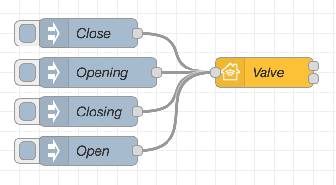
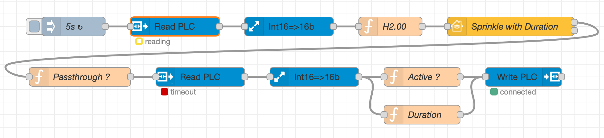
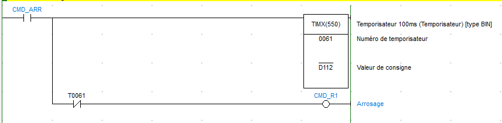

**Note :** `SetDuration` is a value ! **No action in Home app !**\
**Note :** `RemainingDuration` is a **input variable** of Homekit node !


## Possible Valve Type

The `ValveType` Characteristics will determine what the Home.app shows for the valve item.\
Here is a table showing all (known) Valve Type :

| ValveType | Home.app shows |
| --- | --- |
| `0` | Generic Valve |
| `1` | Irrigation |
| `2` | Shower Head |
| `3` | Water Faucet |

## Basic Principle

This is the simplest example of a Generic Valve item. The input nodes are `Close`, `Opening`, `Closing` and `Open`.



Copyable Node-RED flow:

```json
[{"id":"04c963093073daea","type":"inject","z":"96be518d.693a18","name":"Close","props":[{"p":"payload"}],"repeat":"","crontab":"","once":false,"onceDelay":0.1,"topic":"","payload":"{\"Active\":0,\"InUse\":0}","payloadType":"json","x":130,"y":80,"wires":[["2e5664d6894d86cd"]]},{"id":"a6cd9bf2c6c16195","type":"inject","z":"96be518d.693a18","name":"Opening","props":[{"p":"payload"}],"repeat":"","crontab":"","once":false,"onceDelay":0.1,"topic":"","payload":"{\"Active\":1,\"InUse\":0}","payloadType":"json","x":140,"y":120,"wires":[["2e5664d6894d86cd"]]},{"id":"2e5664d6894d86cd","type":"homekit-service","z":"96be518d.693a18","isParent":true,"hostType":"0","bridge":"4a2a4fc162440a41","accessoryId":"","parentService":"","name":"Valve","serviceName":"Valve","topic":"","filter":false,"manufacturer":"NRCHKB","model":"1.4.3","serialNo":"Default Serial Number","firmwareRev":"1.4.3","hardwareRev":"1.4.3","softwareRev":"1.4.3","cameraConfigVideoProcessor":"ffmpeg","cameraConfigSource":"","cameraConfigStillImageSource":"","cameraConfigMaxStreams":2,"cameraConfigMaxWidth":1280,"cameraConfigMaxHeight":720,"cameraConfigMaxFPS":10,"cameraConfigMaxBitrate":300,"cameraConfigVideoCodec":"libx264","cameraConfigAudioCodec":"libfdk_aac","cameraConfigAudio":false,"cameraConfigPacketSize":1316,"cameraConfigVerticalFlip":false,"cameraConfigHorizontalFlip":false,"cameraConfigMapVideo":"0:0","cameraConfigMapAudio":"0:1","cameraConfigVideoFilter":"scale=1280:720","cameraConfigAdditionalCommandLine":"-tune zerolatency","cameraConfigDebug":false,"cameraConfigSnapshotOutput":"disabled","cameraConfigInterfaceName":"","characteristicProperties":"{\"ValveType\":{\"minValue\":0,\"maxValue\":0}}","waitForSetupMsg":false,"outputs":2,"x":310,"y":120,"wires":[[],[]]},{"id":"60403f5f0a717273","type":"inject","z":"96be518d.693a18","name":"Closing","props":[{"p":"payload"}],"repeat":"","crontab":"","once":false,"onceDelay":0.1,"topic":"","payload":"{\"Active\":0,\"InUse\":1}","payloadType":"json","x":130,"y":160,"wires":[["2e5664d6894d86cd"]]},{"id":"c6119ed30d0c44ae","type":"inject","z":"96be518d.693a18","name":"Open","props":[{"p":"payload"}],"repeat":"","crontab":"","once":false,"onceDelay":0.1,"topic":"","payload":"{\"Active\":1,\"InUse\":1}","payloadType":"json","x":130,"y":200,"wires":[["2e5664d6894d86cd"]]},{"id":"4a2a4fc162440a41","type":"homekit-bridge","bridgeName":"Bridge Node-RED","pinCode":"605-37-162","port":"","advertiser":"bonjour-hap","allowInsecureRequest":false,"manufacturer":"NRCHKB","model":"1.4.3","serialNo":"Default Serial Number","firmwareRev":"1.4.3","hardwareRev":"1.4.3","softwareRev":"1.4.3","customMdnsConfig":false,"mdnsMulticast":true,"mdnsInterface":"","mdnsPort":"","mdnsIp":"","mdnsTtl":"","mdnsLoopback":true,"mdnsReuseAddr":true,"allowMessagePassthrough":true}]
```

### Characteristic Properties

Use the following JSON in your characteristic properties so that the Home application displays a Generic Valve.

```json
{ 
    "ValveType":{
      "minValue":0
      "maxValue":0
      }
}
```

You can also add `SetDuration` characteristic allowing to choose the duration operating time.

```json
{ 
    "SetDuration":{
      "minValue":30
      "maxValue":1800
      }
}
```

### Possible Combinations of Valve Status

The combination of `Active` and `InUse` Characteristics will determine what the Home.app shows for the valve item.
Here is a table showing all (known) combinations:

| Active | InUse | Home.app shows |
| --- | --- | --- |
| `0` | `0` | Off |
| `0` | `1` | Stopping |
| `1` | `0` | Start-Up |
| `1` | `1` | Running |

## Examples

These examples are meant to be copied into your Node-RED system and adapted to your setup.

### 4 Zone Sprinkler connected to OpenSprinkler

This is a fully functional sprinkler system with 4 zones which is connected to [OpenSprinkler](https://opensprinkler.com) running on the same Raspberry Pi as Node-RED. The example is set up so that each of 4 zones can be turned on independently. If any zone is running, the "whole yard" zone will also show that it is running. When turning on a zone, a default is set for 10 minutes (600 seconds). This can be changed with the `Default Time` inject node.

Functions:

- "Hey Siri, turn on Front Yard for 15 minutes" will water the front yard for 15 minutes
- Turning on "Whole Yard" will run OpenSprinkler program number 1
- "Whole Yard" remaining duration is a sum of each queued zone
- Does not interfere with normal operation of OpenSprinkler, only shows status and allows control from HomeKit


#### Characteristic Properties

These properties define the sprinkler to show as a "sprinkler" in HomeKit (rather than a generic faucet) and define that the zone show with a "SetDuration" option (so the duration may be set from HomeKit).

```json
{
    "ValveType":
    {
        "minValue":1,
        "maxValue":1
    },
    "SetDuration":
    {
        "minValue":300,
        "maxValue":1800
    }
}
```

**Note:** The topic must be set in HomeKit to filter nodes based on incoming topic.

Copyable Node-RED flow:

```json
[{"id":"972fe2e4.b830e8","type":"http request","z":"d58d7d15.df3be8","name":"GET all","method":"GET","ret":"obj","paytoqs":false,"url":"http://localhost:8080/ja","tls":"","proxy":"","authType":"basic","x":340,"y":460,"wires":[["d94230d6.8aef9"]]},{"id":"d94230d6.8aef9","type":"function","z":"d58d7d15.df3be8","name":"Sprinkler -> HK","func":"var out = {};\nfor (i = 0; i < 4; i++) {\n    out[i] = {\n        \"payload\": {\n            \"Active\":Math.min(1,msg.payload.settings.ps[i][0]),\n            \"InUse\":msg.payload.status.sn[i],\n            \"RemainingDuration\":msg.payload.settings.ps[i][1]\n        },\n        \"topic\": String(i)\n    };\n}\nout[4] = {\n    \"payload\": {\n        \"Active\":Math.max(\n            out[0].payload.Active,\n            out[1].payload.Active,\n            out[2].payload.Active,\n            out[3].payload.Active\n            ),\n        \"InUse\":Math.max(\n            out[0].payload.InUse,\n            out[1].payload.InUse,\n            out[2].payload.InUse,\n            out[3].payload.InUse\n            ),\n        \"RemainingDuration\":(\n            out[0].payload.RemainingDuration +\n            out[1].payload.RemainingDuration +\n            out[2].payload.RemainingDuration +\n            out[3].payload.RemainingDuration\n            )\n    },\n    \"topic\": String(4)\n};\nvar prevout = context.get(\"prevout\") || {};\nreturn [[out[0], out[1], out[2], out[3], out[4]]];\n","outputs":1,"noerr":0,"x":520,"y":460,"wires":[["aac7c238.08a87"]]},{"id":"c61a0975.d8116","type":"inject","z":"d58d7d15.df3be8","name":"Cron","topic":"","payload":"","payloadType":"date","repeat":"2","crontab":"","once":false,"onceDelay":0.1,"x":190,"y":460,"wires":[["972fe2e4.b830e8"]]},{"id":"aac7c238.08a87","type":"rbe","z":"d58d7d15.df3be8","name":"","func":"rbe","gap":"","start":"","inout":"out","property":"payload","x":720,"y":460,"wires":[["9f1112f8.bcec38","b4c04a5a.94dc6","4a61c969.7498e","41a98348.87c93c","af1afae5.f437f8"]]},{"id":"470fbc10.3b41b4","type":"function","z":"d58d7d15.df3be8","name":"Duration","func":"var out = {};\nfor (i = 0; i < 4; i++) {\n    out[i] = {\n        \"payload\": {\n            \"SetDuration\": msg.payload\n        },\n        \"topic\": String(i)\n    }\n}\nreturn [[out[0], out[1], out[2], out[3]]];\n","outputs":1,"noerr":0,"x":540,"y":400,"wires":[["aac7c238.08a87"]]},{"id":"9f1112f8.bcec38","type":"homekit-service","z":"d58d7d15.df3be8","isParent":true,"bridge":"6a8d3ef1.88061","parentService":"","name":"Butterfly Garden","serviceName":"Valve","topic":"0","filter":true,"manufacturer":"Default Manufacturer","model":"Default Model","serialNo":"Default Serial Number","characteristicProperties":"{\n    \"ValveType\":\n    {\n        \"minValue\":1,\n        \"maxValue\":1\n    },\n    \"SetDuration\":\n    {\n        \"minValue\":300,\n        \"maxValue\":1800\n    }\n}","x":940,"y":340,"wires":[["3f49c0d.c9f03c"]]},{"id":"b4c04a5a.94dc6","type":"homekit-service","z":"d58d7d15.df3be8","isParent":true,"bridge":"6a8d3ef1.88061","parentService":"","name":"Driveway","serviceName":"Valve","topic":"1","filter":true,"manufacturer":"Default Manufacturer","model":"Default Model","serialNo":"Default Serial Number","characteristicProperties":"{\n    \"ValveType\":\n    {\n        \"minValue\":1,\n        \"maxValue\":1\n    },\n    \"SetDuration\":\n    {\n        \"minValue\":300,\n        \"maxValue\":1800\n    }\n}","x":920,"y":400,"wires":[["3f49c0d.c9f03c"]]},{"id":"4a61c969.7498e","type":"homekit-service","z":"d58d7d15.df3be8","isParent":true,"bridge":"6a8d3ef1.88061","parentService":"","name":"Front Yard","serviceName":"Valve","topic":"2","filter":true,"manufacturer":"Rainbird 500","model":"Default Model","serialNo":"Zone 3","characteristicProperties":"{\n    \"ValveType\":\n    {\n        \"minValue\":1,\n        \"maxValue\":1\n    },\n    \"SetDuration\":\n    {\n        \"minValue\":300,\n        \"maxValue\":1800\n    }\n}","x":930,"y":460,"wires":[["3f49c0d.c9f03c"]]},{"id":"41a98348.87c93c","type":"homekit-service","z":"d58d7d15.df3be8","isParent":true,"bridge":"6a8d3ef1.88061","parentService":"","name":"Back Yard","serviceName":"Valve","topic":"3","filter":true,"manufacturer":"RainBird 500","model":"Default Model","serialNo":"Zone 4","characteristicProperties":"{\n    \"ValveType\":\n    {\n        \"minValue\":1,\n        \"maxValue\":1\n    },\n    \"SetDuration\":\n    {\n        \"minValue\":300,\n        \"maxValue\":1800\n    }\n}","x":930,"y":520,"wires":[["3f49c0d.c9f03c"]]},{"id":"af1afae5.f437f8","type":"homekit-service","z":"d58d7d15.df3be8","isParent":true,"bridge":"6a8d3ef1.88061","parentService":"","name":"Whole Yard","serviceName":"Valve","topic":"4","filter":true,"manufacturer":"Default Manufacturer","model":"Default Model","serialNo":"Default Serial Number","characteristicProperties":"{\n    \"ValveType\":\n    {\n        \"minValue\":1,\n        \"maxValue\":1\n    }\n}","x":930,"y":580,"wires":[["3f49c0d.c9f03c"]]},{"id":"7437d718.0a2d98","type":"link in","z":"d58d7d15.df3be8","name":"Run program","links":["5bf24742.9efdf"],"x":530,"y":520,"wires":[["aac7c238.08a87"]],"l":true},{"id":"e5af1a32.c833c","type":"inject","z":"d58d7d15.df3be8","name":"10 minute default run time","topic":"","payload":"600","payloadType":"num","repeat":"","crontab":"00 22 * * *","once":false,"onceDelay":"10","x":280,"y":400,"wires":[["470fbc10.3b41b4"]]},{"id":"5d81641e.9b310c","type":"inject","z":"d58d7d15.df3be8","name":"5 minute runtime","topic":"","payload":"300","payloadType":"num","repeat":"","crontab":"","once":false,"onceDelay":"10","x":320,"y":340,"wires":[["470fbc10.3b41b4"]]},{"id":"3f49c0d.c9f03c","type":"function","z":"d58d7d15.df3be8","name":"HK -> OS","func":"var Zone = parseInt(msg.topic, 10); // Zone = zone number - 1\n\nvar duration = flow.get(\"duration\") || {\n    0: 300,\n    1: 300,\n    2: 300,\n    3: 300\n};\n\nif (msg.payload.SetDuration) {\n    duration[Zone] = msg.payload.SetDuration;\n}\n\nflow.set(\"duration\", duration);\n\nif (msg.hap !== undefined && msg.hap.context !== undefined && msg.payload.Active !== undefined) {\n    var ip = \"http://localhost:8080/\";\n    var cmd;\n    var msg2 = null;\n    if (Zone !== 4) {\n        cmd = \"cm?sid=\" + Zone + \"&en=\" + msg.payload.Active + \"&t=\" + duration[Zone];\n    } else {\n        if (msg.payload.Active === 1) {\n            cmd = \"mp?pid=1&uwt=1\";\n        } else {\n            cmd = \"cv?rsn=1\";\n        }\n        msg2 = {\n            \"payload\": {\n                \"Active\": msg.payload.Active\n            },\n            \"topic\": String(Zone)\n        };\n    }\n    return [{\"url\": ip + cmd}, msg2];\n}\n","outputs":2,"noerr":0,"x":1160,"y":460,"wires":[["73635ba2.3827c4"],["5bf24742.9efdf"]]},{"id":"73635ba2.3827c4","type":"http request","z":"d58d7d15.df3be8","name":"HTTP command","method":"GET","ret":"obj","paytoqs":false,"url":"","tls":"","proxy":"","authType":"basic","x":1340,"y":440,"wires":[[]]},{"id":"5bf24742.9efdf","type":"link out","z":"d58d7d15.df3be8","name":"Run program","links":["7437d718.0a2d98"],"x":1330,"y":480,"wires":[],"l":true},{"id":"6a8d3ef1.88061","type":"homekit-bridge","z":"","bridgeName":"Garage","pinCode":"111-11-111","port":"","allowInsecureRequest":false,"manufacturer":"Garrett","model":"Pi HAT","serialNo":"3","customMdnsConfig":false,"mdnsMulticast":true,"mdnsInterface":"","mdnsPort":"","mdnsIp":"","mdnsTtl":"","mdnsLoopback":true,"mdnsReuseAddr":true}]
```

### Sprinkler with LC Tech 4ch relay (including working timer)

Only default NodeRed modules used!


In this sample only one relay module is used. You should paste flow for each relay (1-4) of your module. Instruction to flash LC Tech ESP8266 modules: [Tasmota](https://github.com/arendst/Sonoff-Tasmota/wiki/LC-Technology-WiFi-Relay).

```json
[{"id":"3becee57.bd9272","type":"homekit-service","z":"2d469ba1.82003c","isParent":false,"bridge":"bdd4551c.5849d","parentService":"4fcab8b0.6fe368","name":"Sprinkler1","serviceName":"Valve","topic":"","filter":false,"manufacturer":"ptath","model":"Ротор Irritrol 550","serialNo":"00001","characteristicProperties":"{\n    \"ValveType\":\n    {\n        \"minValue\":1,\n        \"maxValue\":1\n    },\n    \"IsConfigured\":1,\n    \"SetDuration\":\n    {\n        \"minValue\":300,\n        \"maxValue\":3600,\n        \"validValues\": [300,600,1200,2400,3600]\n    }\n}","x":244,"y":288,"wires":[["f4c45dca.981af8","8aacc164.a83628"]]},{"id":"8aacc164.a83628","type":"function","z":"2d469ba1.82003c","name":"Timer Handler","func":"// if timer changes in Home.app, set new duration\n// WARNING!!! this is NOT persistent, settings will gone after nodered restart\n// you should store it somewhere to production use, for example in file or DB\n// or set default timer value in HomeKit node (SetDuration minValue > 0)\n\nvar SetDuration, Valve1 = global.get(\"Valve1\");\n\nif(msg.hap.context !== undefined){\n    if (msg.payload.SetDuration) {\n        SetDuration = msg.payload.SetDuration; // seconds\n        Valve1.SetDuration = SetDuration; // seconds\n        global.set(\"Valve1\", Valve1);\n\n        node.warn(\"New SetDuration is set: \" + global.get(\"Valve1\").SetDuration)\n    }\n}\n\n// no output","outputs":1,"noerr":0,"x":448,"y":256,"wires":[[]]},{"id":"f4c45dca.981af8","type":"function","z":"2d469ba1.82003c","name":"On/Off Handler","func":"var RemainingDuration, newMsg, newpayload = {};\nvar Valve1 = global.get(\"Valve1\");\n\nif (msg.payload.Active === 1){\n\n    if (Valve1.SetDuration) { // if duration is set while valve is turning on\n        RemainingDuration = Valve1.SetDuration; // payload to HomeKit\n        Valve1.StopTimer = Date.now() + RemainingDuration*1000; // milliseconds\n        global.set(\"Valve1\", Valve1);\n\n        node.warn(\"Turning ON Valve1 with timer \" + RemainingDuration + \" seconds\");\n        // first output is MQTT node (Power1 ON), second — HomeKit node (RemainingDuration)\n        return [{\"payload\": 1}, {\"payload\": {\"RemainingDuration\": RemainingDuration}}];\n    }\n\n    node.warn(\"Turning ON Valve1 with NO timer\");\n    return [{\"payload\": 1},null];\n    \n} else if (msg.payload.Active === 0) {\n\n    node.warn(\"Turning OFF Valve1\");\n    return [{\"payload\": 0},null];\n}\n","outputs":2,"noerr":0,"x":448,"y":296,"wires":[["309a41fa.97ce0e"],["1418cf19.aab189"]]},{"id":"309a41fa.97ce0e","type":"mqtt out","z":"2d469ba1.82003c","name":"Valve ON/OFF","topic":"cmnd/watering/POWER1","qos":"2","retain":"","broker":"119575ac.bc37e2","x":688,"y":296,"wires":[]},{"id":"736ec258.c7f4b4","type":"mqtt in","z":"2d469ba1.82003c","name":"Valve STAT","topic":"stat/watering/POWER1","qos":"2","datatype":"auto","broker":"119575ac.bc37e2","x":84,"y":192,"wires":[["5547a9f2.837248"]]},{"id":"5547a9f2.837248","type":"function","z":"2d469ba1.82003c","name":"State to HomeKit","func":"// pulling state from MQTT to HomeKit\n\nvar newMsg, newpayload = {};\nvar Valve1 = global.get(\"Valve1\");\n\nif (msg.payload == \"ON\"){\n    newpayload.InUse = true;\n    //newpayload.Active = true;\n    Valve1.InUse = true;\n    global.set(\"Valve1\", Valve1)\n} else if (msg.payload == \"OFF\") {\n    newpayload.InUse = false;\n    newpayload.Active = false;\n    Valve1.InUse = false;\n    global.set(\"Valve1\", Valve1)\n}\n\nnewMsg = { \"payload\": newpayload }\nreturn newMsg;","outputs":1,"noerr":0,"x":458,"y":192,"wires":[["3becee57.bd9272"]]},{"id":"2f61a5e4.75db3a","type":"link in","z":"2d469ba1.82003c","name":"","links":["1418cf19.aab189","bb840899.f99f8"],"x":119,"y":312,"wires":[["3becee57.bd9272"]]},{"id":"1418cf19.aab189","type":"link out","z":"2d469ba1.82003c","name":"Timer data","links":["2f61a5e4.75db3a"],"x":623,"y":352,"wires":[]},{"id":"106c6f7c.9b3ae1","type":"inject","z":"2d469ba1.82003c","name":"Timer check","topic":"","payload":"","payloadType":"date","repeat":"1","crontab":"","once":false,"onceDelay":0.1,"x":256,"y":352,"wires":[["a317f2c5.adb958"]]},{"id":"a317f2c5.adb958","type":"function","z":"2d469ba1.82003c","name":"Timer OFF Handler","func":"var Valve1 = global.get(\"Valve1\");\n\nif ((global.get(\"Valve1\").StopTimer <= Date.now()) &&\n    (global.get(\"Valve1\").InUse === true)) \n    {\n        node.warn(\"Turning OFF Valve1 by timer\");\n        // first output is MQTT, second — HomeKit\n        return [{\"payload\": 0}, {\"payload\": {\"Active\": 0}}];\n} else {\n    return [null, null];\n}\n","outputs":2,"noerr":0,"x":458,"y":336,"wires":[["309a41fa.97ce0e"],["1418cf19.aab189"]]},{"id":"bca42b7f.b1e5d","type":"mqtt in","z":"2d469ba1.82003c","name":"Valve TELE","topic":"tele/watering/STATE","qos":"2","datatype":"json","broker":"119575ac.bc37e2","x":84,"y":96,"wires":[["84958af.1eaa9f8"]]},{"id":"84958af.1eaa9f8","type":"change","z":"2d469ba1.82003c","name":"","rules":[{"t":"set","p":"payload","pt":"msg","to":"POWER1","tot":"msg"}],"action":"","property":"","from":"","to":"","reg":false,"x":248,"y":144,"wires":[["a70a02f2.385c6"]]},{"id":"c70209be.7ddf1","type":"inject","z":"2d469ba1.82003c","name":"Global","topic":"","payload":"","payloadType":"date","repeat":"","crontab":"","once":true,"onceDelay":0.1,"x":74,"y":48,"wires":[["cbbaf292.c55eb"]]},{"id":"cbbaf292.c55eb","type":"function","z":"2d469ba1.82003c","name":"Set global Valve1 (empty)","func":"// global variable Valve1 to store state and settings\n\nvar Valve1 = {};\nglobal.set(\"Valve1\", Valve1);","outputs":1,"noerr":0,"x":278,"y":48,"wires":[[]]},{"id":"a70a02f2.385c6","type":"rbe","z":"2d469ba1.82003c","name":"","func":"rbe","gap":"","start":"","inout":"out","property":"payload","x":354,"y":96,"wires":[["5547a9f2.837248"]]},{"id":"43304657.98a99","type":"rbe","z":"2d469ba1.82003c","name":"","func":"rbe","gap":"","start":"","inout":"out","property":"payload","x":266,"y":192,"wires":[[]]},{"id":"bdd4551c.5849d","type":"homekit-bridge","z":"","bridgeName":"DRAGON-RED","pinCode":"111-11-111","port":"","allowInsecureRequest":false,"manufacturer":"ptath","model":"Raspberry Pi 3B+","serialNo":"0000","customMdnsConfig":false,"mdnsMulticast":true,"mdnsInterface":"","mdnsPort":"","mdnsIp":"","mdnsTtl":"","mdnsLoopback":true,"mdnsReuseAddr":true},{"id":"119575ac.bc37e2","type":"mqtt-broker","z":"","name":"LOCAL","broker":"192.168.1.10","port":"1883","clientid":"","usetls":false,"compatmode":true,"keepalive":"60","cleansession":true,"birthTopic":"","birthQos":"0","birthRetain":"false","birthPayload":"","closeTopic":"","closeQos":"0","closeRetain":"false","closePayload":"","willTopic":"","willQos":"0","willRetain":"false","willPayload":""}]
```

### Sprinkler using a simple outlet (e.g. Philips Hue)

- Duration is configurable and remaining duration time will be displayed in the Home.app.
- Implementation in a simple loop
- My Osram Smart Plug attached to Philips Hue Bridge can be controlled by boolean characteristic "On", for other characteristics change function nodes as required
- Configure default duration (used each time after relaunching Node-red) in "Init" node
- Configure min/max and step characteristics in "Irrigation" node


```json
[{"id":"28e78105.d1c456","type":"tab","label":"Irrigation","disabled":false,"info":""},{"id":"f02d025d.ae73d8","type":"homekit-service","z":"28e78105.d1c456","isParent":true,"bridge":"d18fb229.b6994","accessoryCategory":"SPRINKLER","parentService":"","name":"Irrigation","serviceName":"Valve","topic":"","filter":false,"manufacturer":"Default Manufacturer","model":"Default Model","serialNo":"Default Serial Number","cameraConfigVideoProcessor":"","cameraConfigSource":"","cameraConfigStillImageSource":"","cameraConfigMaxStreams":"","cameraConfigMaxWidth":"","cameraConfigMaxHeight":"","cameraConfigMaxFPS":"","cameraConfigMaxBitrate":"","cameraConfigVideoCodec":"","cameraConfigAudioCodec":"","cameraConfigAudio":false,"cameraConfigPacketSize":"","cameraConfigVerticalFlip":false,"cameraConfigHorizontalFlip":false,"cameraConfigMapVideo":"","cameraConfigMapAudio":"","cameraConfigVideoFilter":"","cameraConfigAdditionalCommandLine":"","cameraConfigDebug":false,"characteristicProperties":"{\n\"SetDuration\": {\n    \"maxValue\":7200,\n    \"minValue\":300,\n    \"minStep\" :300\n    }\n}","x":280,"y":200,"wires":[["2a837370.d0b1d4"],[]]},{"id":"2a837370.d0b1d4","type":"function","z":"28e78105.d1c456","name":"Active2On","func":"if (\"SetDuration\" in msg.payload){\n  flow.set(\"Duration\",msg.payload.SetDuration);\n}\n\nif (\"Active\" in msg.payload){\n  return {\"payload\": {\"on\":msg.payload.Active}}\n}\nelse\n  return null","outputs":1,"noerr":0,"x":450,"y":200,"wires":[["e9d2ec48.fa96c8"]]},{"id":"e9d2ec48.fa96c8","type":"hue-light","z":"28e78105.d1c456","name":"Outlet","bridge":"c590a68c.ba7cc","lightid":"12","colornamer":false,"x":610,"y":200,"wires":[["45dd146e.32be3c"]],"icon":"node-red/cog.png"},{"id":"45dd146e.32be3c","type":"trigger","z":"28e78105.d1c456","op1":"","op2":"0","op1type":"pay","op2type":"str","duration":"-10","extend":false,"units":"s","reset":"","bytopic":"all","name":"","x":790,"y":200,"wires":[["a828f8d7.85d198"]]},{"id":"363b177b.58b9","type":"inject","z":"28e78105.d1c456","name":"Init","topic":"","payload":"{\"SetDuration\": 1800, \"ValveType\":1, \"Active\":false}","payloadType":"json","repeat":"","crontab":"","once":true,"onceDelay":0.1,"x":130,"y":120,"wires":[["f02d025d.ae73d8"]]},{"id":"a828f8d7.85d198","type":"function","z":"28e78105.d1c456","name":"Update Time","func":"\nvar DURATION = flow.get(\"Duration\");\nvar WateringEndTime   = context.get(\"WateringEndTime\")||0;\nvar RemainingDuration = 0\n\nif (msg.payload.on) {\n//Just switched on ?    \n  if (WateringEndTime ===  0) {\n    WateringEndTime = new Date(Date.now() + DURATION * 1000) \n    RemainingDuration  = DURATION;\n  } else {\n// Still switched on ? Update RemainingDuration     \n    RemainingDuration = (WateringEndTime - Date.now()) / 1000\n// WateringEndTime reached ? Switch off\n    if (RemainingDuration <= 0) {\n      WateringEndTime = 0;\n      msg.payload.on  = false;\n    }\n  }\n} else {\n// Just switched off or still off ?\n  RemainingDuration = 0;\n  WateringEndTime   = 0;\n}\n\ncontext.set(\"WateringEndTime\", WateringEndTime);\n\nreturn {\n    \"payload\": {\"InUse\"            : msg.payload.on ? 1 : 0,\n                \"Active\"           : msg.payload.on ? 1 : 0,\n                \"RemainingDuration\": RemainingDuration }\n    \n};","outputs":1,"noerr":0,"x":110,"y":200,"wires":[["f02d025d.ae73d8"]]},{"id":"d18fb229.b6994","type":"homekit-bridge","z":"","bridgeName":"Node-Red","pinCode":"111-11-111","port":"","allowInsecureRequest":false,"manufacturer":"Default Manufacturer","model":"Default Model","serialNo":"Default Serial Number","customMdnsConfig":false,"mdnsMulticast":true,"mdnsInterface":"","mdnsPort":"","mdnsIp":"","mdnsTtl":"","mdnsLoopback":true,"mdnsReuseAddr":true,"allowMessagePassthrough":true},{"id":"c590a68c.ba7cc","type":"hue-bridge","z":"","name":"Andreas Hue","bridge":"Andreas-hue.local","key":"IkVE3KKWgDVmXB4FNu15AOSIpJMEPpp9gj2jDB-G","interval":"1000"}]
```

### Implementation with an Omron PLC (with Set and Remaining Duration)

This is an example of a sprinkler element controlled by PLC and interfaced by Home app.



Screenshot PLC Program



Copyable Node-RED flow:

```json
[{"id":"c229e83874d35ae9","type":"inject","z":"96be518d.693a18","name":"5s","props":[{"p":"time","v":"true","vt":"bool"},{"p":"topic","vt":"str"}],"repeat":"5","crontab":"","once":true,"onceDelay":"2","topic":"","x":150,"y":280,"wires":[["6a82155e2e5d5504"]]},{"id":"6a82155e2e5d5504","type":"FINS Read Multiple","z":"96be518d.693a18","name":"Read PLC","connection":"11b8375b.b1ee31","addressType":"str","address":"CIO104,H2,T61","msgPropertyType":"msg","msgProperty":"READ_PLC","outputFormatType":"signed","outputFormat":"","x":310,"y":280,"wires":[["ea84cf21eebd5537"]]},{"id":"ea84cf21eebd5537","type":"buffer-parser","z":"96be518d.693a18","name":"Int16=>16b","data":"READ_PLC","dataType":"msg","specification":"spec","specificationType":"ui","items":[{"type":"16bitbe","name":"CIO104","offset":0,"length":1,"offsetbit":0,"scale":"1","mask":""},{"type":"16bitbe","name":"H2","offset":2,"length":1,"offsetbit":0,"scale":"1","mask":""},{"type":"int16be","name":"T61","offset":4,"length":1,"offsetbit":0,"scale":"1","mask":""}],"swap1":"","swap2":"","swap3":"","swap1Type":"swap","swap2Type":"swap","swap3Type":"swap","msgProperty":"READ_PLC","msgPropertyType":"str","resultType":"keyvalue","resultTypeType":"output","multipleResult":false,"fanOutMultipleResult":false,"setTopic":true,"outputs":1,"x":490,"y":280,"wires":[["f2ba52946f96789d"]]},{"id":"4ab54398175195a8","type":"homekit-service","z":"96be518d.693a18","isParent":true,"hostType":"0","bridge":"4a2a4fc162440a41","accessoryId":"","parentService":"","name":"Sprinkle with Duration","serviceName":"Valve","topic":"","filter":false,"manufacturer":"NRCHKB","model":"1.3.6","serialNo":"Default Serial Number","firmwareRev":"1.3.6","hardwareRev":"1.3.6","softwareRev":"1.3.6","cameraConfigVideoProcessor":"ffmpeg","cameraConfigSource":"","cameraConfigStillImageSource":"","cameraConfigMaxStreams":2,"cameraConfigMaxWidth":1280,"cameraConfigMaxHeight":720,"cameraConfigMaxFPS":10,"cameraConfigMaxBitrate":300,"cameraConfigVideoCodec":"libx264","cameraConfigAudioCodec":"libfdk_aac","cameraConfigAudio":false,"cameraConfigPacketSize":1316,"cameraConfigVerticalFlip":false,"cameraConfigHorizontalFlip":false,"cameraConfigMapVideo":"0:0","cameraConfigMapAudio":"0:1","cameraConfigVideoFilter":"scale=1280:720","cameraConfigAdditionalCommandLine":"-tune zerolatency","cameraConfigDebug":false,"cameraConfigSnapshotOutput":"disabled","cameraConfigInterfaceName":"","characteristicProperties":"{\"ValveType\":{\"minValue\":1,\"maxValue\":1},\"SetDuration\":{\"minValue\":30,\"maxValue\":600}}","waitForSetupMsg":false,"outputs":2,"x":840,"y":280,"wires":[["a8d64110c459709a"],[]]},{"id":"f2ba52946f96789d","type":"function","z":"96be518d.693a18","name":"H2.00","func":"var State = msg.READ_PLC.H2[0].bits[0];     // On/Off HMI\nvar InUse = msg.READ_PLC.CIO104[0].bits[0];     // Contact NO when Valve is open\nvar RemainingDuration = msg.READ_PLC.T61/10;    // TIMX on PLC\n\n\nif(State && RemainingDuration >0){\n    Active = true;\n}\nelse{\n    Active = false;\n}\n\nmsg.payload = {\n    \"Active\":Active,\n    \"InUse\":InUse,\n    \"RemainingDuration\":RemainingDuration\n    \n}\n\nreturn msg;","outputs":1,"noerr":0,"initialize":"","finalize":"","libs":[],"x":650,"y":280,"wires":[["4ab54398175195a8"]]},{"id":"ef11f5451df404a4","type":"FINS Write","z":"96be518d.693a18","name":"Write PLC","connection":"11b8375b.b1ee31","addressType":"msg","address":"ADDRESS","dataType":"msg","data":"WRITE","msgPropertyType":"msg","msgProperty":"payload","x":860,"y":360,"wires":[[]]},{"id":"a8d64110c459709a","type":"function","z":"96be518d.693a18","name":"Passthrough ?","func":"if (msg.hap.session) {\n    // Do stuff if it's from homekit\n    return msg;\n} else {\n    // Do different stuff if it's not from homekit\n    return;\n}","outputs":1,"noerr":0,"initialize":"","finalize":"","libs":[],"x":160,"y":360,"wires":[["4e57c40a38ca08bc"]]},{"id":"a01f09fa4b2128bf","type":"function","z":"96be518d.693a18","name":"Duration","func":"var SetDuration = msg.payload.SetDuration;\n\n\nif(SetDuration !== undefined){\n    msg.WRITE = SetDuration*10;\n    msg.ADDRESS = \"D112\";\n    return nsg;\n}\nelse{\n    return;\n}","outputs":1,"noerr":0,"initialize":"","finalize":"","libs":[],"x":700,"y":420,"wires":[["ef11f5451df404a4"]]},{"id":"4e57c40a38ca08bc","type":"FINS Read Multiple","z":"96be518d.693a18","name":"Read PLC","connection":"11b8375b.b1ee31","addressType":"str","address":"H2","msgPropertyType":"msg","msgProperty":"READ_PLC","outputFormatType":"signed","outputFormat":"","x":350,"y":360,"wires":[["772dfe65c7021c15"]]},{"id":"772dfe65c7021c15","type":"buffer-parser","z":"96be518d.693a18","name":"Int16=>16b","data":"READ_PLC","dataType":"msg","specification":"spec","specificationType":"ui","items":[{"type":"16bitbe","name":"H2","offset":0,"length":1,"offsetbit":0,"scale":"1","mask":""}],"swap1":"","swap2":"","swap3":"","swap1Type":"swap","swap2Type":"swap","swap3Type":"swap","msgProperty":"READ_PLC","msgPropertyType":"str","resultType":"keyvalue","resultTypeType":"output","multipleResult":false,"fanOutMultipleResult":false,"setTopic":true,"outputs":1,"x":530,"y":360,"wires":[["a01f09fa4b2128bf","605e329b7612ee48"]]},{"id":"605e329b7612ee48","type":"function","z":"96be518d.693a18","name":"Active ?","func":"var Write = (msg.payload.Active)? 0:1;\nvar READ = msg.READ_PLC.H2[0].bits;\n\nREAD[0] = Write;    // H2.00\n\nnbr = parseInt (READ[15]+\"\"+READ[14]+\"\"+READ[13]+\"\"+READ[12]+\"\"+READ[11]+\"\"+READ[10]+\"\"+READ[9]+\"\"+READ[8]+\"\"+READ[7]+\"\"+READ[6]+\"\"+READ[5]+\"\"+READ[4]+\"\"+READ[3]+\"\"+READ[2]+\"\"+READ[1]+\"\"+READ[0]);\n\nconst convert = {\n  bin2dec : s => parseInt(s, 2).toString(10)\n};\n\nmsg.ADDRESS = \"H2\";\nmsg.WRITE = parseInt (convert.bin2dec(nbr));\n\nreturn msg;","outputs":1,"noerr":0,"initialize":"","finalize":"","libs":[],"x":700,"y":360,"wires":[["ef11f5451df404a4"]]},{"id":"11b8375b.b1ee31","type":"FINS Connection","name":"PLC","host":"192.168.1.2","port":"9600","MODE":"","MODEType":"CS","protocol":"","protocolType":"udp","ICF":"","DNA":"","DA1":"2","DA2":"","SNA":"","SA1":"20","SA2":"","autoConnect":true},{"id":"4a2a4fc162440a41","type":"homekit-bridge","bridgeName":"Bridge Node-RED","pinCode":"605-37-162","port":"","advertiser":"bonjour-hap","allowInsecureRequest":false,"manufacturer":"NRCHKB","model":"1.4.3","serialNo":"Default Serial Number","firmwareRev":"1.4.3","hardwareRev":"1.4.3","softwareRev":"1.4.3","customMdnsConfig":false,"mdnsMulticast":true,"mdnsInterface":"","mdnsPort":"","mdnsIp":"","mdnsTtl":"","mdnsLoopback":true,"mdnsReuseAddr":true,"allowMessagePassthrough":true}]
```

Here you can read more about [OMRON PLC in Node-RED]( "OMRON PLC in Node-RED")
